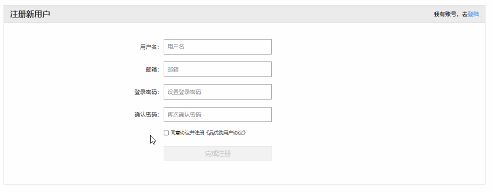
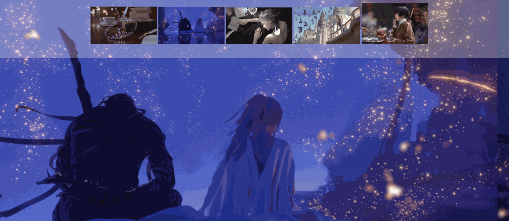
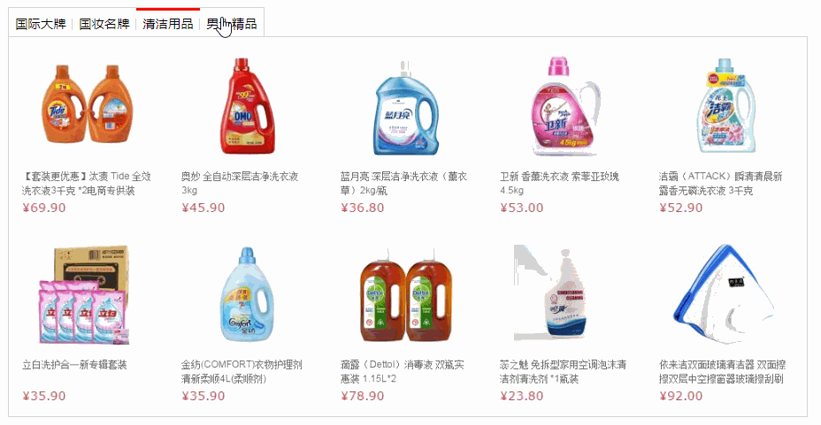
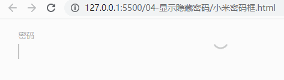
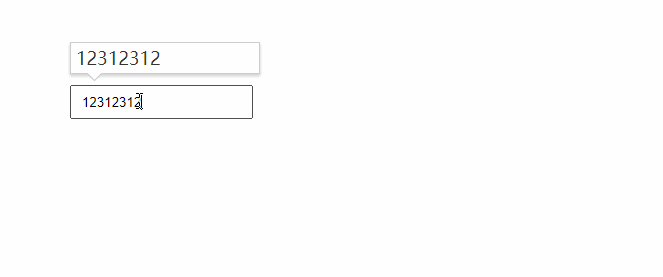
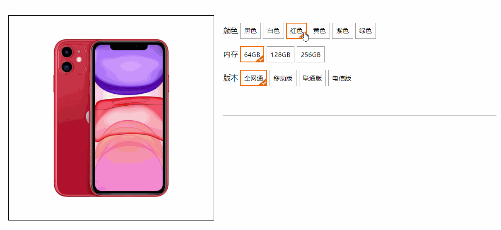

# Web APIs 第二天作业安排

## 客观题

1. 关于js中的事件，下列说法错误的是？(A)

    A： DOM2事件中， 不能给元素注册同名事件,比如给同一个按钮同时注册2个点击事件

    B： 事件注册之后，回调函数里面的代码，不会立即触发

    C： 注册事件本质是把回调函数注册到元素身上

    D： 事件既可以通过用户交互来触发，也可以使用代码主动触发,比如 btn.click() 

2. 下列关于事件类型解释错误的是? (C)

   A.  鼠标事件类型：click   鼠标点击   mouseenter 鼠标经过   mouseleave  鼠标离开

   B.  表单获得光标事件类型：focus    获得焦点       blur  失去焦点

   C.  键盘事件类型： Keydown 键盘弹起触发     Keyup    键盘按下触发

   D.  用户输入表单事件类型： input    用户输入时，并且表单里面的值发生变化时候触发

3. 下列关于事件监听解释错误的是? (D)

   A.  事件监听也称为事件注册或者事件绑定

   B.  事件监听三要素是：事件源、事件类型、事件处理函数

   C.  事件类型要求是字符串的，并且是小写字母

   D.  事件处理函数点击之后再去执行，而且只能执行一次

4. 关于回调函数说法正确的是? (ABCD) 多选

   A.  当一个函数当做参数来传递给另外一个函数的时候，这个函数就是回调函数

   B.  以前我们学过的 间隔函数（定时器）里面的函数，还有事件监听的匿名函数都是回调函数

   C.  使用匿名函数做为回调函数比较常见

   D.  回调函数简单理解，就是执行完某个命令之后，回头调用的函数，简称回调函数

5. 关于事件对象解释错误的是？(D)

   A.  事件对象也是个对象，这个对象里有事件触发时的相关信息

   B.  例如：鼠标点击事件中，事件对象就存了鼠标点在哪个位置等信息

   C.  在事件绑定的回调函数的第一个参数就是事件对象，一般命名为 event、ev或者e

   D.  鼠标触发的事件包含事件对象，其余的比如键盘事件是没有事件对象的

6. 可以得到用户按下了哪个键写法正确的是？(B)

   A.  事件对象.e

   B.  事件对象.key

   C.  事件对象.keyboard

   D.  事件对象.keydown

7. 用户按下回车键，下列判断条件写法正确的是？(B)

   A.  e.key === Enter

   B.  e.keyboard  === 'enter'

   C.  e.key === 'Enter'

   D.  e.keyboard  = 'Enter'

8. 关于环境对象this，下列说法错误的是? (C)

   A.  this是js中的一个环境对象，一般用于函数中

   B.  在事件处理函数中，this指向事件源dom对象，简单说指向函数调用者

   C.  只要是事件处理函数，就必须要使用this，否则无法实现功能

   D.  this相当于中文的我， 谁调用，我就是谁

9. 以下注册事件的说法，正确的是(B)

   A： 可以使用on+事件名称给一元素的同一个事件注册多个事件处理函数

   B： addEventListener方法可以给一个元素的同一个事件注册多个事件处理函数

   C： addEventListener第一个参数是事件名，注意需要加"on"

    D： addEventListener方法没有兼容性问题

10. 以下给元素注册点击事件，说法正确的是 (BD) 多选

    A：所有元素可以直接注册点击事件

    B：如果单个元素，可以直接注册点击事件

    C： 如果多个元素无法完成注册点击事件

     D：如果获得的元素是伪数组，则可以使用 for 遍历数组的形式，给每个元素注册点击事件

## 主观题

正常明天休息，所以咱们多做作业....

 ### 同意协议

需求： 

1. 用户勾选了同意复选框，下面的完成注册按钮可以启用
2. 用户不勾选同意复选框，下面的完成注册按钮禁用

### 百度换肤效果

**需求：**

1. 用户点击小图片，页面背景会先显示对应的大图片

### 京东 tab 栏

tab栏切换

### 小米密码框

 

**需求：**

1. 获得焦点之后，密码两个字会动画到上侧
2. 失去焦点之后，如果表单内容为空，则密码两个字复原为原来位置
3. 点击之后是睁开眼睛图片，则可以看到密码
4. 点击之后是闭上眼睛图片，则看不到密码

### 顺风快递查询

 
需求：

1. 用户输入数字的时候，表单上侧会出现一个大盒子，里面显示对应的输入的内容
2. 如果失去焦点，则放大盒子隐藏

### 淘宝购物

**需求：**

1. 点击颜色，左侧图片可以对应更换
2. 点击内存和版本可以选中当前高亮

## 排错题

### 排错题1

~~~html
<body>
  <button id="btn">按钮</button>
  
</body>
~~~

### 排错题2

~~~html
<body>
  <input type="text" name="username">
  <button id="btn">注册</button>
  
</body>
~~~

### 排错题3

~~~html
<body>
  <button>点击</button>
  <button>点击</button>
  <button>点击</button>
  <button>点击</button>
  
~~~

### 排错题4

~~~html
<body>
  <textarea id="tx" placeholder="发一条友善的评论" rows="2"></textarea>
  
</body>
~~~

