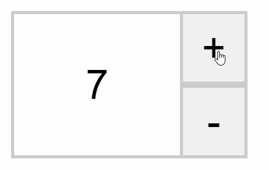
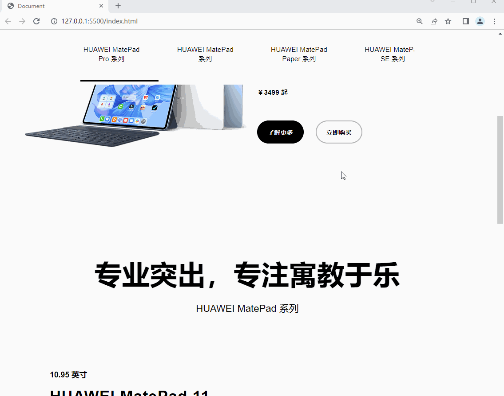

# Web APIs 第三天作业安排

## 客观题

1. 以下关于事件对象，说法错误的是：(C)

   A. 事件对象在事件监听回调函数的第一个参数

   B. 事件对象一般用于获取鼠标坐标信息与键盘按键信息

   C. 事件对象不可以自己命名，必须严格遵循规则来写，比如 必须是 event

   D. 事件对象不仅有属性，还有方法

2. 以下关于事件委托，说法错误的是? (D)

   A.  事件委托指的是 给父元素(祖先元素）注册事件，委托给父元素来监听事件的发生

   B.  事件委托也称为事件委派、事件代理

   C.  事件委托可以减少页面注册事件的次数,事件委托其实是利用事件冒泡的特点

   D.  事件委托中的this与e.target指向同一个对象，它们可以随意互换

3. 以下关于事件流，说法错误的是? (D)

   A.  事件流两个主要阶段是：事件捕获、事件冒泡

   B.  默认情况下，我们一般注册的事件都是冒泡事件

   C.  addEventListener 可以捕获和冒泡，而 btn.onclick= funciton(){} 只有冒泡

   D.   事件流是浏览器默认现象，我们无法阻止

4. 关于js中的事件冒泡与事件捕获，下列说法正确的是？(A)

    A： 捕获类型事件，只能使用addEventListener注册，传统注册方法只能是事件冒泡

    B： 事件对象的stopPropagation()方法只能阻止冒泡，不能阻止捕获

    C： 事件冒泡是浏览器的默认行为，我们无法阻止

    D： 如果想要阻止事件的冒泡行为，可以使用事件对象的preventDefault()方法

5. 在 JavaScript 中，用于阻止默认事件的默认操作的方法是? (D)

    A：  事件对象.stopDeafault()

    B：  事件对象.stopPropagation()

    C：  事件对象.preventPropagation()

    D： 事件对象.preventDefault()

6. 在 JavaScript 中，用于阻止事件冒泡的操作的方法是? (B)

   A：  事件对象. stopDeafault()

    B：  事件对象.stopPropagation()

    C：  事件对象.preventPropagation()

    D： 事件对象.preventDefault()

7. 事件委托中，可以获得真正触发事件的元素的是? (A)

    A：  事件对象.target. tagName

    B：  target. tagName

    C：  事件对象.target. name

    D： 事件对象.tagName

8. 下面关于尺寸说法正确的是？ (ABCD)

    A：scrollLeft和scrollTop  是获取被卷去的左侧和头部， 是可读写的

    B： offsetLeft 和 offsetTop   元素位置距离定位父级(祖先元素) 左上距离，只读

    C： clientWidth和clientHeight 获取元素的可见部分宽高（不包含边框，滚动条等）只读

    D： offsetWidth和offsetHeight  获取元素的自身宽高、包含元素自身设置的宽高、padding、border ，只读的

9. 下面是页面加载事件的是?(B)

    A：  scroll

    B：  load

    C：  resize

    D： target

10. 下面是页面滚动事件的是?(A)

     A：  scroll

     B：  load

     C：  resize

     D： target

11. 下面是页面尺寸发生变化触发的事件是?(C)

     A：  scroll

     B：  load

     C：  resize

     D： target

## 主观题

 ### 购物车加减

 

需求：

1. 点击加号，文本框里面的值会 ++
2. 点击减号，文本框里面的值会 -- ，如果到1了，减号就禁用

### 华为页面效果（当天晚自习做不完，可以等到白天自习完成)

需求：

1. 顶部导航页面滑动大于80像素时候，会改为固定定位
2. 点击顶部导航部分模块，页面会滑动到对应区域
3. 点击顶部小模块，底部的黑色线条会滑动到对应区域
4. 页面滑动到大模块对应区域，顶部的黑色线条也会滑动到部分区域

## 排错题

### 排错题1

~~~html
<body>
  <form>
    账号：<input type="text" name="username">  
    密码：<input type="password" name="password">  
    <button>提交</button>
  </form>
  
</body>
~~~

### 排错题2

~~~html
<body>
  <ul>
    <li>001</li>
    <li>002</li>
    <li>003</li>
  </ul>
  
</body>
~~~

### 排错题3

~~~html
<!DOCTYPE html>
<html lang="en">

<head>
  <meta charset="UTF-8">
  <meta http-equiv="X-UA-Compatible" content="IE=edge">
  <meta name="viewport" content="width=device-width, initial-scale=1.0">
  <title>Document</title>
  
</head>

<body>
  
</body>

</html>
~~~

