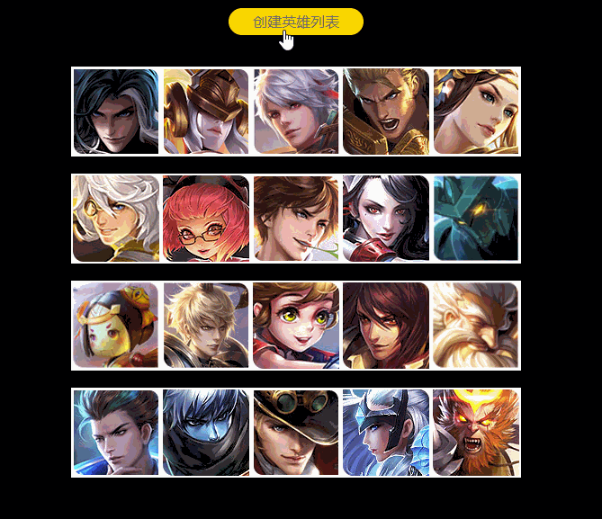
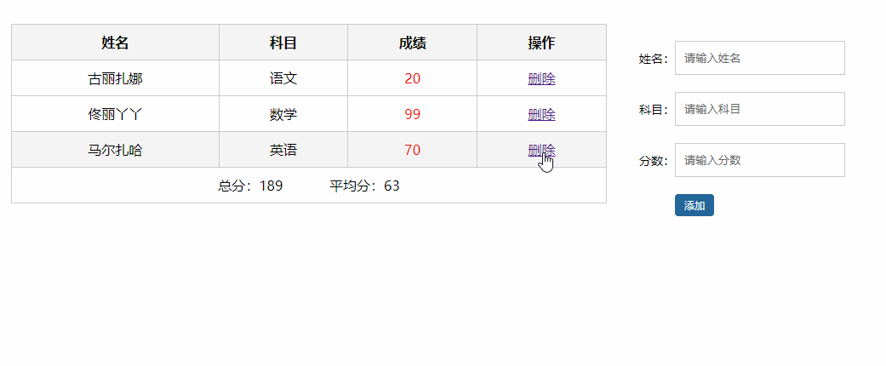

# Web APIs 第四天作业安排

## 客观题

1. 以下说法错误的是？（D）

   A. **DOM树：**DOM 将 HTML文档以树状结构直观的表现出来，我们称之为 DOM 树 或者 节点树

   B. **节点（Node）**是DOM树(节点树)中的单个点

   C. 文档本身、元素、文本以及注释都属于是节点

   D. 我们重点要学习文本节点，因为我们经常对文本进行操作

2. 以下关于查询节点语法，错误的是：(C)

   A. 元素.parentNode 是获取父元素（最近一级父元素，亲爸爸）

   B. 元素.previousElementSibling 是获取上一个元素

   C. 元素.childNode 是获取所有子元素

   D. 元素.nextElementSibling 是获取下一个元素

3. 以下关于新增节点，错误的是：(D)

   A. document.createElement() 创建的是空标签

   B. 元素.append(子元素)   会将子元素添加到最后面

   C. 元素.prepend(子元素) 会将子元素添加到最前面

   D. document.createElement() 会将元素添加到DOM树并渲染

4. 以下关于节点操作，错误的是? (C)

   A. 元素.remove(子元素)  作用是删除当前元素

   B. 元素.innerHTML = ''  可以实现清空该元素的所有内容

   C. 父元素.remove(子元素)  也可以删除父元素中的子元素

   D. document.createElement()  是创建一个新的节点

5. 在JavaScript，可以使用Date对象的哪个方法返回一个月中的某一天(A)

   A. getDate()

   B. getYear()

   C. getMonth()

   D.getTime()

6. 关于获得时间戳的方法哪个是错误的? (D)

   A. new Date().getTime()

   B. +new Date()

   C. Date.now()

   D.Date.getTime()

7. 关于时间戳的说明说法正确的是? (ABCD) 多选

   A.  比如计算倒计时效果，时间不方便直接进行相减，需要借助于时间戳完成

   B. 时间戳是指1970年01月01日00时00分00秒起至现在的毫秒数，它是一种特殊的计量时间的方式

   C. 倒计时的算法是： 将来的时间戳  -  现在的时间戳  =   剩余时间毫秒数 ，之后转换为时分秒

   D. 时间戳需要借助于日期对象

8. 下列不属于移动端事件的是？（C）

   A.  touchstart

   B. touchclick

   C. touchmove

   D. touchend

9. 下列说法正确的是？（BCD）多选

   A.  遍历对象我们可以使用 forEach 方法

   B.  字符串截取我们新学习了： 字符串.substring(起始索引号, [结束索引号])

   C. 我们尽量减少dom操作，采取操作数据的形式，为了更好的和Vue接轨

   D. 我们尽量对数组进行的操作，然后根据数组数据渲染页面

10. 下面属于事件委托好处的是？（AC）多选

    A.  减少了注册次数，提高了程序性能

    B.  遍历数组更加方便，多了一个操作数组的方式

    C. 给新增元素注册事件，因为动态新增的元素我们无法直接注册事件

    D. 事件委托是合理的利用了事件捕获，提高了我们程序性能

## 主观题

 ### 网页时钟

 

需求：

1. 根据当前系统时间显示时钟

公式：

~~~html
// 角度换算： 公式复制即可
// 小时角度公式：小时 * 30 + 分钟 / 60 * 30 
// 分钟角度公式：分钟* 6 + 秒 / 60 * 6
// 秒角度公式： 当前秒数 * 6
~~~

### 创建英雄列表

 

需求：

1. 点击按钮根据数据生成英雄列表
2. 要求必须使用 `forEach`遍历对象数组
3. 要求`必须使用拼接字符串`完成效果，不得使用dom操作，比如增加节点和新增节点等(不允许)

### 携程旅游

需求：

1. 点击不同tab栏，底部显示不同的内容
2. 要求必须使用 `forEach`遍历对象数组
3. 要求`必须使用拼接字符串`完成效果，不得使用dom操作，比如增加节点和新增节点等(不允许)
4. 注意点： 此处数据是 数组里面包含对象，对象里面又包含数组，是比较常见的写法，学会运用

### 学生成绩表

需求：

1. 有渲染功能，根据提供的数据先渲染页面
2. 有计算功能，可以计算总分和平均分
3. 有新增功能，输入相关数据可以渲染页面，如果为空，则提示不能输入
4. 有删除功能，点击删除链接，可以删除当前数据
5. 必须采取 操作数组形式完成以上功能，不允许操作DOM节点增删改查

