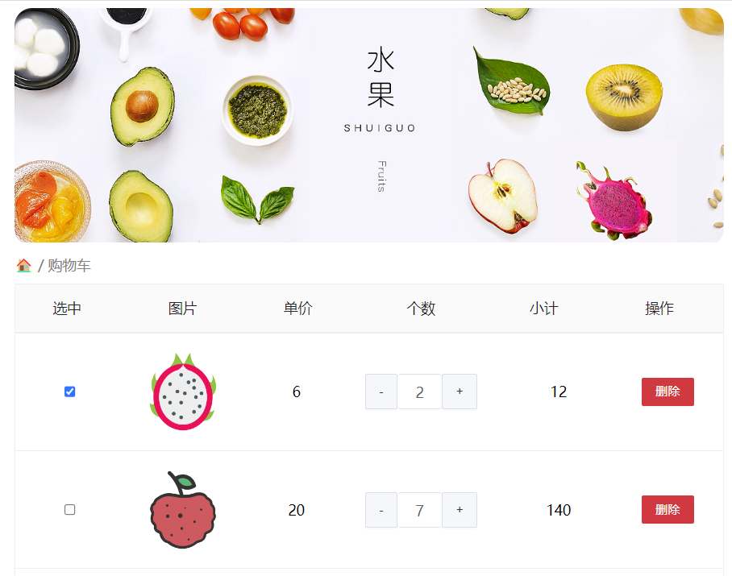
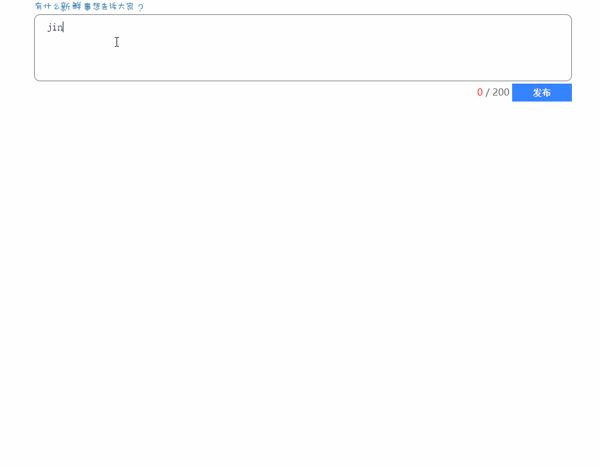

# Web APIs 第五天作业安排

## 客观题

1. 关于定时器，下列说法错误的是?(C)

   A. 延时函数 setTimeout() 只会执行一次

   B. 间歇函数 setInterval() 会重复执行，必须要手动清除

   C. 无论是哪一种定时器，只要开启就会立即执行

   D. clearInterval()  清除定时器必须要传参，参数是定时器的id

2. 关于window对象描述，错误的是?(D)

   A. window对象的成员，使用时可以省略window

   B. window.document === document ,结果是true

   C. window.a = 10 , 这行代码相当于添加了一个全局变量a

   D. window  里面 load 事件，会在DOM树加载完成后执行

3. 关于bom对象，下列说法错误的是?(D)

   A. location.href = ‘url’ 可以实现页面跳转功能

   B. location.search  获取地址中携带的参数，符号 ？后面部分

   C. location.hash 属性获取地址中的哈希值，符号 # 后面部分

   D. history.go(1) 和 history.back() 功能一致

4. 关于localStorage与sessionStorage，下列说法错误的是? (A)

   A. 可以存储任意类型的数据

   B. 他们的作用相同，但是存储方式不同，因此应用场景也不同

   C.  `localStorage` 的数据可以长期保留,关闭浏览器也不会消失，我们重点学习

   D. sessionStorage是临时存储，页面被关闭时，存储在 `sessionStorage` 的数据会被清除 

5. localStorage 存储语法是什么？  (A)

   A. localStorage.setItem(key,value)

   B. localStorage.getItem(key)

   C. localStorage.removeItem(key)

   D. localStorage.addItem(key)

6. localStorage 获取语法是什么？  (B)

   A. localStorage.setItem(key,value)

   B. localStorage.getItem(key)

   C. localStorage.removeItem(key)

   D. localStorage.addItem(key)

7. localStorage 删除语法是什么？  (C)

   A. localStorage.setItem(key,value)

   B. localStorage.getItem(key)

   C. localStorage.removeItem(key)

   D. localStorage.addItem(key)

8. localStorage  存储的时候使用那个方法可以存储为JSON字符串？(A)

   A. JSON.stringify(复杂数据类型)

   B. JSON.parse(复杂数据类型)

   C. '复杂数据类型'

   D. 数组.join('')

   ​

9. localStorage  获取复杂数据类型如何转换为对象格式？(B)

   A. JSON.stringify(JSON字符串)

   B. JSON.parse(JSON字符串)

   C. '复杂数据类型'

   D. 数组.join('')

10. 关于数组方法map说法正确的是? (ABCD)

    A. map 可以处理数据，并且返回新的数组

    B. map方法里面的回调函数有2个参数， 第一个参数是当前数组元素， 第二个参数是 当前数组元素的索引号

    C. map 是迭代数组，也称为映射，可以给数组元素做某些操作，并且里面写return，就可以返回处理后的数据

    D. map 方法 也可以遍历数组， 只不过设计map 的初衷是要返回处理后的新数组

11. 关于数组方法 join方法说法正确的是? (ABCD)

    A.  join() 方法用于把数组中的所有元素转换一个字符串

    B. 比如 [1,2,3].join('') 会得到 字符串 '123'

    C. 数组元素是通过参数里面指定的分隔符进行分隔的

    D. 比如 [1,2,3].join('-') 会得到 字符串 '1-2-3'

## 主观题

 ### 渲染水果页面

 

需求：

1. 根据提供的数据渲染页面

2. 要求必须有本地存储

3. 要求有删除功能

4. 必须使用 map + join 的方法来实现

5. 注意事件委托判断类名的写法

   ~~~javascript
   if (e.target.className === 'del') {}
   ~~~

### 发布微博

 

需求：

1. 有渲染功能
2. 有新增功能
3. 有删除功能
4. 有本地存储功能
5. 注意发布微博最新留言要在最上方，所以用 unshift 追加数组
6. 留言里面的头像和名字，利用随机函数抽取即可，时间必须是当前时间
6. 必须采取 map + join 方法 操作数组实现

## 排错题

### 排错题1

~~~html
<body>
  
</body>
~~~

### 排错题2

~~~html
<body>
  

  
</body>
~~~

