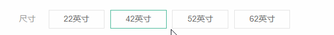
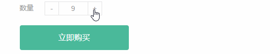
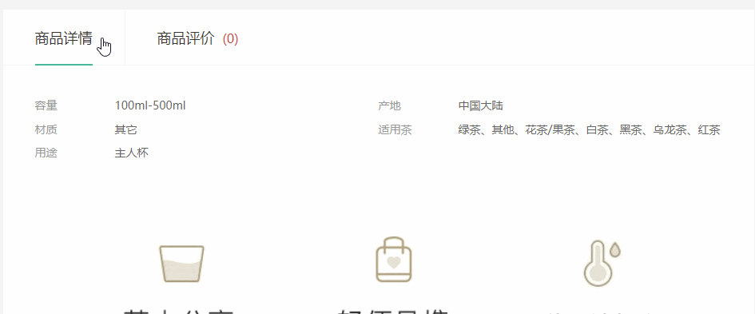

# Web APIs 第六天作业安排

## 客观题

1. 下面关于正则表达式说法正确的是？(ABCD) 多选

   A.  正则表达式是是一种字符串匹配的模式（规则）

   B. 可以用于表单验证（匹配）

   C. 可以用于过滤敏感词（替换）

   D. 可以用于字符串中提取我们想要的部分（提取）

2. 下面声明正则表达式正确的是? (B)

   A.  const 变量名 = \表达式\

   B.  const 变量名 = /表达式/

   C.  const 变量名 =  表达式

   D.  const 变量名 =  '表达式'

3. 下面哪个方法可以用于检测正则表达式与指定的字符串是否匹配? (C)

   A.  text()

   B.  has()

   C.  test()

   D.  excel()

4. 下列关于正则中特殊字符描述正确的是（ABCD ）?  多选

   A： ^和$符号为定界符，用于表示匹配以什么开头或以什么结尾

   B： []表示范围，用于匹配多个选项中的任意1个

   C： \d和\D是字符类，是一种简写字符

   D： *、?、+是量词符，用于表示字符出现的次数

5. 下列选项能够将字符串str中的”java”、”Java”、”JAVA”替换为“前端”的是（BD）多选

A： 

~~~javascript
const str = 'javascript和JAVA是两个不同的语言，Javascript诞生于1995年'
const strend = str.replace(/java/i, '前端')
console.log(strend)
~~~

 B： 

~~~javascript
const str = 'javascript和JAVA是两个不同的语言，Javascript诞生于1995年'
const strend = str.replace(/java/gi, '前端')
console.log(strend)
~~~

 C： 

~~~javascript
const str = 'javascript和JAVA是两个不同的语言，Javascript诞生于1995年'
const strend = str.replace(/java|JAVA|Java/, '前端')
console.log(strend)
~~~

 D： 

~~~javascript
const str = 'javascript和JAVA是两个不同的语言，Javascript诞生于1995年'
const strend = str.replace(/java|JAVA|Java/g, '前端')
console.log(strend)
~~~

6. 关于正则表达式声明6位数字的邮编，以下代码正确的是？(C)

    A：  const reg = /\d6/

    B： const reg = \d{6}\

    C： const reg = /\d{6}/

    D： const reg =  /d6/

7. 下列关于事件说法正确的是？ (ABCD) 多选

   A. change 事件是表单里面的值被修改并且失去焦点后触发

   B. input 事件 是用户输入，当表单里面的值发生改变的时候触发

   C. blur 事件是当表单失去焦点的时候触发

   D. 可以把change事件看做是 input + blur的结合体

8. 下列关于类操作说法错误是？ (C) 

   A.  元素.classList.add()  是添加类

   B. 元素.classList.remove()  是删除类

   C. 元素.classList.toggleClass()  是切换类

   D. 元素.classList.contains()  是判断是否包含类

## 主观题

明天开始实战：

今天晚上先把实战-产品详情页中除了放大镜效果之外的效果做完。

## 顶部导航模块

需求：

1. 顶部导航开始不显示
2. 等页面滑到主导航栏，这个**新顶部导航栏滑动下拉显示**，并且改为固定定位
3. 等页面滑到上面，新顶部导航栏隐藏

## 点击颜色模块

 
点击可以添加边框效果

## 点击尺寸模块

 

点击可以选择想要的尺寸

## 点击梳理模块

 

点击加减可以修改商品数量，如果购买数量是1，则鼠标提示禁用提示

## tab栏切换模块

## 返回顶部模块

 

页面滚动底部，可以出现一个侧边栏，点击返回顶部，可以返回顶部

