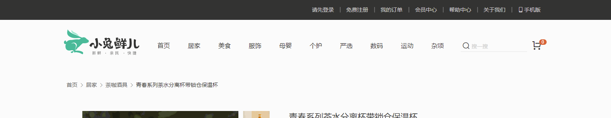

# 个人实战

本次实战是对自己整个api阶段的总结

本次实战主要分为2部分 

# 个人实战文档1

## 顶部导航模块

需求：

1. 顶部导航开始不显示
2. 等页面滑到主导航栏，这个**新顶部导航栏滑动下拉显示**，并且改为固定定位
3. 等页面滑到上面，新顶部导航栏隐藏

## 放大镜效果（课堂讲解）

  

业务分析：

①： 鼠标经过对应`小图片`，左侧`中等图片`跟随变化

②： 鼠标经过/离开`中盒子`，右侧`大盒子`显示/隐藏

③： `黑色遮罩`盒子跟随`鼠标移动`

④： `大图片`可以跟随移动

 

思路分析：

**①：鼠标经过`小图片`，左侧`中图片`跟随变化**

1. 采取`事件委托`的形式，监听鼠标经过小盒子里面的`图片`， 注意此时需要使用 `mouseover` 事件，因为需要事件冒泡触发small 
2. 鼠标经过小图片，可以拿到小图片的 `src`
   - 把当前小图片的src 给 中等图片的 src 
3. 绿色边框通过添加类删除类实现。
   - 当前图片的**爸爸**li 添加类，其余移除类

   ​

**②：  鼠标经过`中盒子`，右侧`大盒子`显示/隐藏**

1. 鼠标经过时，`显示`大盒子，显示`遮罩盒子`，修改`大盒子的图片`，把中图片给大盒子做`背景`合适，因为小图片会变化

2. 鼠标离开时，`隐藏`大盒子，添加`定时器`，隐藏`遮罩盒子`

   ​

**③： 黑色遮罩盒子跟着鼠标来移动**

2.  让黑色遮罩跟着鼠标来走, 需要用到鼠标移动事件  `mousemove`  

2. 让黑色盒子的移动的核心思想：不断把鼠标在中等盒子内的`坐标`给黑色遮罩盒子` let  top` 值，这样遮罩层就可以跟着移动了。

   1. 得到鼠标在盒子内的坐标。   事件对象里面 `offsetX`  和 `offsetY` ，然后把值给 黑色遮罩盒子 top left

      - 注意会出现抖动的效果。

        - 原因：是因为鼠标移动的时候滑到黑色遮罩盒子上了，坐标有变化。

        - 解决方案： 通过CSS把黑色遮罩的盒子屏蔽掉鼠标事件。 

        - >   pointer-events: none;      设置元素是否对鼠标事件做出反应（可以理解为 鼠标穿透）

        - 如果希望鼠标再次变成移动形状，可以给 middle盒子添加   cursor: move; 

   2.  设置鼠标在黑色遮罩盒子中间位置。

      - 让鼠标offsetX的值 - 盒子宽度的一半， 就是 黑色遮罩x的坐标
      - 让鼠标offsetY的值 - 盒子高度的一半， 就是 黑色遮罩y的坐标

   3. 限定遮罩盒子在中间盒子内

      1. 如果x小于0，则黑色遮罩就不移动了，可以设置x为0

      2. 如果x大于200，则黑色遮罩就不移动了，可以设置x为 200

      3. 如果y小于0，则黑色遮罩就不移动了，可以设置y为0

      4. 如果y大于200，则黑色遮罩就不移动了，可以设置x为 200

      5. 最后修改下 200数字，中间盒子宽度/高度 - 黑色盒子宽度/高度

         ​

**④：让大盒子图片跟随移动**

1.  中间盒子移动1px，大盒子图片移动2px，所以存在2倍的关系

~~~javascript
large.style.backgroundPosition = `${-2 * x}px ${-2 * y}px`
~~~

**全部代码：**

~~~html
 
~~~

## 点击颜色模块

 
点击可以添加边框效果

## 点击尺寸模块

 

点击可以选择想要的尺寸

## 点击梳理模块

 

点击加减可以修改商品数量，如果购买数量是1，则鼠标提示禁用提示

## tab栏切换模块

## 返回顶部模块

页面滚动底部，可以出现一个侧边栏，点击返回顶部，可以返回顶部

 

# 个人实战文档2

 

可以面向人编程也可以面向百度编程，但是不要抄袭

