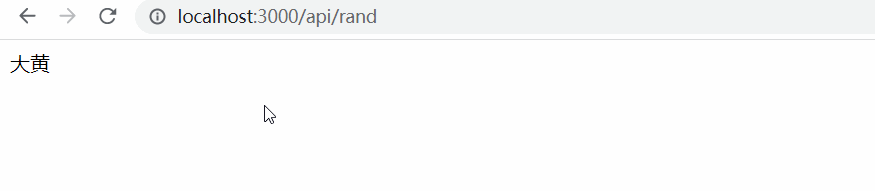
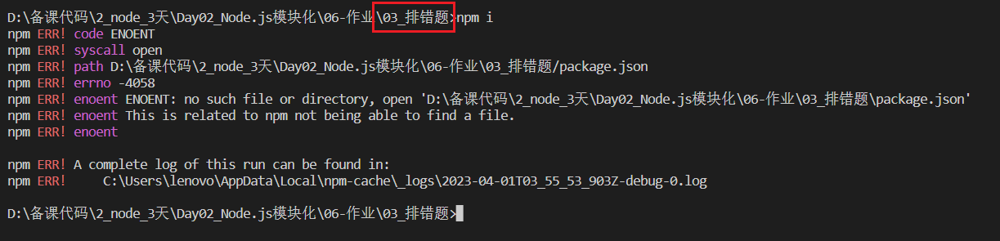

# Day02_Node.js模块化

## 客观题

* 参考客观题目录下的excel

* 在线直接答题：https://ks.wjx.top/vm/YrZEsls.aspx# 

  > ps：本测试链接来自问卷星，请不要轻信问卷星广告！

## 主观题

### 作业1 - 点名

需求1：编写 Web 服务，支持跨域，前端 GET 请求方式，请求 /api/rand 接口

需求2：使用 npm 下载 lodash 使用里面封装的函数，随机产生一个 0 - 10 之间的任意整数:

需求3：自定义模块 stuName.js 导出一个数组，值为 10 个名字，并随机取出一个名字返回给前端

> PS：当然你也可以做个简单的页面，点击按钮，随机显示名字

## 排错题

配套文件夹内的《npm 下载依赖有问题》，使用 VSCode 打开此项目

注意：一定要在《npm 下载依赖有问题》文件夹父级 《03_排错题》，执行 npm i 观察问题

请分析问题原因，并说出解决方案！

## 面试题

### 1. 什么是浏览器的同源策略？

浏览器的同源策略是一种安全策略，用来限制一个源（协议、域名、端口号）的文档或脚本如何与另一个源的资源进行交互。同源策略的目的是防止恶意网站通过脚本等手段获取用户的敏感信息，如Cookie、Session等。也能防止跨域伪造请求攻击

### 2. 什么是跨域？

跨域（Cross-Origin）指的是在浏览器中，一个网页的脚本通过XMLHttpRequest请求另一个源的资源时，如果两个网页的协议、域名或端口号有任何一个不同，就会发生跨域。跨域是浏览器的同源策略的限制。

跨域问题是前端开发中常见的问题，比如在开发中，我们要使用Ajax请求一个跨域的API接口，就会遇到跨域问题。为了解决跨域问题，可以在开发环境下使用CORS技术 / 代理转发，上线后，可以放到同一个源下 / 代理转发

