# 面经PC端-element (上) 

vant 项目的定位：

- 熟悉vant， 熟悉架子(各个目录)，熟悉模块 api  request storage

element 项目的定位：

- 熟悉element => **表单组件**，表单校验，**表格组件**
- 巩固架子，巩固模块封装

项目演示: 本地源代码《教学资料》

接口文档: https://www.apifox.cn/apidoc/project-934563/api-19465917

**接口根路径**: http://interview-api-t.itheima.net/

本项目的技术栈 本项目技术栈基于 [ES2015+](http://es6.ruanyifeng.com/)、[vue2](https://cn.vuejs.org/index.html)、[vuex3](https://vuex.vuejs.org/zh-cn/)、[vue-router3](https://router.vuejs.org/zh-cn/) 、[vue-cli5](https://github.com/vuejs/vue-cli) 、[axios](https://github.com/axios/axios) 和 [element-ui](https://github.com/ElemeFE/element)


## 页面展示

### 登录页

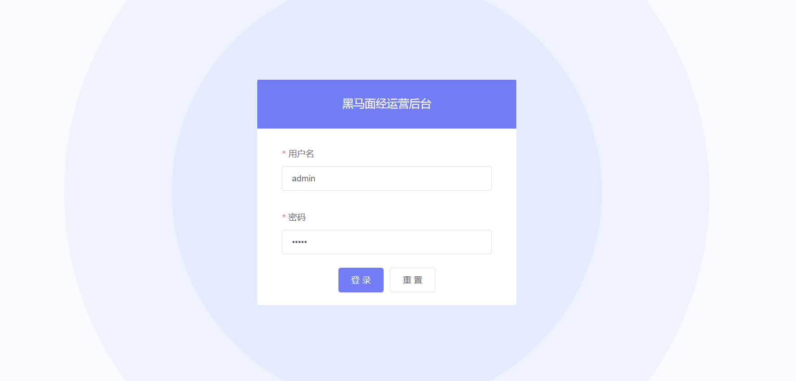

### 首页

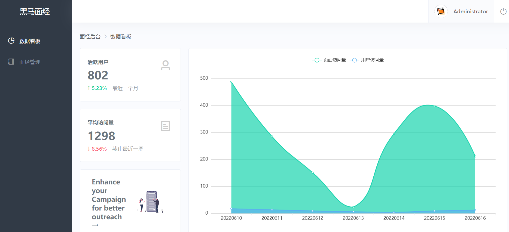

### 面经管理 - 列表展示

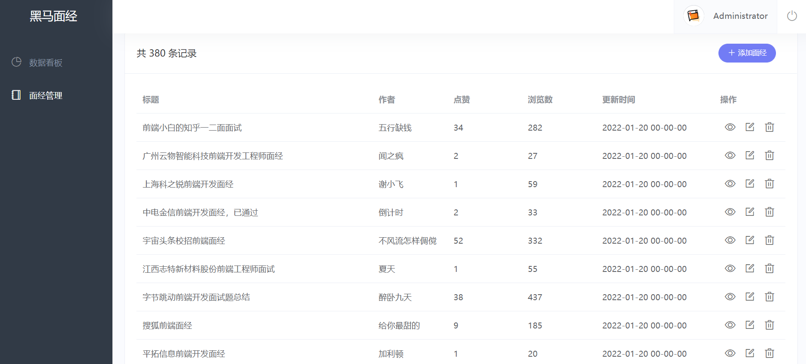

### 面经管理 - 预览效果

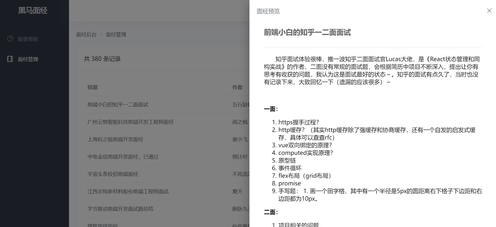

### 面经管理 - 删除功能

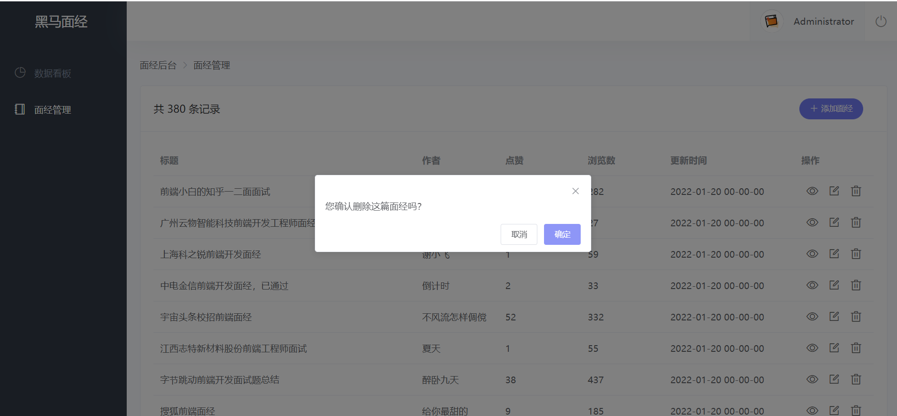

### 面经管理 - 添加功能

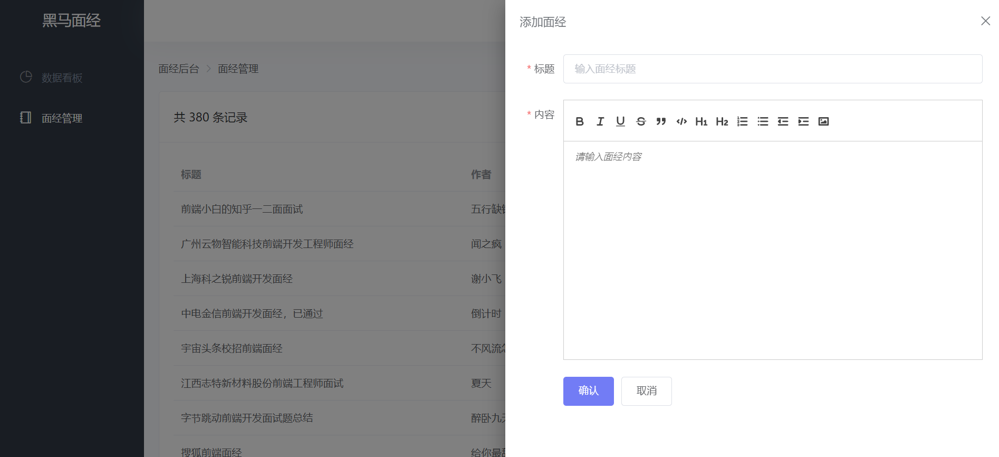


### 面经管理 - 修改功能

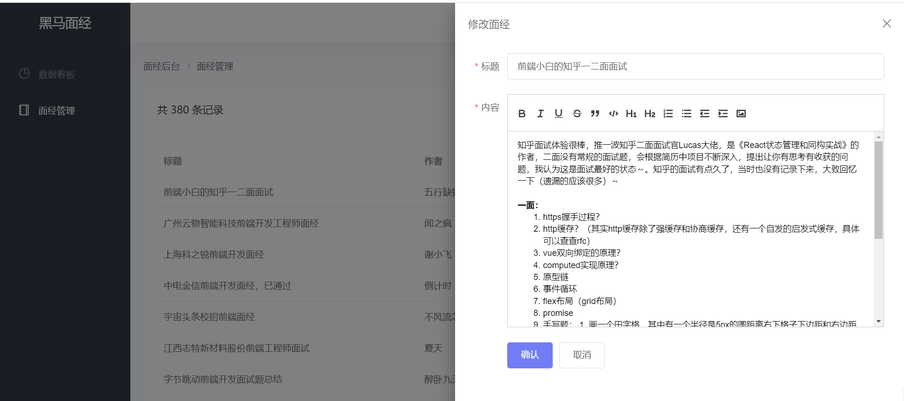


## 创建项目

```jsx
vue create hm-element-pc
```

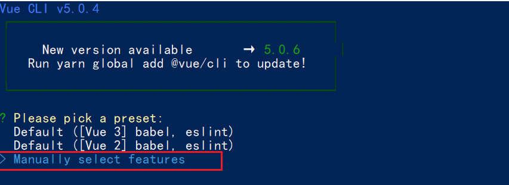


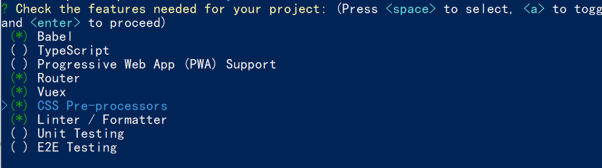


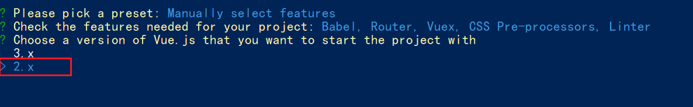


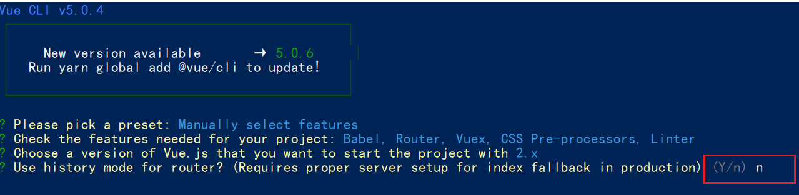


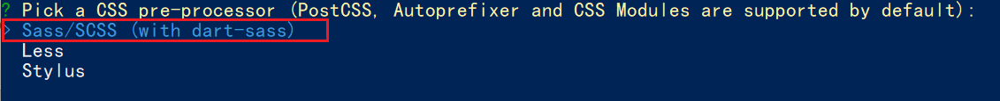


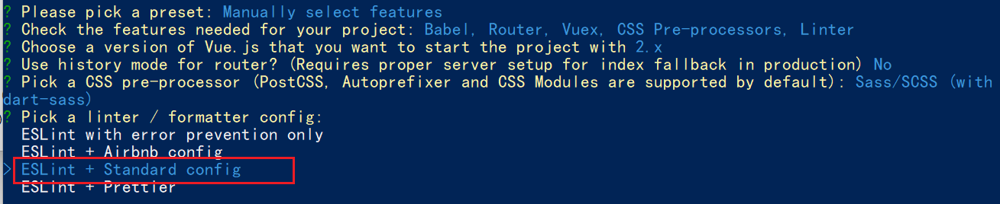


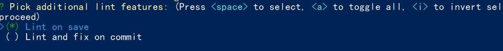


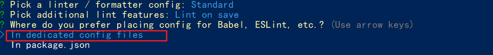


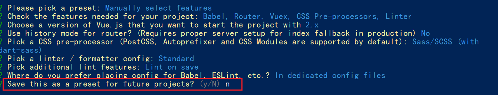


## sass/scss 语法说明

```txt
less sass stylus 都是 css 预处理器，语法上稍有差异，作用一样
都是让 css，增强能力，具备变量，函数.. 的能力

sass的语法两种语法 .sass(旧) .scss(新)
1 .sass 和 .stylus 语法很像 (了解)
  要求省略 {} 和 分号， 缩进表示嵌套
  
2 .scss 和 .less   语法很像， 都支持嵌套, 变量...
  scss 声明变量：$变量名
  less 声明变量: @变量名
```


## 调整项目目录

默认生成的目录结构不满足我们的开发需求，所以这里需要做一些自定义改动。主要是4个工作：

1. 删除文件

- components/HelloWorld.vue
- views/HomeView.vue
- views/AboutView.vue
- assets/logo.png

2. 修改内容

`src/router/index.js`

```jsx
import Vue from 'vue'
import VueRouter from 'vue-router'

Vue.use(VueRouter)

const router = new VueRouter({
  routes: []
})

export default router
```

`src/App.vue`

```jsx
<template>
  <div id="app">
    <router-view></router-view>
  </div>
</template>

<style lang="scss">

</style>
```

store/index.js  和 main.js 不用动

3. 新增需要目录

在 src 目录下中补充创建以下目录：

- /api ： 存储请求函数模块
- /styles: 样式文件模块
- /utils: 工具函数模块

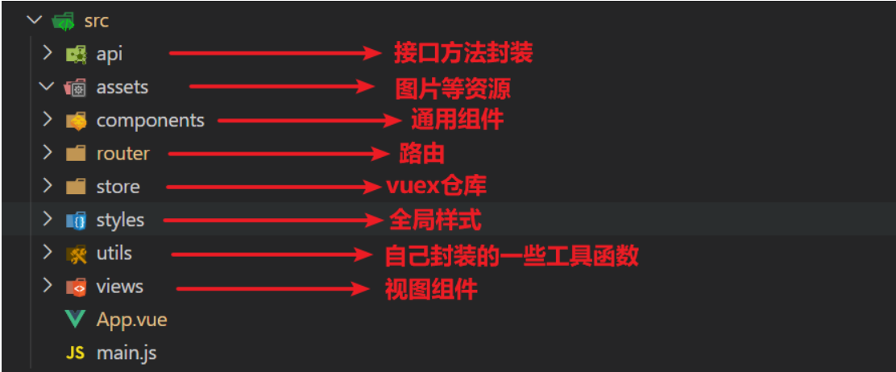

4. 将项目需要的图片资源放置  **assets 文件夹**  中


## 引入 element-ui 组件库


官方文档: https://element.eleme.io/#/zh-CN

### 全部引入

全部引入,  会导入所有的组件， 但是体积会变大

- 安装

```jsx
yarn add element-ui
```

- 在`main.js`中

```jsx
import ElementUI from 'element-ui';
import 'element-ui/lib/theme-chalk/index.css';
Vue.use(ElementUI);
```

- 演示

```jsx
<el-button type="primary">主要按钮</el-button>
```

### 按需导入 (推荐)  

减轻将来打包后的包的体积

+ 安装

```jsx
yarn add element-ui
```

- 安装`babel-plugin-component`

```jsx
yarn add babel-plugin-component -D
```

- 在` babel.config.js `中配置

```jsx
module.exports = {
  presets: [
    '@vue/cli-plugin-babel/preset'
  ],
  // 新增plugins插件节点,修改完配置文件一定重启项目
  "plugins": [
    [
      "component",
      {
        "libraryName": "element-ui",
        "styleLibraryName": "theme-chalk"
      }
    ]
  ]
}
```

- 使用插件`main.js`中

```jsx
import { Button } from 'element-ui'
Vue.use(Button)
```

### 抽离element-ui.js模块

- 由于组件的导入都书写到了`main.js`中,导致`main.js` 代码冗余

  将element-ui组件的导入和注册单独抽离到utils文件夹中

- 新建element-ui.js 

- **项目中 **  完整按需导入如下：

```jsx
import Vue from 'vue';
import {
  Popconfirm,
  Avatar,
  Breadcrumb,
  BreadcrumbItem,
  Pagination,
  Dialog,
  Menu,
  Input,
  Option,
  Button,
  Table,
  TableColumn,
  Form,
  FormItem,
  Icon,
  Row,
  Col,
  Card,
  Container,
  Header,
  Aside,
  Main,
  Footer,
  Link,
  Image,
  Loading,
  MessageBox,
  Message,
  Drawer,
  MenuItem
} from 'element-ui';

Vue.use(Breadcrumb);
Vue.use(BreadcrumbItem);
Vue.use(Drawer);
Vue.use(Popconfirm);
Vue.use(Avatar);
Vue.use(Pagination);
Vue.use(Dialog);
Vue.use(Menu);
Vue.use(MenuItem);
Vue.use(Input);
Vue.use(Option);
Vue.use(Button);
Vue.use(Table);
Vue.use(TableColumn);
Vue.use(Form);
Vue.use(FormItem);
Vue.use(Icon);
Vue.use(Row);
Vue.use(Col);
Vue.use(Card);
Vue.use(Container);
Vue.use(Header);
Vue.use(Aside);
Vue.use(Main);
Vue.use(Footer);
Vue.use(Link);
Vue.use(Image);

Vue.use(Loading.directive);

Vue.prototype.$loading = Loading.service;
Vue.prototype.$msgbox = MessageBox;
Vue.prototype.$alert = MessageBox.alert;
Vue.prototype.$confirm = MessageBox.confirm;
Vue.prototype.$prompt = MessageBox.prompt;
Vue.prototype.$notify = Notification;
Vue.prototype.$message = Message;
```

- 直接导入main.js中

```jsx
// 直接导入vant-ui.js
import '@/utils/element.js'
```


### 导入公共样式

新建 styles/index.scss

```jsx
// 修改主题色
$--color-primary: rgba(114,124,245,1);
$--font-path: '~element-ui/lib/theme-chalk/fonts';
@import "~element-ui/packages/theme-chalk/src/index";

body {
  margin: 0;
  padding: 0;
  background: #fafbfe;
}
```

main.js 引入

```js
import '@/styles/index.scss'
```


## request模块 - axios封装

接口文档地址：https://www.apifox.cn/apidoc/project-934563/api-19465917

我们会使用 axios 来请求后端接口, 一般都会对 axios 进行一些配置 (比如: 配置基础地址等)

一般项目开发中, 都会对 axios 进行基本的二次封装, 单独封装到一个模块中, 便于使用

1. 安装 axios

```
yarn add axios
```

2. 新建 `utils/request.js` 封装 axios 模块

   利用 axios.create 创建一个自定义的 axios 来使用

   http://www.axios-js.com/zh-cn/docs/#axios-create-config

```js
/* 封装axios用于发送请求 */
import axios from 'axios'

// 创建一个新的axios实例
const request = axios.create({
  baseURL: 'http://interview-api-t.itheima.net/',
  timeout: 5000
})

// 添加请求拦截器
request.interceptors.request.use(function (config) {
  // 在发送请求之前做些什么
  return config
}, function (error) {
  // 对请求错误做些什么
  return Promise.reject(error)
})

// 添加响应拦截器
request.interceptors.response.use(function (response) {
  // 对响应数据做点什么
  return response.data
}, function (error) {
  // 对响应错误做点什么
  return Promise.reject(error)
})

export default request
```


## storage模块 - 本地存储

新建 utils/storage.js

```jsx
// 以前 token 令牌，如果存到了本地，每一次都写这么长，太麻烦
// localStorage.setItem(键， 值)
// localStorage.getItem(键)
// localStorage.removeItem(键)

const KEY = 'my-token-element-pc'

// 直接用按需导出，可以导出多个
// 但是按需导出，导入时必须 import { getToken } from '模块名导入'

// 获取
export const getToken = () => {
  return localStorage.getItem(KEY)
}

// 设置
export const setToken = (newToken) => {
  localStorage.setItem(KEY, newToken)
}

// 删除
export const delToken = () => {
  localStorage.removeItem(KEY)
}
```


## 路由设计配置

但凡是: 单个页面，独立展示的，都是一级路由  (登录  注册   首页架子   文章详情 ...)

路由设计：

- 登录页 （一级） login
- 首页架子（一级） layout
  - 数据看板（二级）dashboard
  - 文章管理（二级）article

### 新建目录

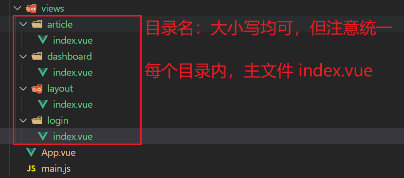

`login/index.vue`

```jsx
<template>
  <div>我是一级登录</div>
</template>

<script>
export default {
  name: 'LoginIndex'
}
</script>

<style>

</style>
```

`layout/index.vue`

```jsx
<template>
  <div>我是一级首页架子</div>
</template>

<script>
export default {
  name: 'LayoutIndex'
}
</script>

<style>

</style>
```

`dashboard/index.vue`

```jsx
<template>
  <div>我是二级数据看板页面</div>
</template>

<script>
export default {
  name: 'DashBoard'
}
</script>

<style>

</style>
```

`article/index.vue`

```jsx
<template>
  <div>我是二级文章管理页</div>
</template>

<script>
export default {
  name: 'ArticleIndex'
}
</script>

<style>

</style>
```


### 配置路由

`router/index.js`

```jsx
import VueRouter from 'vue-router'
import Vue from 'vue'

import Layout from '@/views/layout'
import Login from '@/views/login'
import Dashboard from '@/views/dashboard'
import Article from '@/views/article'

Vue.use(VueRouter)

const router = new VueRouter({
  routes: [
    { path: '/login', component: Login },
    {
      path: '/',
      component: Layout,
      redirect: '/dashboard',
      children: [
        { path: 'dashboard', component: Dashboard },
        { path: 'article', component: Article }
      ]
    }
  ]
})

export default router
```

`layout/index` 配置二级路由出口

```jsx
<template>
  <div>
    <div>头部</div>
    <div>侧边</div>
    <router-view></router-view>
  </div>
</template>

<script>
export default {
  name: 'LayoutIndex'
}
</script>

<style>

</style>
```

测试路径1： http://localhost:8080/#/login

测试路径2： http://localhost:8080/#/dashboard

测试路径3： http://localhost:8080/#/article


## 登录模块

### element-ui 基本表单

说明：我们先学习 element-ui 表单组件的基本结构使用

需求：实现如图效果

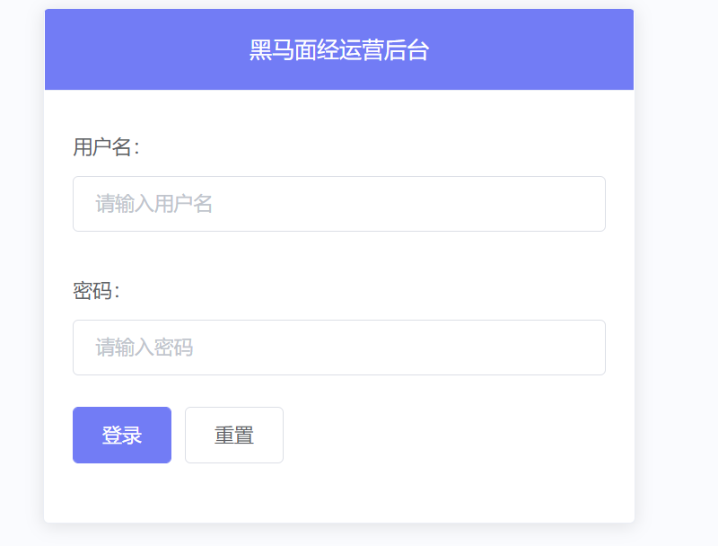

一般情况，这种第三方的组件，为了样式控制方便，会给组件的根元素，起一个和组件名同名的类名

控制组件的样式：

1. 直接通过组件名 同名的 类， 进行控制样式

2. 自己通过添加 class 类名，进行控制样式


默认，写在scoped中的样式，只会影响到当前组件模板中的元素内容

深度作用选择器：向下影响到子元素的样式

 ::v-deep (scss)

/deep/  (less)

```jsx
<template>
  <div class="login-page">
    <el-card class="el-card">
      <template #header>黑马面经运营后台</template>
      <el-form>
        <el-form-item label="用户名：">
          <el-input placeholder="请输入用户名" />
        </el-form-item>
        <el-form-item label="密码：">
          <el-input placeholder="请输入密码：" />
        </el-form-item>
        <el-form-item>
          <el-button type="primary">登录</el-button>
          <el-button>重置</el-button>
        </el-form-item>
      </el-form>
    </el-card>
  </div>
</template>

<script>
export default {
  name: 'login-page'
}
</script>

<style lang="scss" scoped>
.el-card {
  width: 420px;
  margin: 0 auto;
  // 深度作用选择器   ::v-deep   /deep/
  ::v-deep .el-card__header {
    background: rgba(114,124,245,1);
    text-align: center;
    color: white;
  }
}
</style>
```

**样式美化：**

```jsx
<template>
  <div class="login-page">
    <el-card>
      <template #header>黑马面经运营后台</template>
      <el-form autocomplete="off">
        <el-form-item label="用户名">
          <el-input placeholder="输入用户名"></el-input>
        </el-form-item>

        <el-form-item label="密码">
          <el-input type="password" placeholder="输入用户密码"></el-input>
        </el-form-item>

        <el-form-item class="tc">
          <el-button type="primary">登 录</el-button>
          <el-button >重 置</el-button>
        </el-form-item>
      </el-form>
    </el-card>
  </div>
</template>

<script>
export default {
  name: 'login-page',
  data () {
    return {

    }
  },
  methods: {

  }
}
</script>

<style lang="scss" scoped>
.login-page {
  min-height: 100vh;
  background: url(@/assets/login-bg.svg) no-repeat center / cover;
  display: flex;
  align-items: center;
  justify-content: center;
  .el-card {
    width: 420px;
    ::v-deep .el-card__header{
      height: 80px;
      line-height: 40px;
      background: rgba(114,124,245,1);
      text-align: center;
      color: #fff;
      font-size: 18px;
    }
  }
  .el-form {
    padding: 0 20px;
  }
  .tc {
    text-align: center;
  }
}
</style>
```


### element-ui 基本校验

说明：在向后端发请求，调用接口之前，我们需要对所要传递的参数进行验证，把用户的错误扼杀在摇篮之中。

讲解内容:

- element-ui的校验

  - el-form:  `model`属性, `rules`规则

  - el-form-item:  绑定 `prop` 属性

  - el-input:   绑定` v-model`

Form 组件提供了表单验证的功能

1.  form组件需要 `:model`绑定form对象（必须）， 需要通过 `rules` 属性传入约定的验证规则 

```jsx
<el-form :model="form" :rules="rules">
    
export default {
  data() {
    return {
      form: {
        username: '',
        password: ''
      }
    }
  }
}
```

2. 在 data 中准备 rules 规则

```js
rules: {
  username: [
    { required: true, message: '请输入用户名', trigger: ['blur', 'change'] },
    { min: 5, max: 11, message: '长度在 5 到 11 个字符', trigger: ['blur', 'change'] }
  ]
}
```

3.  将 Form-Item 的 `prop` 属性设置为需校验的字段名 

```html
<el-form-item label="用户名：" prop="username">
  <el-input v-model="form.username" placeholder="请输入手机号" />
</el-form-item>
```


### element-ui 正则校验

下面是常用内置的基本验证规则：其余校验规则参见 [async-validator](https://github.com/yiminghe/async-validator)

| 规则     | 说明                                           |
| -------- | ---------------------------------------------- |
| required | 必须的，例如校验内容是否非空                   |
| pattern  | 正则表达式，例如校验手机号码格式、校验邮箱格式 |

```jsx
rules: {
  username: [
    { required: true, message: '请输入用户名', trigger: ['blur', 'change'] },
    { min: 5, max: 11, message: '长度在 5 到 11 个字符', trigger: ['blur', 'change'] }
  ],
  password: [
    { required: true, message: '请输入密码', trigger: ['blur', 'change'] },
    { pattern: /^\w{5,11}$/, message: '请输入 5 到 10 位的密码', trigger: ['blur', 'change'] }
  ]
}

// \d 数字 0-9
// \w 字母数字下划线
// {m,n} 前面的字符，可以出现 m次 ~ n次
```

不要忘了配置prop

```html
<el-form-item prop="password">
```

上述已经可以完成大部分需求，如果需要更复杂业务校验需求，可以自定义校验~ （项目课程：人力资源系统会进一步讲解）


### 提交表单校验 和 重置

每次点击按钮, 进行ajax登录前, 应该先对整个表单内容校验, 不然还是会发送很多无效的请求!!!

要通过校验了, 才发送请求!!!

**作用: `ref` 属性配合 `$refs` 可以获取 dom 元素 (或者 vue组件实例)**

1. 给组件或者元素, 添加  ref 属性

```html
<hello ref="bb"></hello>
```

2. 通过 this.$refs 可以获取对应的引用, 并且调用方法

```jsx
this.$refs.bb.sayHi()
```

**添加登录提交的校验**

```js
<el-form ref="form" :model="form" :rules="rules" autocomplete="off">
...
<el-button @click="login" type="primary">登 录</el-button>

methods: {
  async login () {
    try {
      const valid = await this.$refs.form.validate()
      console.log(valid)
    } catch (e) {
      console.log(e)
    }
  }
}
```

**添加重置功能**

```jsx
<el-button @click="reset">重 置</el-button>

methods: {
  reset () {
    this.$refs.form.resetFields()
  }
}
```


### 封装登录api登录请求

新建 `api/user.js` 提供api接口函数

```jsx
import request from '@/utils/request'

export const login = ({ username, password }) => {
  return request.post('/auth/login', {
    username,
    password
  })
}
```

### vuex user 模块 - 存token

新建 `store/modules/user.js` 准备 action 和 mutation

```jsx
import { getToken, setToken } from '@/utils/storage'

export default {
  namespaced: true,
  state () {
    return {
      token: getToken()
    }
  },
  mutations: {
    setUserToken (state, payload) {
      state.token = payload
      setToken(payload)
    }
  },
  actions: {
    async loginAction (context, payload) {
      const res = await login(payload)
      context.commit('setUserToken', res.data.token)
    }
  }
}

```

挂载模块

```jsx
import Vue from 'vue'
import Vuex from 'vuex'
import user from './modules/user'

Vue.use(Vuex)

export default new Vuex.Store({
  modules: {
    user
  }
})
```

登录时 dispatch 调用

```jsx
async login () {
  try {
    const valid = await this.$refs.form.validate()
    if (valid) {
      await this.$store.dispatch('user/loginAction', this.form)
      this.$router.push('/')
      this.$message.success('登录成功')
    }
  } catch (e) {
    console.log(e)
  }
},
```

响应拦截器统一处理错误提示

```jsx
// 添加响应拦截器
request.interceptors.response.use(function (response) {
  // 对响应数据做点什么
  return response.data
}, function (error) {
  // 所有的响应错误信息，统一处理
  if (error.response) {
    Message.error(error.response.data.message)
  }
  // 对响应错误做点什么
  return Promise.reject(error)
})
```


### 登录访问拦截

`router/index.js`

没有token 且 访问的不是 登录页，就直接拦截到登录

```jsx
const whiteList = ['/login']

router.beforeEach((to, from, next) => {
  const { token } = store.state.user
  if (token) {
    next()
    return
  }
  if (whiteList.includes(to.path)) {
    next()
    return
  }
  next('/login')
})

```


## 首页 layout 模块

### layout 布局

`api/user.js `准备api接口

```jsx
export const getUser = () => {
  return request.get('/auth/currentUser')
}
```

`layout/index.vue`准备结构 （已准备）

```jsx
<template>
  <el-container class="layout-page">
    <el-aside width="200px">
      <div class="logo">黑马面经</div>
      <el-menu
        router
        :default-active="$route.path"
        background-color="#313a46"
        text-color="#8391a2"
        active-text-color="#FFF"
      >
        <el-menu-item index="/dashboard">
          <i class="el-icon-pie-chart"></i>
          <span>数据看板</span>
        </el-menu-item>
        <el-menu-item index="/article">
          <i class="el-icon-notebook-1"></i>
          <span>面经管理</span>
        </el-menu-item>
      </el-menu>
    </el-aside>
    <el-container>
      <el-header>
        <div class="user">
          <el-avatar
            :size="36"
            :src="avatar"
          ></el-avatar>
          <el-link :underline="false">{{name}}</el-link>
        </div>
        <div class="logout">
          <el-popconfirm title="您确认退出黑马面运营后台吗？" @confirm="handleConfirm">
            <i slot="reference" title="logout" class="el-icon-switch-button"></i>
          </el-popconfirm>
        </div>
      </el-header>
      <el-main>
        <router-view></router-view>
      </el-main>
    </el-container>
  </el-container>
</template>

<script>
import { getUser } from '@/api/user'
export default {
  name: 'layout-page',
  data () {
    return {
      avatar: '',
      name: ''
    }
  },
  created () {
    this.initData()
  },
  methods: {
    async initData () {
      const { data } = await getUser()
      this.avatar = data.avatar
      this.name = data.name
    },
    handleConfirm () {
      this.$router.push('/login')
    }
  }
}
</script>

<style lang="scss" scoped>
.layout-page {
  height: 100vh;
  .el-aside {
    background: #313a46;
    .logo {
      color: #fff;
      font-size: 20px;
      height: 60px;
      line-height: 60px;
      text-align: center;
    }
    .el-menu {
      border-right: none;
      margin-top: 20px;
      &-item {
        background-color: transparent !important;
        > span, i {
          padding-left: 5px;
        }
      }
    }
  }
  .el-header {
    box-shadow: 0px 0px 35px 0px rgba(154, 161, 171, 0.15);
    background: #fff;
    display: flex;
    justify-content: flex-end;
    align-items: center;
    z-index: 999;
    .user {
      display: flex;
      align-items: center;
      background: #fafbfd;
      height: 60px;
      border: 1px solid #f1f3fa;
      padding: 0 15px;
      .el-avatar {
        margin-right: 15px;
      }
    }
    .logout {
      font-size: 20px;
      color: #999;
      cursor: pointer;
      padding: 0 15px;
    }
  }
  .el-footer {
    display: flex;
    justify-content: space-between;
    align-items: center;
    color: #aaa;
    border-top: 1px solid rgba(152, 166, 173, 0.2);
    font-size: 14px;
  }
}
</style>
```

遇到 401 错误

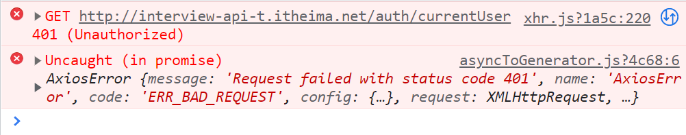


### 请求拦截器携带token

`utils/request.js`

```jsx
// 添加请求拦截器
request.interceptors.request.use(function (config) {
  // 在发送请求之前做些什么
  const { token } = store.state.user
  if (token) {
    config.headers.Authorization = `Bearer ${token}`
  }
  return config
}, function (error) {
  // 对请求错误做些什么
  return Promise.reject(error)
})
```


### 退出功能

退出操作

```jsx
handleConfirm () {
  this.$store.commit('user/logout')
  this.$router.push('/login')
}
```

提供mutation

```jsx
import { delToken, getToken, setToken } from '@/utils/storage'

export default {
  namespaced: true,
  state () {
    return {
      token: getToken()
    }
  },
  mutations: {
    ...,
    logout (state) {
      state.token = null
      delToken()
    }
  }
}
```


### 处理token过期

响应拦截器，处理token过期

```jsx
import router from '../router'

// 添加响应拦截器
request.interceptors.response.use(function (response) {
  // 对响应数据做点什么
  return response.data
}, function (error) {
  // 对响应错误做点什么  普通错误 + 401情况
  // console.dir(error)
  if (error.response) {
    if (error.response.status === 401) {
      // 给提示，清除无效token(vuex+本地)，拦到登录
      Message.error('尊敬的用户，当前登录状态已过期！')

      // 提交清除token的mutation
      store.commit('user/logout')

      // 跳转到登录
      router.push('/login')
    } else {
      // 给提示
      Message.error(error.response.data.message)
    }
  }
  return Promise.reject(error)
})
```


## 数据看板 (了解)

### 静态结构

`dashboard/index.vue`

```jsx
<template>
  <div class="dashboard-page">
    <el-breadcrumb separator-class="el-icon-arrow-right">
      <el-breadcrumb-item>面经后台</el-breadcrumb-item>
      <el-breadcrumb-item>数据看板</el-breadcrumb-item>
    </el-breadcrumb>
    <el-row :gutter="20">
      <el-col :span="6">
        <el-card style="height: 140px" shadow="never">
          <i class="el-icon-user"></i>
          <h5 class="tit">活跃用户</h5>
          <h2 class="num">802</h2>
          <p class="tag"><i>↑ 5.23%</i> 最近一个月</p>
        </el-card>
        <el-card style="height: 140px" shadow="never">
          <i class="el-icon-tickets"></i>
          <h5 class="tit">平均访问量</h5>
          <h2 class="num">1298</h2>
          <p class="tag"><i class="red">↓ 8.56%</i> 截止最近一周</p>
        </el-card>
        <el-card class="row" style="height: 180px" shadow="never">
          <h4>Enhance your Campaign for better outreach →</h4>
          
        </el-card>
      </el-col>
      <el-col :span="18">
        <el-card style="height: 504px" shadow="never">
          <div class="chart-box" style="height: 500px"></div>
        </el-card>
      </el-col>
      <el-col :span="8">
        <el-card style="height: 420px" shadow="never">
          <h4>性别分布情况</h4>
          
        </el-card>
      </el-col>
      <el-col :span="8">
        <el-card style="height: 420px" shadow="never">
          <h4>浏览访问情况</h4>
          
        </el-card>
      </el-col>
      <el-col :span="8">
        <el-card style="height: 420px" shadow="never">
          <h4>设备系统访问情况</h4>
          
        </el-card>
      </el-col>
    </el-row>
  </div>
</template>

<script>
export default {
  name: 'dashboard-page',
  data () {
    return {
      loading: true
    }
  },
  created () {},
  methods: {}
}
</script>

<style lang="scss" scoped>
.dashboard-page {
  .el-breadcrumb {
    margin-top: 10px;
    margin-bottom: 25px;
  }
  .el-card {
    margin-bottom: 20px;
    position: relative;
    &.row {
      h4 {
        width: 40%;
        float: left;
        font-size: 18px;
        margin-left: 5%;
      }
      img {
        width: 40%;
        float: left;
        margin-left: 10%;
        margin-top: 30px;
      }
    }
    [class^="el-icon"] {
      font-size: 30px;
      color: #ccc;
      position: absolute;
      right: 25px;
      top: 30px;
      font-weight: bold;
    }
    .tit {
      color: #6c757d;
      font-size: 14px;
      margin: 6px 0;
    }
    .num {
      color: #6c757d;
      font-size: 30px;
      margin: 6px 0;
    }
    .tag {
      color: #999;
      margin: 0;
      font-size: 14px;
      > i {
        font-style: normal;
        margin-right: 10px;
        color: rgb(10, 207, 151);
        &.red {
          color: #fa5c7c;
        }
      }
    }
    img {
      width: 100%;
      height: 100%;
    }
    h4 {
      margin: 0;
      padding-bottom: 20px;
      color: #6c757d;
    }
  }
}
</style>
```


### vue中echarts的使用

装包

```jsx
yarn add echarts
```

导入

```jsx
import * as echarts from 'echarts'
```

添加ref

```html
<div ref="box" class="chart-box" style="height: 500px"></div>
```

mounted初始化

```jsx
mounted () {
  const myChart = echarts.init(this.$refs.box)
  // 绘制图表
  myChart.setOption({
    title: {
      text: '职业方向访问热度'
    },
    tooltip: {},
    xAxis: {
      data: ['体育', '医疗', '科技', '电商', '土木', '金融']
    },
    yAxis: {},
    series: [
      {
        name: '人数',
        type: 'bar',
        data: [5, 20, 36, 10, 10, 26]
      }
    ]
  })
},
```


