# 面经 H5 端 - Vant（上）

接口文档地址：https://www.apifox.cn/apidoc/project-934563/api-20384515

## 项目创建目录初始化

### vue-cli 建项目 

安装脚手架 (已安装)

```
npm i @vue/cli -g
```

创建项目

```
vue create hm-vant-h5
```

+ 选项

```js
Vue CLI v5.0.8
? Please pick a preset:
  Default ([Vue 3] babel, eslint)
  Default ([Vue 2] babel, eslint)
> Manually select features     选自定义
```

+ 手动选择功能

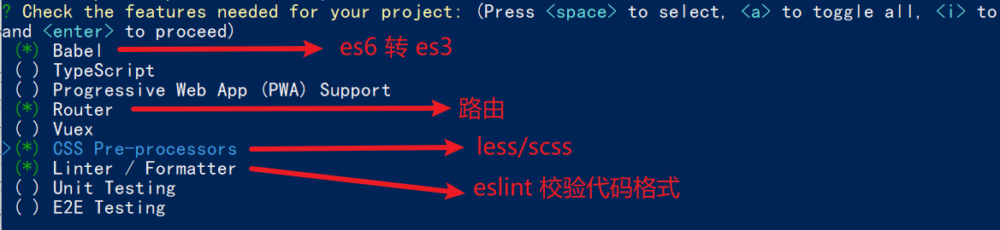

+ 选择vue的版本

```jsx
  3.x
> 2.x
```

+ 是否使用history模式

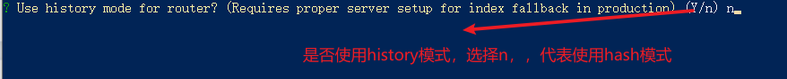

+ 选择css预处理

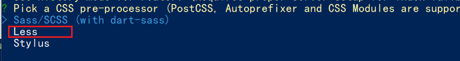

+ 选择eslint的风格 （eslint 代码规范的检验工具，检验代码是否符合规范）
+ 比如：const age = 18;   =>  报错！多加了分号！后面有工具，一保存，全部格式化成最规范的样子


+ 选择校验的时机 （直接回车）

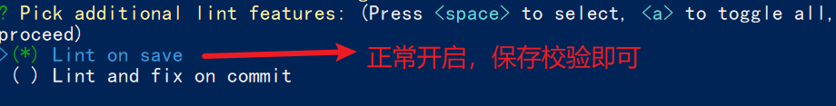

+ 选择配置文件的生成方式 （直接回车）


- 是否保存预设，下次直接使用？  =>   不保存，输入 N

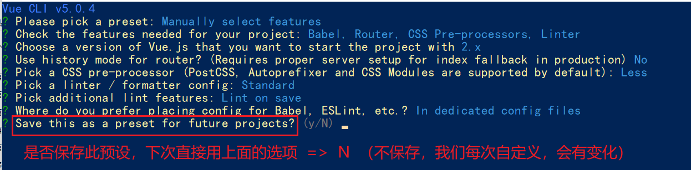

+ 等待安装，项目初始化完成

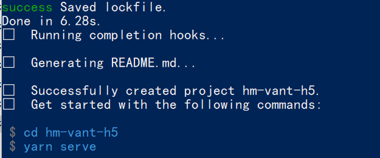

+ 启动项目

```
npm run serve
```


### ESlint代码规范

代码规范：一套写代码的约定规则。例如：赋值符号的左右是否需要空格？一句结束是否是要加;？... 

>  没有规矩不成方圆  

ESLint:是一个代码检查工具，用来检查你的代码是否符合指定的规则(你和你的团队可以自行约定一套规则)。在创建项目时，我们使用的是 [JavaScript Standard Style](https://standardjs.com/readme-zhcn.html) 代码风格的规则。

#### JavaScript Standard Style 规范说明

建议把：https://standardjs.com/rules-zhcn.html 看一遍，然后在写的时候,  遇到错误就查询解决。

下面是这份规则中的一小部分：

- *字符串使用单引号* – 需要转义的地方除外
- *无分号* – [这](http://blog.izs.me/post/2353458699/an-open-letter-to-javascript-leaders-regarding)[没什么不好。](http://inimino.org/~inimino/blog/javascript_semicolons)[不骗你！](https://www.youtube.com/watch?v=gsfbh17Ax9I)
- *关键字后加空格* `if (condition) { ... }`
- *函数名后加空格* `function name (arg) { ... }`
- 坚持使用全等 `===` 摒弃 `==` 一但在需要检查 `null || undefined` 时可以使用 `obj == null`
- ......

#### 代码规范错误

如果你的代码不符合standard的要求，eslint会跳出来刀子嘴，豆腐心地提示你。

下面我们在main.js中随意做一些改动：添加一些空行，空格。

```js
import Vue from 'vue'
import App from './App.vue'

import './styles/index.less'
import router from './router'
Vue.config.productionTip = false

new Vue ( {
  render: h => h(App),
  router
}).$mount('#app')


```

按下保存代码之后：

你将会看在控制台中输出如下错误：

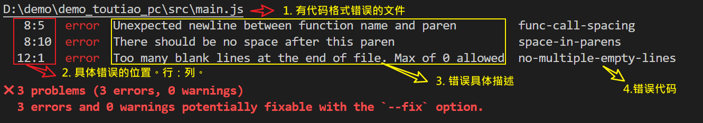

> eslint 是来帮助你的。心态要好，有错，就改。


#### 手动修正

根据错误提示来一项一项手动修正。

如果你不认识命令行中的语法报错是什么意思，你可以根据错误代码（func-call-spacing, space-in-parens,.....）去 ESLint 规则列表中查找其具体含义。

打开 [ESLint 规则表](https://cn.eslint.org/docs/rules/)，使用页面搜索（Ctrl + F）这个代码，查找对该规则的一个释义。


#### 通过vscode中的eslint插件来实现自动修正

> 1. eslint会自动高亮错误显示
> 2. 通过配置，eslint会自动帮助我们修复错误

+ 如何安装

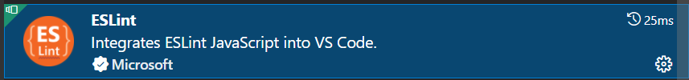

+ 如何配置

```js
// 当保存的时候，eslint自动帮我们修复错误
"editor.codeActionsOnSave": {
    "source.fixAll": true
},
// 保存代码，不自动格式化
"editor.formatOnSave": false
```

+ 注意：==eslint的配置文件必须在根目录下，这个插件才能才能生效。打开项目必须以根目录打开，一次打开一个项目==
+ 注意：==使用了eslint校验之后，把vscode带的那些格式化工具全禁用了 Beatify ==

settings.json 参考

```jsx
{
    "window.zoomLevel": 2,
    "workbench.iconTheme": "vscode-icons",
    "editor.tabSize": 2,
    "emmet.triggerExpansionOnTab": true,
    // 当保存的时候，eslint自动帮我们修复错误
    "editor.codeActionsOnSave": {
        "source.fixAll": true
    },
    // 保存代码，不自动格式化
    "editor.formatOnSave": false
}
```


### 调整初始化目录结构

> 强烈建议大家严格按照老师的步骤进行调整，为了符合企业规范

为了更好的实现后面的操作，我们把整体的目录结构做一些调整。

目标:

1. 删除初始化的一些默认文件
2. 修改没删除的文件
3. 新增我们需要的目录结构

#### 删除文件

- src/assets/logo.png
- src/components/HelloWorld.vue
- src/views/AboutView.vue
- src/views/HomeView.vue

#### 修改文件

`main.js` 不需要修改

`router/index.js`

删除默认的路由配置

```js
import Vue from 'vue'
import VueRouter from 'vue-router'

Vue.use(VueRouter)

const routes = [
]

const router = new VueRouter({
  routes
})

export default router

```

`App.vue`

```html
<template>
  <div id="app">
    <router-view/>
  </div>
</template>
```

#### 新增目录

- src/api 目录
  - 存储接口模块 (发送ajax请求接口的模块)
- src/utils 目录
  - 存储一些工具模块 (自己封装的方法)

目录效果如下:

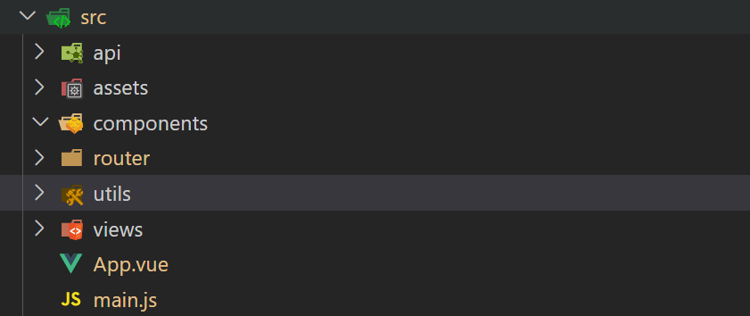


## vant 按需加载

### vant-ui组件库的引入

> 组件库：第三方封装好了很多很多的组件，整合到一起就是一个组件库。
>
> https://vant-contrib.gitee.io/vant/v2/#/zh-CN/

组件库并不是唯一的

pc:  element-ui     iview      **ant-design**

移动：vant-ui 

### 全部导入

+ 安装vant-ui

```
yarn add vant@latest-v2
```

+ 在main.js中

```js
import Vant from 'vant';
import 'vant/lib/index.css';
// 把vant中所有的组件都导入了
Vue.use(Vant)
```

- 即可使用

```jsx
<van-button type="primary">主要按钮</van-button>
<van-button type="info">信息按钮</van-button>
```

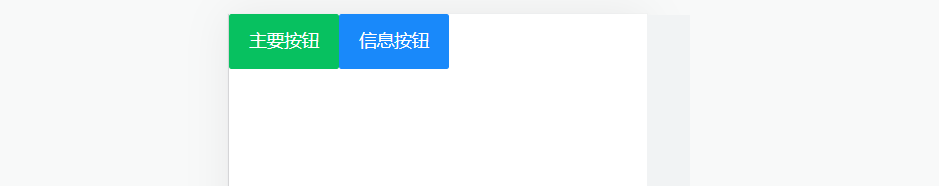

==vant-ui提供了很多的组件，全部导入，会导致项目打包变得很大。==


### 按需加载

+ 安装vant-ui

```
npm i vant@latest-v2  或  yarn add vant@latest-v2
```

+ 安装一个插件

```jsd
npm i babel-plugin-import -D
```

+ 在`babel.config.js`中配置

```js
module.exports = {
  presets: [
    '@vue/cli-plugin-babel/preset'
  ],
  plugins: [
    ['import', {
      libraryName: 'vant',
      libraryDirectory: 'es',
      style: true
    }, 'vant']
  ]
}
```

+ 按需加载，在`main.js`

```js
import { Button, Icon } from 'vant'

Vue.use(Button)
Vue.use(Icon)
```

+ main.js中引入

```jsx
import '@/utils/vant'
```

+ `app.vue`中进行测试

```js
<van-button type="primary">主要按钮</van-button>
<van-button type="info">信息按钮</van-button>
<van-button type="default">默认按钮</van-button>
<van-button type="warning">警告按钮</van-button>
<van-button type="danger">危险按钮</van-button>
```


## 项目中的vw适配

官方说明：https://vant-contrib.gitee.io/vant/v2/#/zh-CN/advanced-usage

```js
yarn add postcss-px-to-viewport@1.1.1 -D
```

+ 项目根目录， 新建postcss的配置文件`postcss.config.js`

```jsx
// postcss.config.js
module.exports = {
  plugins: {
    'postcss-px-to-viewport': {
      viewportWidth: 375,
    },
  },
};
```


## 路由设计配置

但凡是单个页面，独立展示的，都是一级路由

路由设计：

- 登录页 （一级） Login
- 注册页（一级） Register
- 文章详情页（一级） Detail
- 首页（一级） Layout
  - 面经（二级）Article
  - 收藏（二级）Collect
  - 喜欢（二级）Like
  - 我的（二级）My

### 一级路由

`router/index.js`配置一级路由,  一级views组件于教学资料中直接 CV 即可

```jsx
import Vue from 'vue'
import VueRouter from 'vue-router'
import Login from '@/views/Login'
import Register from '@/views/Register'
import Detail from '@/views/Detail'
import Layout from '@/views/Layout'
Vue.use(VueRouter)

const router = new VueRouter({
  routes: [
    { path: '/login', component: Login },
    { path: '/register', component: Register },
    { path: '/article/:id', component: Detail },
    {
      path: '/',
      component: Layout
    }
  ]
})

export default router
```

清理 `App.vue`

```jsx
<template>
  <div id="app">
    <router-view/>
  </div>
</template>

<script>
export default {
  async created () {

  }
}
</script>
```


### tabbar标签页

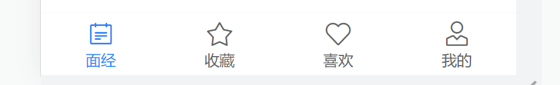

https://vant-contrib.gitee.io/vant/v2/#/zh-CN/tabbar

`vant-ui.js` 引入组件

```jsx
import { Button, Icon, Tabbar, TabbarItem } from 'vant'
Vue.use(Tabbar)
Vue.use(TabbarItem)
```

`layout.vue`

```jsx
<template>
  <div class="layout-page">
    首页架子 - 内容区域

    <van-tabbar>
      <van-tabbar-item icon="notes-o">面经</van-tabbar-item>
      <van-tabbar-item icon="star-o">收藏</van-tabbar-item>
      <van-tabbar-item icon="like-o">喜欢</van-tabbar-item>
      <van-tabbar-item icon="user-o">我的</van-tabbar-item>
    </van-tabbar>
  </div>
</template>
```


### 配置主题色

整体网站风格，其实都是橙色的，可以通过变量覆盖的方式，制定主题色

https://vant-contrib.gitee.io/vant/v2/#/zh-CN/theme

`babel.config.js` 制定样式路径

```jsx
module.exports = {
  presets: [
    '@vue/cli-plugin-babel/preset'
  ],
  plugins: [
    ['import', {
      libraryName: 'vant',
      libraryDirectory: 'es',
      // 指定样式路径
      style: (name) => `${name}/style/less`
    }, 'vant']
  ]
}
```

`vue.config.js` 覆盖变量

```jsx
const { defineConfig } = require('@vue/cli-service')
module.exports = defineConfig({
  transpileDependencies: true,
  css: {
    loaderOptions: {
      less: {
        lessOptions: {
          modifyVars: {
            // 直接覆盖变量
            'blue': '#FA6D1D',
          },
        },
      },
    },
  },
})
```

重启服务器生效！


### 二级路由

`router/index.js`配置二级路由

```jsx
import Vue from 'vue'
import VueRouter from 'vue-router'
import Login from '@/views/Login'
import Register from '@/views/Register'
import Detail from '@/views/Detail'
import Layout from '@/views/Layout'

import Like from '@/views/Like'
import Article from '@/views/Article'
import Collect from '@/views/Collect'
import User from '@/views/User'
Vue.use(VueRouter)

const router = new VueRouter({
  routes: [
    { path: '/login', component: Login },
    { path: '/register', component: Register },
    { path: '/article/:id', component: Detail },
    {
      path: '/',
      component: Layout,
      redirect: '/article',
      children: [
        { path: '/article', component: Article },
        { path: '/like', component: Like },
        { path: '/collect', component: Collect },
        { path: '/user', component: User }
      ]
    }
  ]
})

export default router
```

`layout.vue` 配置路由出口,  配置 tabbar

```jsx
<template>
  <div class="layout-page">
    <router-view></router-view>

    <van-tabbar route>
      <van-tabbar-item to="/article" icon="notes-o">面经</van-tabbar-item>
      <van-tabbar-item to="/collect" icon="star-o">收藏</van-tabbar-item>
      <van-tabbar-item to="/like" icon="like-o">喜欢</van-tabbar-item>
      <van-tabbar-item to="/user" icon="user-o">我的</van-tabbar-item>
    </van-tabbar>
  </div>
</template>
```


## 登录&注册功能

### 登录静态布局

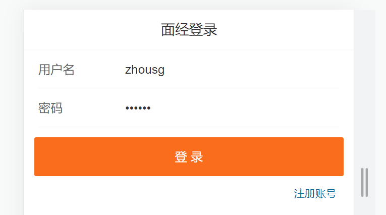

使用组件

- van-nav-bar
- van-form
- van-field
- van-button

`vant-ui.js` 注册

```jsx
import Vue from 'vue'
import {
  NavBar,
  Form,
  Field
} from 'vant'
Vue.use(NavBar)
Vue.use(Form)
Vue.use(Field)
```

`Login.vue` 使用

```jsx
<template>
  <div class="login-page">
    <!-- 导航栏部分 -->
    <van-nav-bar title="面经登录" />

    <!-- 一旦form表单提交了，就会触发submit，可以在submit事件中
         根据拿到的表单提交信息，发送axios请求
     -->
    <van-form @submit="onSubmit">
      <!-- 输入框组件 -->
      <!-- \w 字母数字_   \d 数字0-9 -->
      <van-field
        v-model="username"
        name="username"
        label="用户名"
        placeholder="用户名"
        :rules="[
          { required: true, message: '请填写用户名' },
          { pattern: /^\w{5,}$/, message: '用户名至少包含5个字符' }
        ]"
      />
      <van-field
        v-model="password"
        type="password"
        name="password"
        label="密码"
        placeholder="密码"
        :rules="[
          { required: true, message: '请填写密码' },
          { pattern: /^\w{6,}$/, message: '密码至少包含6个字符' }
        ]"
      />
      <div style="margin: 16px">
        <van-button block type="info" native-type="submit">提交</van-button>
      </div>
    </van-form>
  </div>
</template>

<script>
export default {
  name: 'LoginPage',
  data () {
    return {
      username: 'zhousg',
      password: '123456'
    }
  },
  methods: {
    onSubmit (values) {
      console.log('submit', values)
    }
  }
}
</script>
```

`login.vue`添加 router-link 标签（跳转到注册）

```vue
<template>
  <div class="login-page">
    <van-nav-bar title="面经登录" />

    <van-form @submit="onSubmit">
      ...
    </van-form>
    
    <router-link class="link" to="/register">注册账号</router-link>
  </div>
</template>
```

`login.vue`调整样式

```jsx
<style lang="less" scoped>
.link {
  color: #069;
  font-size: 12px;
  padding-right: 20px;
  float: right;
}
</style>
```


### 注册静态布局

`Register.vue`

```jsx
<template>
  <div class="login-page">
    <van-nav-bar title="面经注册" />

    <van-form @submit="onSubmit">
      <van-field
        v-model="username"
        name="username"
        label="用户名"
        placeholder="用户名"
        :rules="[{ required: true, message: '请填写用户名' }]"
      />
      <van-field
        v-model="password"
        type="password"
        name="password"
        label="密码"
        placeholder="密码"
        :rules="[{ required: true, message: '请填写密码' }]"
      />
      <div style="margin: 16px">
        <van-button block type="primary" native-type="submit"
          >注册</van-button
        >
      </div>
    </van-form>
    <router-link class="link" to="/login">有账号，去登录</router-link>
  </div>
</template>

<script>
export default {
  name: 'Register-Page',
  data () {
    return {
      username: '',
      password: ''
    }
  },
  methods: {
    onSubmit (values) {
      console.log('submit', values)
    }
  }
}
</script>

<style lang="less" scoped>
.link {
  color: #069;
  font-size: 12px;
  padding-right: 20px;
  float: right;
}
</style>
```


### request模块 - axios封装

接口文档地址：http://interview-api-t.itheima.net/swagger-ui/index.html#/

我们会使用 axios 来请求后端接口, 一般都会对 axios 进行一些配置 (比如: 配置基础地址等)

一般项目开发中, 都会对 axios 进行基本的二次封装, 单独封装到一个模块中, 便于使用

1. 安装 axios

```
npm i axios
```

2. 新建 `utils/request.js` 封装 axios 模块

   利用 axios.create 创建一个自定义的 axios 来使用

   http://www.axios-js.com/zh-cn/docs/#axios-create-config

```js
/* 封装axios用于发送请求 */
import axios from 'axios'

// 创建一个新的axios实例
const request = axios.create({
  baseURL: 'http://interview-api-t.itheima.net/h5/',
  timeout: 5000
})

// 添加请求拦截器
request.interceptors.request.use(function (config) {
  // 在发送请求之前做些什么
  return config
}, function (error) {
  // 对请求错误做些什么
  return Promise.reject(error)
})

// 添加响应拦截器
request.interceptors.response.use(function (response) {
  // 对响应数据做点什么
  return response.data
}, function (error) {
  // 对响应错误做点什么
  return Promise.reject(error)
})

export default request
```

3. 注册测试

```js
// 监听表单的提交，形参中：可以获取到输入框的值
async onSubmit (values) {
  console.log('submit', values)
  const res = await request.post('/user/register', values)
  console.log(res)
}
```


### 封装api接口 - 注册功能

新建 `api/user.js` 提供注册 Api 函数

```jsx
import request from '@/utils/request'

// 注册接口
export const register = (data) => {
  return request.post('/user/register', data)
}
```

`register.vue`页面中调用测试

```jsx
methods: {
  async onSubmit (values) {
    // 往后台发送注册请求了
    await register(values)
    alert('注册成功')
    this.$router.push('/login')
  }
}
```


### toast 轻提示

https://vant-contrib.gitee.io/vant/v2/#/zh-CN/toast

```jsx
import { Toast } from 'vant';
Vue.use(Toast)
```

两种使用方式

1. 导入，调用

```jsx
import { Toast } from 'vant';
Toast('提示内容');
```

2. **组件内 **通过this直接调用

```jsx
this.$toast('提示内容')
```

响应拦截器统一处理错误提示

```jsx
import { Toast } from 'vant'

...

// 添加响应拦截器
request.interceptors.response.use(function (response) {
  // 对响应数据做点什么
  return response.data
}, function (error) {
  if (error.response) {
    // 有错误响应, 提示错误提示
    Toast(error.response.data.message)
  }
  // 对响应错误做点什么
  return Promise.reject(error)
})
```


### 封装api接口 - 登录功能

`api/user.js` 提供登录 Api 函数

```jsx
// 登录接口
export const login = (data) => {
  return request.post('/user/login', data)
}
```

`login.vue` 登录功能

```jsx
import { login } from '@/api/user'

methods: {
  async onSubmit (values) {
    const { data } = await login(values)
    this.$toast.success('登录成功')
    this.$router.push('/')
  }
}
```

### local模块 - 本地存储

新建 utils/storage.js

```jsx
const KEY = 'vant-mobile-exp-token'

// 直接用按需导出，可以导出多个
// 获取
export const getToken = () => {
  return localStorage.getItem(KEY)
}

// 设置
export const setToken = (newToken) => {
  localStorage.setItem(KEY, newToken)
}

// 删除
export const delToken = () => {
  localStorage.removeItem(KEY)
}

```

登录完成存储token到本地

```jsx
import { login } from '@/api/user'
import { setToken } from '@/utils/storage'

methods: {
  async onSubmit (values) {
    const { data } = await login(values)
    setToken(data.token)
    this.$toast.success('登录成功')
    this.$router.push('/')
  }
}
```
