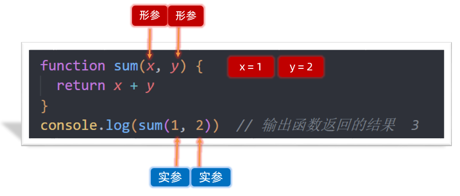
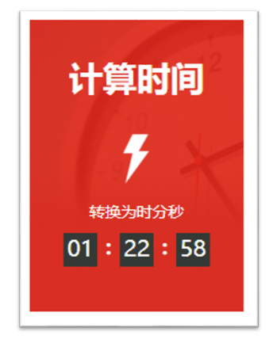

# JavaScript 基础 - 第4天笔记

> 理解封装的意义，能够通过函数的声明实现逻辑的封装，知道对象数据类型的特征，结合数学对象实现简单计算功能。

- 函数
- 综合案例

## 函数

> 理解函数的封装特性，掌握函数的语法规则

### 函数的基本使用

**函数:** 是可以被重复使用的代码块

**作用：**函数可以把具有相同或相似逻辑的代码“包裹”起来，这么做的优势是有利于代码复用

#### 声明（定义）函数

声明（定义）一个完整函数包括关键字、函数名、形式参数、函数体、返回值5个部分

利用关键字 function 定义函数 （声明函数）

语法：

~~~javascript
<script>

// 函数： 是可以被重复使用的代码块，作用是有利于代码复用
// 1. 声明（定义）了最简单的函数，既没有形式参数，也没有返回值
function sayHi() {
console.log('嗨~')
}
~~~

注意：

1. 函数名命名跟变量一致，采用`小驼峰`命名法
2. 函数名经常采用 动词

#### 调用

声明（定义）的函数必须调用才会真正被执行，使用 `()` 调用函数。

```html
<!DOCTYPE html>
<html lang="en">
<head>
  <meta charset="UTF-8">
  <title>JavaScript 基础 - 声明和调用</title>
</head>
<body>
  <script>
    // 声明（定义）了最简单的函数，既没有形式参数，也没有返回值
    function sayHi() {
      console.log('嗨~')
    }
    // 函数调用，这些函数体内的代码逻辑会被执行
    // 函数名()
        
    sayHi()
    // 可以重复被调用，多少次都可以
    sayHi()
  </script>
</body>
</html>
```

> 注：函数名的命名规则与变量是一致的，并且尽量保证函数名的语义。


### 函数的整体认知


**语法：**

~~~javascript
function sum(参数1, 参数2...) {
    return 结果
}
console.log(sum(1, 2))  // 输出函数返回的结果

~~~

**说明：**

1. 函数参数，如果有多个则用逗号分隔，用于接受传递过来的数据
2. return 关键字可以把结果返回给调用者

###  函数参数

通过向函数传递参数，可以让函数更加灵活多变



**形参：**声明函数时小括号里的叫形参（形式上的参数）

**实参：**调用函数时小括号里的叫实参（实际上的参数）

**执行过程：** 会把实参的数据传递给形参，从而提供给函数内部使用，我们可以把形参理解为变量

我们曾经使用过的 alert('打印')，parseInt('11px')，Number('11')本质上都是函数调用的传参

```html
<script>
  // 函数的参数  形参和实参个数不匹配

  // 1. 形参个数过多， 会自动补充 undefined 
  function sum(x, y) {  // 形参 
    return x + y
  }
  console.log(sum(1, 2))  // 实参   3
  console.log(sum(1))  // 实参  NaN  x = 1  y 没有给值默认值是 undefined
  //  1 + undefined  = NaN

  // 2. 实参个数过多，则多余的实参会被忽略
  console.log(sum(1, 2, 3)) // 实参 3

  // 3. 开发中提倡要保证实参和形参个数统一
</script>
```

在Javascript中 实参的个数和形参的个数可以不一致

- 如果形参过多 会自动填上undefined 
- 如果实参过多 那么多余的实参会被忽略 

### 逻辑中断

逻辑中断： 存在于逻辑运算符 && 和 || 中，左边如果满足一定条件会中断代码执行，也称为逻辑短路

>false && anything    // 逻辑与左边false则中断，如果左边为true，则返回右边代码的值
>
>true || anything       // 逻辑或左边true则中断，如果左边为false，则返回右边代码的值

~~~javascript
<script>
// 逻辑中断   && ||

// 1. 逻辑与中断：如果左边为假，则中断，如果左边为真，则返回右边的值
console.log(false && 1 + 2)  // false
console.log(0 && 1 + 2)  // 0
console.log('' && 1 + 2)  // ''
console.log(undefined && 1 + 2)  // undefined
console.log(true && 1 + 2)  // 3 此处不会发生逻辑中断
console.log(1 && 1 + 2)  // 3 此处不会发生逻辑中断

// 2. 逻辑或中断，如果左侧为真，则中断，如果左侧为假，则返回右边的值
console.log(true || 1 + 2) // true  发生了中断
console.log(1 || 1 + 2) // 1  发生了中断
console.log(false || 1 + 2) // 3 此处不会发生逻辑中断

// 3. 使用场景
// function sum(x, y) {
//   return x + y
// }
// console.log(sum(1, 2)) // 3
// console.log(sum()) // NaN

function sum(x, y) {   // x = undefined
  //  x = undefined || 0
  // x = 1 || 0
  x = x || 0
  y = y || 0
  return x + y
}
console.log(sum())  // 0
console.log(sum(1, 2)) // 3
</script>
~~~

### 函数默认参数

默认参数：可以给形参设置默认值

> 说明：这个默认值只会在缺少实参传递或者实参是undefined才会被执行

**默认参数和逻辑中断使用场景区别：**

1. 默认参数主要处理函数形参（处理参数要比逻辑中断更简单）
2. 逻辑中断除了参数还可以处理更多的需求

~~~javascript
<script>
  // 默认参数: 给形参一个默认值
  // 1. 默认参数里面的值执行：
  // 1.1 没有实参传递过来 x = 0 
  // 1.2 有实参传递但是传递的是undefined  x = 0
  function sum(x = 0, y = 0) {
  return x + y
	}
  console.log(sum()) // 0
  console.log(sum(undefined, undefined))  // 0
  console.log(sum(1, 2))  // 3

  // 2. 默认参数和逻辑中断使用场景的区别：
  // 2.1 默认参数主要针对的是形参
  // 2.2 逻辑中断除了处理参数之外，还可以做更多
</script>
~~~


### 函数返回值

函数的本质是封装（包裹），函数体内的逻辑执行完毕后，函数外部如何获得函数内部的执行结果呢？

要想获得函数内部逻辑的执行结果，需要通过 `return` 这个关键字，将内部执行结果传递到函数外部，这个被传递到外部的结果就是返回值。

>  返回值：把处理结果返回给调用者

```html
<script>
    // 函数返回值细节
    // 1. return 结束函数，return 后面的代码不会执行了， break退出循环或者switch
    // function sum(x, y) {
    //   return x + y
    //   console.log('我不会执行')
    // }
    // console.log(sum(1, 3))

    // 2. return 和被返回的结果不要换行
    // function sum(x, y) {
    //   return
    //   x + y
    // }
    // console.log(sum(1, 3))

    // 3. 如果函数没有return 则默认返回的是 undefined
    function fn() {

    }
    console.log(fn())  // undefined
  </script>
```

总结：

1. return会立即结束当前函数，所以后面代码不会再被执行
2. 在 return 关键字和被返回的表达式之间不允许使用换行符，否则内部执行相当于会自动补充分号
3. 函数可以没有 return，这种情况函数默认返回值为 undefined

### 作用域

**作用域（scope）**： 变量或者值在代码中可用性的范围

**作用：**作用域的使用提高了程序逻辑的局部性，增强了程序的可靠性，减少了名字冲突。

#### 全局作用域

作用于所有代码执行的环境(整个 script 标签内部)或者一个独立的 js 文件

处于全局作用域内的变量，称为全局变量

#### 局部作用域

1. 函数作用域。作用于函数内的代码环境
2. 块级作用域。{ } 大括号内部

处于局部作用域内的变量称为局部变量

>注意：
>
>1. 如果函数内部，变量没有声明，直接赋值，也当全局变量看，但是强烈不推荐
>2. 但是有一种情况，函数内部的形参可以看做是局部变量。

#### 变量的访问原则

访问原则：在能够访问到的情况下先局部，局部没有再找全局，总结： `就近原则`

### 匿名函数

函数可以分为具名函数和匿名函数

匿名函数：没有名字的函数,无法直接使用。

#### 函数表达式

将匿名函数赋值给一个变量，并且通过变量名称进行调用 我们将这个称为函数表达式

~~~javascript
// 声明
let fn = function() { 
   console.log('函数表达式')
}
// 调用
fn()
~~~

总结：

1. 其实函数也是一种数据类型
2. 函数表达式必须先定义，后使用
3. 函数的形参和实参使用跟具名函数一致

#### 立即执行函数

IIFE (立即执行函数表达式) (Immediately Invoked Function Expression)

**场景介绍:** 避免全局变量之间的污染

**注意：**多个立即执行函数要用 ; 隔开，要不然会报错

~~~javascript
(function(){ xxx  })();
(function(){xxxx}());
~~~

## 综合案例



需求：用户输入秒数，可以自动转换为时分秒

分析：

①：用户弹窗输入 总秒数 

②：封装函数 getTime, 计算时分秒，注意：里面包含数字补0

③：打印输出

计算公式：计算时分秒

小时：  h =  parseInt(总秒数 / 60 / 60 %24)

分钟：  m = parseInt(总秒数 / 60 % 60 )

秒数:     s  = parseInt(总秒数 % 60) 

完整代码：

~~~html

<!DOCTYPE html>
<html lang="en">

<head>
  <meta charset="UTF-8">
  <meta http-equiv="X-UA-Compatible" content="IE=edge">
  <meta name="viewport" content="width=device-width, initial-scale=1.0">
  <title>综合案例-转换时间案例</title>
  <style>
    .box {
      position: relative;
      width: 190px;
      height: 260px;
      color: #fff;
      background: #e83632 url(./images/bg.png) 50%/contain no-repeat;
    }

    .title {
      width: 100%;
      text-align: center;
      font-size: 30px;
      font-weight: 700;
      padding-top: 31px;
    }

    .count {
      margin-top: 90px;
      font-size: 14px;
      text-align: center;
    }

    .timer {
      margin-left: auto;
      margin-right: auto;
      width: 130px;
      height: 30px;
      margin-top: 10px;
      display: block;
    }

    .timer span {
      position: relative;
      float: left;
      width: 30px;
      height: 30px;
      text-align: center;
      background-color: #2f3430;
      margin-right: 20px;
      color: white;
      font-size: 20px;
    }

    .timer span:nth-child(-n+2)::after {
      content: ":";
      display: block;
      position: absolute;
      right: -20px;
      font-weight: bolder;
      font-size: 18px;
      width: 20px;
      height: 100%;
      top: 0;
    }

    .timer span:last-child {
      margin-right: 0;
    }
  </style>
</head>

<body>
  <!-- <div class="box">
    <div class="title">计算时间</div>
    <div>
      <div class="count">转换为时分秒</div>
      <div class="timer">
        <span class="hour">01</span>
        <span class="minute">22</span>
        <span class="second">58</span>
      </div>
    </div>
  </div> -->

  <script>
    // 转换时分秒案例 
    // 计算公式：计算时分秒
    // 小时：  h = parseInt(总秒数 / 60 / 60 % 24)
    // 分钟：  m = parseInt(总秒数 / 60 % 60)
    // 秒数:   s = parseInt(总秒数 % 60) 

    // 1. 用户输入总的秒数
    let totalSeconds = +prompt('请您输入总的秒数:')

    // 2. 封装函数 getTime，把总的秒数转换为时分秒，注意记得数字补0 哦
    function getTime(t = 0) {
      // 转换小时
      let h = parseInt(t / 60 / 60 % 24)
      // 转换分钟
      let m = parseInt(t / 60 % 60)
      // 转换秒数
      let s = parseInt(t % 60)
      // 数字补0
      h = h < 10 ? '0' + h : h
      m = m < 10 ? '0' + m : m
      s = s < 10 ? '0' + s : s
      console.log(h, m, s)
      return `
        <span class="hour">${h}</span>
        <span class="minute">${m}</span>
        <span class="second">${s}</span>
      `
    }
    let str = getTime(totalSeconds) // 实参
    console.log(str)
    // 3. 页面打印输出
    document.write(`
       <div class="box">
        <div class="title">计算时间</div>
        <div>
          <div class="count">转换为时分秒</div>
          <div class="timer">
            ${str}
          </div>
        </div>
      </div>
    `)
  </script>
</body>

</html>
~~~


​		在能够访问到的情况下 先局部 局部没有在找全局