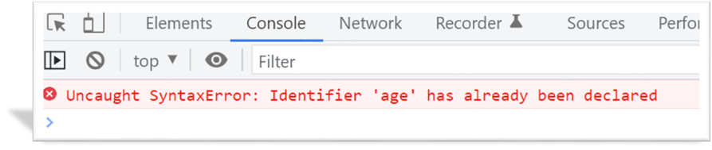

# 一、每日作业-JavaScript第01天

## 客观题

1. 下列定义的变量名中，不合法的是 ()
    A： 2age
    B： newClass
    C： userName
    D： _age

2. 下列有关字符串变量定义正确的是（） 可以多选~~~  
   A： let strMsg = "我爱北京天安门"
   B： let  strMsg2 = '我爱吃猪蹄'
   C： let  strMsg3 = 我爱大肘子
   D： let  strMsg4 = '我是'高帅富'程序猿'

3. 下面那些是字面量？（） 可以多选
   A:  123
   B:  '大肘子'
   C:  ture    
   D:   []

5. 下面不属于JavaScript数据类型的是？ ( )
   A、number
   B、string
   C、boolean
   D、int
   E、undefined

6. 在js代码中，'123'+ 4 的运行结果是
   A:127
   B:'1234'  字符串型
   C:1234 数字型
   D:'123'4

7. 请问模板字符串使用哪种字符串来做？（）
   A: 单引号  '' 
   B: 双引号 ""
   C: 反引号  ``
   D: 都是可以的

8. 下列有关javascript变量命名说法错误的是
   A:变量名不能是关键字比如 let 、var、if 等
   B: 变量名是区分大小写的
   C:变量名可以由数字、字母、下划线、$组成，可以以数字开头
   D:变量名建议使用驼峰命名法

9. 在算术运算符中，如果计算错误返回的结果是？（）
   A:    1
   B： 报错
   C： NaN
   D： undefined

10. 比较运算符中，关于 == 和 === 说法正确的是？（）
    A:    == 和 === 都是判断相等所以没有什么区别
    B： == 是判断值和数据类型都要相等
    C： === 是判断值相等即可
    D： 开发中，我们更提倡使用 === 来判断左右是否相等

11. 下面关于逻辑运算符计算正确的是？（）
    A:   console.log(true && false)   // 结果是 true
    B：console.log(3>5 && 2<1)   // 结果是 false
    C： console.log(3>5  ||  2<1)   // 结果是 true
    D： console.log(!true)   // 结果是 true

12. 下面关于优先级最高的是？（）
    A:   *
    B：&&
    C：！
    D：>=

13. 下列代码输出的结果是？（）
    
    ```javascript
    console.log(1 > 2)
    console.log(2 >= 2)
    console.log(2 <= 2)
    console.log(2 == '2')
    console.log(2 === '2')
    ```
    
    A： false  true  true  true  false
     B： false  true  true  false  false
     C： false  true  true  true  true 
     D： false  false  false  true false

## 今日单词

1.今日单词1： 请问页面文档输出的语句是？

A:prompt()

B:alert()

C: document.write()

D:console.log()

2.今日单词2： 请问控制台打印输出的语句是？

A:prompt()

B:alert()

C:document.write()

D:console.log()

3.今日单词3： 请问页面弹出警示框语句是？

A:prompt()

B: alert()

C: document.write()

D:console.log()

4.今日单词4： 请问页面弹出对话框语句是？

A: prompt()

B: alert()

C: document.write()

D: console.log()

6.今日单词5： 请问检测数据类型的语句是？

A:type

B:Number()

C:typeof

D: script

7. 今日单词6： 请问定义常量的关键字是？（）

A: let

B: var

C:const

D: function

8. 今日单词7： 请问空类型是哪个关键字？（）

A: null

B: undefined

C: boolean

D: string

9. 今日单词8： 请问未定义数据类型是哪个关键字？（）

A: null

B: undefined

C: boolean

D: string

## 简答题

1. 请说出变量的使用场景？

```

```

2. 请说出基本数据类型有哪5种？

```

```

3. 请说出模板字符串使用方法？

```

```

4. 如果出现这个报错提示会是什么原因引起的？ 
    

```html

```

5. 如果出现这个报错提示会是什么原因引起的？ 



```html

```


## 排错题

### 排错题1

```javascript
<!-- bug:请你修改下面的变量找到bug,让变量里面保存的值正常输出 -->

<body>
  <script>
    let let = 100
    let username = '张三'
    let 123abc = '123abc'


    const age = 100
    age = 200
    console.log(age)
    </script>
</body>
```

### 排错题2

```javascript
<body>
  <script>
    // 下面代码变量不能正常输出原因是什么？
    let age = 18
    document.write('我的年龄是:${age}')
  </script>
</body>
```


## 主观题

### 获取用户信息

- 题目描述
  依次询问并获取用户的姓名、年龄、性别，收集数据之后在控制台依次打印出来。
  具体表现如下图：


- 题目提示
  - 通过prompt来弹出提示框，收集用户信息
  - 通过变量保存数据

### 增加年龄

- 题目描述
  1、询问用户年龄，用户输入年龄后，把用户输入的年龄增加5岁
  2、增加5岁后，通过弹出框提示用户 “ 据我估计，五年后，你可能XX岁了”
  
  
  
  

- 题目提示
  
  - 通过prompt来弹出提示框，收集用户信息
  - 通过变量保存数据
  - 转换数据类型(需要预习第二天的数据类型转换哟)

###  计算银行卡余额案例

- 题目描述
  1、用户输入总的银行卡金额，依次输入本月花费的电费，水费，网费。
  2、页面打印一个表格，计算出本月银行卡还剩下的余额。
  
  

- 题目提示
  
  - 思路：
    1.我们需要5个变量：银行卡总额、水费、电费、网费、银行卡余额
    2.银行卡余额= 银行卡总额 – 水费 –电费  - 网费  
    3.第一步准备5个变量接受输入的数据
    4.第二步计算银行卡余额 
    5.第三步页面打印生成表格，里面填充数据即可。
    6.当然可以提前把html页面搭好。

23123
