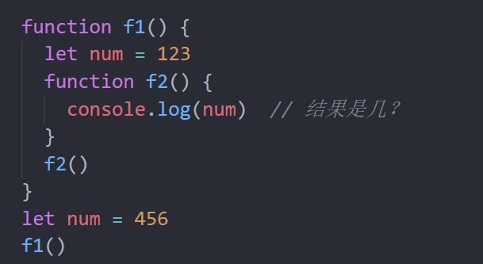

# JavaScript基础第四天作业

## 客观题

1. 在JavaScript中，下列有关于自定义函数的说法错误的是（ B )

   A： 自定义函数的关键字是“function”

   B： 自定义函数必须带有参数

   C： 自定义函数被调用时接受的参数可以是常量、变量或其他表达式

   D： 自定义函数返回结果的关键字是“return”

2. 有以下代码运行的结果是？( A )

   ~~~javascript
   function fn(num1,num2){
       return num1 + num2
   }
   alert(fn(10,20,30))
   ~~~

    A： 30

    B： 60

    C： undefined

    D： null

3. 下列关于函数的参数 描述正确的是( ABC )

    A： 形参表示形式上的参数 不是一个具体的值

    B： 函数的参数我们可以划分为形参和实参

    C： 实参就是函数调用时传入小括号内的真实数据

    D： 形参和实参的个数一定要匹配,否则一定会报错

4. 下列关于逻辑中断说法错误的是？（ D ）

    A： 逻辑中断只存在于逻辑运算符 && 和 || 中

    B： 左边如果满足一定条件会中断代码执行，也称为逻辑短路

    C： 逻辑与左边false则中断，如果左边为true，则返回右边代码的值

    D：逻辑或右边true则中断，如果右边为false，则返回左边代码的值

5. 求以下运算的结果是？( C )

   ~~~javascript
   <script>
     console.log(true && 3 + 5)
   	console.log(0 && 3 + 5)
   	console.log(null || 3 + 5)
   	console.log(3 || undefined)  
   </script>
   ~~~

    A： true   0   8   3

    B： 8 0   null   3

    C： 8 0 8 3

    D：true  0   null   3

6. 下列关于函数的描述中，错误的是( C )

    A： 函数可以返回一个值

    B： 数可以没有参数

    C： 定义函数时需要返回类型

    D： 函数可以没有return关键字

7. 下列关于函数的描述中，错误的是( C )

    A： 函数封装了一段可以被重复执行的代码块

    B： 通过函数的封装 我们可以大量的复用封装好的功能

    C： 函数让我们的代码更加复杂化

    D： 函数能够多次调用

8. 关于JavaScript的作用域，下列描述错误的是（ C）×    D

    A： 根据作用域的不同，我们可以把变量分为全局变量和局部变量

    B： 函数的形参也可以看做是局部变量，局部变量只能在函数内部使用

    C： 全局变量在浏览器关闭时才会被销毁，局部变量在代码块运行结束后就会被销毁

    D： 在函数内部没有声明直接赋值的变量也属于局部变量

9. 下面关于函数的返回值，描述正确的是：( C )

    A： 任何函数必须要有return返回值

    B： 函数中可以使用break来结束函数的执行

    C： 函数中return后面的语句不再执行

    D： 函数可以使用多个return返回多个值

10. 下面关于函数的返回值，描述错误的是：( A )

     A： 任何函数必须要有return返回值

     B： 如果函数没有返回值，那么这个函数的调用结果是undefined

     C： 通过return可以给函数指定返回值

     D： return可以直接使用，表示函数的结束

11. 下列的函数声明中，正确的是：( B )

     A： Function add(){}

     B： function class(){}

     C： function fn(1,2){}

     D： function fn(a,b){}

12. 下面关于立即执行函数说法错误是:( D )

		 A： 立即执行函数之间必须用分号间隔开

		 B： 立即执行函数的作用是为了减少变量名冲突
		
		 C： 立即执行函数可以添加函数名
		
		 D： 立即执行函数使用非常少，推荐尽量不用

13. 下列关于函数表达式说法错误的是？（ D ）

      A： 将匿名函数赋值给一个变量，并且通过变量名称进行调用，称为函数表达式

		 B： 函数表达式必须先定义，后使用
		
		 C： 函数表达式的形参和实参使用跟具名函数一致
		
		 D： 函数表达式就是普通函数的简写方式，并无不同

14. 求以下函数运算的结果( C )

    ~~~javascript
    function fn(){
    	console.log(100)
    }
    console.log(fn())  
    ~~~

		A： 报错
		
		B： 100 100
		
		C： 100 undefined
		
		D： undefined undefined

15. 以下代码运行后 结果为( B )

    ~~~javascript
    fn(1)
    let fn = function(a) {
      alert(a)
    }
    ~~~

     A： 1

     B： 程序报错

     C： alert(1)

     D： undefined

16. 请问以下代码是几？( A )

 

 A： 123

 B： Uncaught ReferenceError: num is not defined

 C： undefined

 D： 456

## 主观题

### 练习题1： 

请看以下代码，并说出执行的流程~~~

```javascript
function printfInput(content) { 
    // 将用户输入的内容, 在页面中显示
    document.write(content)
}
let constr = prompt('请输入内容')
printfInput(constr)
```

### 练习题2：

**目标：**求和函数封装练习

**要求:**

1. 封装函数, 名字为sum
2. 功能: 根据传入的两个数,求和并且返回求和的结果（函数必须有return返回值）


### 练习题3：

**目的:**  封装函数, 复习函数的基本写法。

**需求：**实现两个数的值交换(函数版本)  

**分析:**

1. 函数名为 changeNum()
2. 调用函数时,  `changeNum(1，2)`
3. 经过函数内部处理后,输出  `第一个值的结果是2  第二个值的结果是1`
4. 可以多调用两次


### 练习题4：

**目的:** 复习函数的声明与调用

**题目：**封装余额函数

**要求:**

1. 运行程序后, 浏览器显示输入确认框(prompt)
2. 第一个输入确认框提示输入银行卡余额
3. 第二个输入确认框提示输入当月食宿消费金额
4. 第三个输入确认框提示输入当月生活消费金额
5. 输入完毕后,在页面中显示银行卡剩余金额
6. 提示: 所有功能代码封装在函数内部（函数需要把余额返回）


### 综合案例变形题:

**目标：** 封装一个函数,可以求任意数组的和 或 平均值

**要求：**

- 函数可以传递2个参数，比如  handleData(arr, true)      `handleData 处理数据的意思`
  - 参数一： 接受实参传递过来的数组
  - 参数二:    布尔类型  如果是true或者不传递参数 是求和操作，   如果传递过来的参数是 false 则是求平均值


### 拓展题

**目标：** 封装一个 every 函数， 用于检测数组所有元素是否都满足条件。

**需求：**检测数组里面的所有元素是否都大于10，如果满足则返回true， 如果不满足则返回 false

例如：

```html
<script>
  function every(ele, arr = []) {
      // 内部处理   
      let re = true
      for(let i = 0;i < arr.length; i++){
         if(arr[i] < 10){
             re = false 
             break
         }
          return re
      }
  }
  console.log(every(10, [10, 20, 30]))   // true
  console.log(every(10, [10, 3, 30]))   // false
</script>
```


## 排错题

### 排错题1

~~~html
<!-- bug:请你找到代码返回NaN的原因,并进行修改 -->
<body>
  <script>
    // 请返回一个数字型的结果 可以使用默认参数或者逻辑中断都可以
    function fn(x, y) {
       // x = x || 0
       // y = y || 0
      console.log(x + y)
    }
    fn(1)
  </script>
</body>

~~~

### 排错题2

~~~html
<!-- bug:请你找到下面代码的2处错误,并进行修改过来-->
<body>
  <script>
    // 任意数组求和案例
    function getsumArr(arr) {
      let sum = 0
      for (let i = 0; i < arr.legnth; i++) {  // for (let i = 0; i < arr.length; i++) {
        sum + arr[i]                         // sum += arr[i]
      }
      return sum
    }
    console.log(getsumArr([10, 20, 30, 40]))
  </script>
</body>
~~~

### 排错题3

~~~html
<!-- bug:请你找到下面代码的2处错误,并进行修改过来-->
<script>
  // 封装函数查看数组是否存在某个元素  ['苹果', '香蕉', '橘子', '荔枝', '梨子']
	 function some(ele, arr = []) {
      let flag = false
      for (let i = 0; i < arr.length; i++) {
        if (ele === i) {      // if (ele === arr[i]) {
          flag = true
          break
        }
      }
      return false       // return flag
    }
    let re = some('荔枝', ['苹果', '香蕉', '橘子', '荔枝', '梨子'])
</script>
~~~

### 排错题4

~~~html
<body>
  <script>
    //  分析下列代码打印结果
    let num = 1
    console.log(num)  //?   //1
    function fn(a) {
      console.log(num)  //?   //3
      num = 2
      console.log(num)  //?   //2
    }
    num = 3
    console.log(num)  //?   //3
    fn(num)
    console.log(num)  //?   //2
  </script>
</body>
~~~


