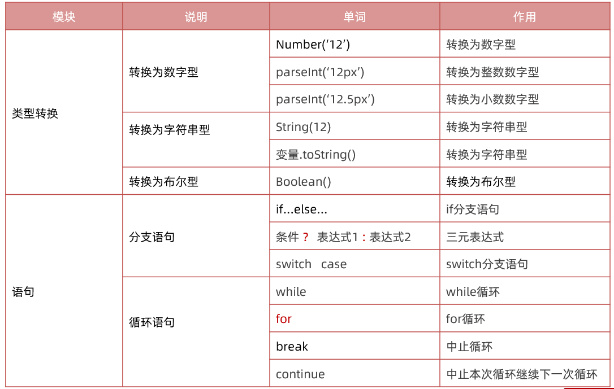
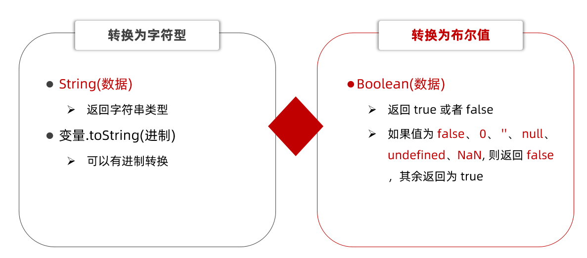
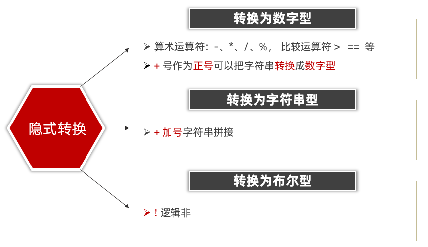
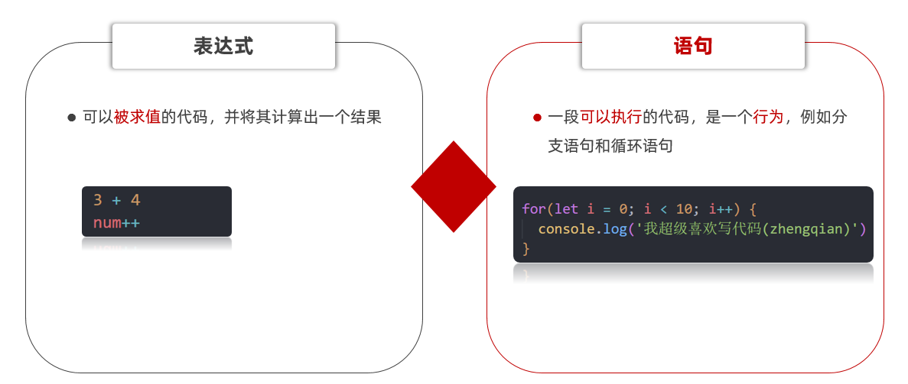
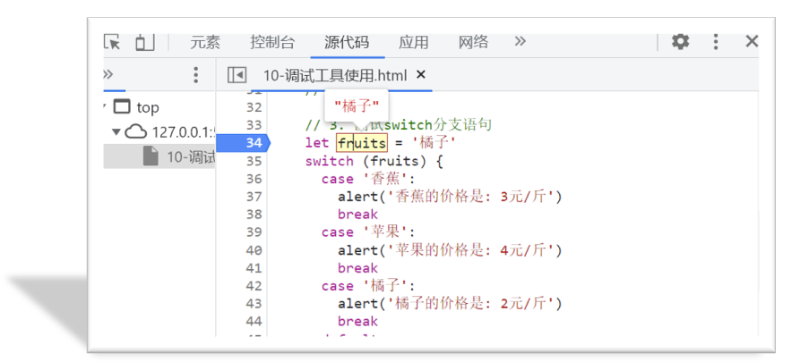

# JavaScript 基础 - 第2天

> 理解什么是流程控制，知道条件控制的种类并掌握其对应的语法规则，具备利用循环编写简易ATM取款机程序能力

- 类型转换
- 语句
- 综合案例

今日重点单词：

 

## 类型转换

类型转换：把一种数据类型转换成另外一种数据类型

**为什么需要类型转换呢？**

例如：使用表单、prompt 获取过来的数据默认是字符串类型的，此时就不能直接简单的进行加法运算

此时需要转换数据类型

数据类型转换可以分为： 显示转换和隐式转换

### 显示转换

自己手动写代码告诉系统该转成什么类型（数据类型明确、程序员主导）

#### 转换为数字型

1. Number(数据)
   - 转换成功返回一个数字类型
   - 转换失败则返回 NaN (例如数据里面包含非数字）
2. parseInt(数据)
   - 只保留整数
   - 如果数字开头的字符串，只保留整数数字 比如 12px 返回 12
3. parseFloat(数据)
   - 可以保留小数
   - 如果数字开头的字符串，可以保留小数 比如 12.5px 返回 12.5

~~~javascript
// 第一个数字
let num1 = prompt('请输入第一个月工资:')
// 第二个数字
let num2 = prompt('请输入第二个月工资:')
//  输出结果
alert(Number(num1) + Number(num2))

// 通过显示转换的方式把其他类型转换为数字型
// 1. Number() 最常用的一种方式 推荐 
// 1.1 把字符串转换为数字型
console.log(typeof Number('1')) // 1   number
console.log(Number('abcd')) // NaN 如果无法完成转换则返回NaN 

// 1.2 把布尔值转换为数字型 true false 
console.log(Number(true))  // 1
console.log(Number(false)) // 0

// 1.3 把 null undefined 转换为数字型
console.log(Number(null)) // 0
console.log(Number(undefined)) // NaN

// 2. parseInt() 和 parseFloat() 固定使用场景的   100px 只要100 不要px 
// 使用场景：把以数字开头的字符串，只保留数字这种情况下就可以使用 
console.log(parseInt('100px'))  // 100
console.log(parseInt('100.5px'))  // 100  parseInt() 只保留整数
console.log(parseFloat('100.5px'))  // 100.5 parseFloat() 可以返回小数
~~~

#### 转换为字符串和布尔型

 

~~~javascript
// 1. 转换为字符串类型 
// 1.1 String(数据) 开发中提倡使用这种方式 
console.log(typeof String(1)) // '1'     string
console.log(String(true)) // 'true'     string

// 1.2 变量.toString(进制)
let num = 10
console.log(typeof num.toString()) //  string 
console.log(num.toString(10)) //  string   '10'
console.log(num.toString(8)) //  string   '12'

// 2. 转换为布尔型 Boolean  (重点) 因为接下来我们要学习分支语句需要用到
// 2.1 有6种情况为false： false 0 '' null undefined NaN (无，没有)
// 2.2 其余的都为true 
console.log(Boolean(false))  // false 
console.log(Boolean(0))  // false 
console.log(Boolean(1))  // true
console.log(Boolean(''))  // false
console.log(Boolean(null))  // false
console.log(Boolean(undefined))  // false
console.log(Boolean(NaN))  // false
~~~

### 隐式转换

某些运算符被执行时，系统内部自动将数据类型进行转换，这种转换称为隐式转换。

~~~javascript
// // 第一个数字
// let num1 = +prompt('请输入第一个月工资:')
// // 第二个数字
// let num2 = +prompt('请输入第二个月工资:')
// //  输出结果
// alert(num1 + num2)

// 1. 隐式转换为数字型的运算符
// 1.1 算术运算符 - *  /   比较运算符  >   ==
console.log(8 - '3') // 5
console.log('1999' * '2') //  3998
console.log(3 > '1')   // true
console.log(3 == '3')  // true

// 1.2 + 正号使用的时候，也会把字符串转换为 数字型
console.log('123')  // '123'
console.log(+'123')  // 123
console.log(typeof +'123')  // number

// 2. 隐式转换为字符串型的运算符   + 拼接字符串 两侧只要有一个是字符串，结果就是字符串
console.log('pink' + 18)
console.log('' + 18)  // '18'

// 3. 隐式转换为布尔型的运算符  ！逻辑非
console.log(!true)  // false 
console.log(!0)  // true
console.log(!'')  // true
console.log(!null) // true
console.log(!undefined)  // true
console.log(!NaN)  // true
console.log(!false)  // true
console.log(!'pink') // false
~~~

## 语句

### 表达式和语句

### 分支语句

分支语句可以根据条件判定真假，来选择性的执行想要的代码

分支语句包含：

1. if分支语句（重点）
2. 三元运算符
3. switch语句

#### if 分支语句

语法：

~~~javascript
if(条件表达式) {
  // 满足条件要执行的语句
}
~~~

小括号内的条件结果是布尔值，为 true 时，进入大括号里执行代码；为false，则不执行大括号里面代码

小括号内的结果若不是布尔类型时，会发生类型转换为布尔值，类似Boolean()

如果大括号只有一个语句，大括号可以省略，但是，俺们不提倡这么做~

~~~javascript
// if 分支语句 选择性的执行代码
// 1. 语法规范
// if (条件) {
//   满足条件要执行的代码
// }

// 2. 体验
// console.log('我想要被表扬')
// if (false) {
//   console.log('我想要被表扬')
// }

// if (3 < 5) {
//   console.log('我想要被表扬')
// }
if ('') {   // 类型转换 类似于 Boolean()
  console.log('我想要被表扬')
}

// 3. 需求： 用户输入高考成绩，如果分数大于等于700分，则提示 '恭喜考入黑马程序员'
let score = +prompt('请您输入高考成绩:')
if (score >= 700) {
  alert('恭喜您考入黑马程序员')
}
~~~

#### if双分支语句

如果有两个条件的时候，可以使用 if else 双分支语句

~~~javascript
if (条件表达式){
  // 满足条件要执行的语句
} else {
  // 不满足条件要执行的语句
}
~~~

例如：

~~~javascript
// if 双分支语句

// 案例1： 考试成绩判断
// 1. 如果成绩大于等于700分，提示 '恭喜您，考入黑马程序员'
// 2. 否则则提示 '非常抱歉，你没有考入黑马程序员，明年再战!'
// let score = +prompt('请您输入考试成绩:')
// if (score >= 700) {
//   alert('恭喜您，考入黑马程序员')
// } else {
//   alert('非常抱歉，你没有考入黑马程序员，明年再战!')
// }

// 案例2： 用户登录案例
// 1. 如果用户名是刘德华并且密码是123456 则提示登录成功
// 2. 否则则提示登录失败
let uname = prompt('请您输入用户名:')
let pwd = prompt('请您输入密码:')
if (uname === '刘德华' && pwd === '123456') {
  alert('登录成功，欢迎回来~')
} else {
  alert('登录失败，您输入的用户名和密码错误~')
}
~~~

#### if 多分支语句

使用场景： 适合于有多个条件的时候

~~~javascript
// if 多分支语句

// 案例： 根据成绩输出评语
// (1).成绩90以上是 优秀
// (2).成绩70~90是  良好
// (3).成绩是60~70之间是 及格
// (4).成绩60分以下是 不及格

// 1. 用户输入成绩
let score = +prompt('请您输入考试成绩:')

// 2. 根据成绩判断输出不同的结果
if (score >= 90) {
  alert('优秀，棒棒棒~')
} else if (score >= 70) {
  alert('良好，棒棒~')
} else if (score >= 60) {
  alert('及格，棒~')
} else {
  alert('不及格，好好加油，你可以的~')
}

// 3. 注意事项
// 3.1 因为我们判断用的是大于等于，则里面的成绩要从大往小写
// 3.2 else if 可以有任意多个， else 不是必须的
~~~

#### 三元运算符（三元表达式）

**使用场景**： 一些简单的双分支，可以使用  三元运算符（三元表达式），写起来比 if  else双分支 更简单

**符号**：? 与 : 配合使用

语法：

~~~javascript
条件 ? 表达式1 ： 表达式2
~~~

例如：

~~~javascript
// 三元运算符（三元表达式）
// 1. 语法格式
// 条件 ? 表达式1 : 表达式2 

// 2. 执行过程 
// 2.1 如果条件为真，则执行表达式1
// 2.2 如果条件为假，则执行表达式2

// 3. 验证
// 5 > 3 ? '真的' : '假的'
console.log(5 < 3 ? '真的' : '假的')

// 4. 练习  求2个数字的最大值
// let x = 10
let x = 100
let y = 20
console.log(x > y ? x : y)
~~~

#### switch语句（了解）

使用场景： 适合于有多个条件的时候，也属于分支语句，大部分情况下和 if多分支语句 功能相同

注意：

1. switch case语句一般用于等值判断, if适合于区间判断
2. switchcase一般需要配合break关键字使用 没有break会造成case穿透
3. if 多分支语句开发要比switch更重要，使用也更多

例如：

~~~javascript
// switch分支语句
// 1. 语法
// switch (表达式) {
//   case 值1:
//     代码1
//     break

//   case 值2:
//     代码2
//     break
//   ...
//   default:
//     代码n
// }

// 2. 体验: 查询水果价格，输入水果，得到当前水果价格
let fruits = '苹果'
switch (fruits) {
  case '香蕉':
    alert('香蕉的价格是: 3元/斤')
    break
    case '苹果':
    alert('苹果的价格是: 4元/斤')
    break
    case '橘子':
    alert('橘子的价格是: 2元/斤')
    break
    default:
    alert('没有查到此水果')
}

// 3. 注意事项
// 3.1  switch适合于等值判断， if多分支适合于区间判断
// 3.2  表达式的值要求 全等于 === case的值，才是能匹配上
// 3.3  break如果落下了，容易造成case穿透
~~~

#### 断点调试

**作用：**学习时可以帮助更好的理解代码运行，工作时可以更快找到bug

浏览器打开调试界面

1. 按F12打开开发者工具
2. 点到源代码一栏 （ sources ）
3. 选择代码文件

**断点：**在某句代码上加的标记就叫断点，当程序执行到这句有标记的代码时会暂停下来

  

### 循环语句

使用场景：重复执行 指定的一段代码，比如我们想要输出10次 '我学的很棒'

学习路径：

1.while循环

2.for 循环（重点）

#### while循环

while :  在…. 期间， 所以 while循环 就是在满足条件期间，重复执行某些代码。

**语法：**

~~~javascript
while (条件表达式) {
   // 循环体    
}
~~~

例如：

~~~javascript
// while循环: 重复执行代码

// 1. 需求: 利用循环重复打印3次 '月薪过万不是梦，毕业时候见英雄'
let i = 1
while (i <= 3) {
  document.write('月薪过万不是梦，毕业时候见英雄~ ')
  i++   // 这里千万不要忘了变量自增否则造成死循环
}
~~~

循环三要素：

1.初始值 （经常用变量）

2.循环条件

3.变量计数（常用自增或者自减）

#### for 循环

作用：重复执行指定的一段代码

好处：把声明初始值、循环条件、变量计数写到一起，让人一目了然，它是最常使用的循环形式

**语法：**

~~~javascript
for (初始值; 循环条件; 变量计数) {
  // 满足条件执行的循环体
}
~~~

例如：

~~~javascript
// for循环：重复执行一段代码
// 1. 语法
// for(初始值; 循环条件; 变量计数) {
//   // 循环体
// }

// 2. 需求： 重复打印3次
// '月薪过万不是梦，毕业时候见英雄。键盘敲烂要行动，前端行业一览众'
for (let i = 1; i <= 3; i++) {
  document.write('键盘敲烂要行动，前端行业一览众~  ')
}
~~~

#### 中止循环

`break`   中止整个循环，一般用于结果已经得到, 后续的循环不需要的时候可以使用（提高效率）  

`continue`  中止本次循环，一般用于排除或者跳过某一个选项的时候

~~~javascript
// 1.break中止整个for循环，一般用于结果已经得到, 后续的循环不需要的时候可以使用
// for (let i = 1; i <= 6; i++) {
//   document.write(`我是第${i}个孩子  `)
//   if (i === 3) {
//     break
//   }
// }

// 2.continue中止本次循环，一般用于排除或者跳过某一个选项的时候
for (let i = 1; i <= 6; i++) {
  // 先验票，再进入电影院
  if (i === 3) {
    continue
  }
  document.write(`第${i}个孩子可以进入电影院 `)

}
~~~

#### 无限循环

1.while(true) 来构造“无限”循环，需要使用break退出循环。（常用）

2.for(;;) 也可以来构造“无限”循环，同样需要使用break退出循环。

~~~javascript
// 无限循环  
// 需求： 页面会一直弹窗询问你爱我吗？
// (1). 如果用户输入的是 '爱'，则退出弹窗
// (2). 否则一直弹窗询问

// 1. while(true) 无限循环
// while (true) {
//   let love = prompt('你爱我吗?')
//   if (love === '爱') {
//     break
//   }
// }

// 2. for(;;) 无限循环
for (; ;) {
  let love = prompt('你爱我吗?')
  if (love === '爱') {
    break
  }
}
~~~

## 综合案例-ATM存取款机

分析：

①：提示输入框写到循环里面（无限循环）

②：用户输入4则退出循环 break

③：提前准备一个金额预先存储一个数额 money

④：根据输入不同的值，做不同的操作

​     (1)  取钱则是减法操作， 存钱则是加法操作，查看余额则是直接显示金额

​     (2) 可以使用 if else if 多分支 来执行不同的操作

完整代码：

~~~javascript
// 综合案例 - ATM存取款机
// 提前声明金额变量 money
let money = 100
// 1.提示输入框写到循环里面（无限循环）
while (true) {
  let num = +prompt(`
请选择您的操作:
1.取款
2.存款
3.查看余额
4.退出
`)
  if (num === 1) {
    let qu = +prompt('请您输入取款金额:')
    // money = money - qu
    money -= qu
  } else if (num === 2) {
    let cun = +prompt('请您输入存款金额:')
    // money = money + cun
    money += cun
  } else if (num === 3) {
    alert(`您的银行卡余额是: ${money}`)
  } else if (num === 4) {
    // 2.用户输入4则退出循环 break   一定要小心数据类型
    break
  }

}
document.write(`滴，您的银行卡余额为: ${money}元，请节约消费`)
~~~

