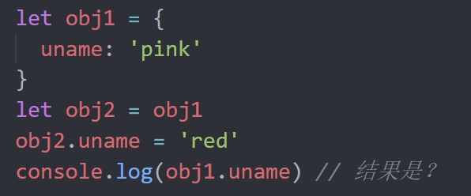

## 客观题

1. 关于对象说法错误的是？（ D）

   A： 对象是一种数据类型，类型是Object

   B： 对象是无序的数据的集合，数组是有序的数据集合

   C： 可以详细的描述描述某个事物

   D： 对象里面只能存放字符串类型或者数字型

2. 关于对象说法正确的是？(ABCD)

   A： 声明对象的语法是：  let  obj = { age: 18 }

   B： 对象有属性和方法组成

   C： 属性一般是名词性的，比如  年龄、性别等

   D： 方法一般是动词性的， 比如唱、跑、跳等，其本质是函数

3. 关于for...in遍历对象，如下描述正确的是（C）

   A： 只能遍历数组属性

   B： 只能遍历对象的属性

   C： 语句用于遍历数组或者对象的属性, 但是我们不推荐使用for in遍历数组

   D： 语句不能遍历数组

4. 关于对象遍历中，for(let k in obj) {} 下面语法说法错误的是？(B)

   A： k 可以遍历得到对象obj的属性名

   B： obj.k  也可以遍历得到对象obj的属性名

   C： obj[k] 可以得到对象obj的属性值

   D： for in 语法一般不用于遍历数组，主要用于遍历对象

5. 关于Math对象的random方法，下列描述正确的是（D）

   A： 返回一个任意随机整数

    B： 返回一个任意的随机小数

    C： 返回一个0-1之间，并且包括0和1的随机小数【0,1】

    D： 返回一个0-1之间，并且包括0不包括1的随机小数【0,1）

6. 基于如下代码，能正常访问到obj对象的my-name属性的方式是（D）× B

   ~~~javascript
   let obj = {
     'my-name': 'zhangsan',
     age: 18
   }

   ~~~

   A： obj.my-name

    B： obj['my-name']

    C： obj('my-name')

    D： obj[key]

7. 想要创建对象{name:'zs',age:18}，以下选项错误的是：(D)

   A： let obj = {};     obj.name='zs';   obj.age=18;

   B： let obj = new Object();     obj.name='zs';    obj.age=18;

   C： let obj =  {name:'zs',age:18}

   D： let obj.name = 'zs'    obj.age = 18

8. js 数据类型说法错误的是? (D)

   A:   js 数据类型分为基本数据类型和引用数据类型

   B： 简单类型又叫做基本数据类型或者值类型

   C： 复杂类型又叫做引用类型

   D： 简单数据类型存放到堆里面，引用数据类型存放到栈里面

9. 请问输出结果是什么？（A）

     

    A:   'pink'
    
    B： 'red'
    
    C： NaN
    
    D： undefined

10. 请问输出的结果是什么？(A)  ×  B

     

  A:   'pink'

  B： 'red'

  C： NaN

  D： undefined

## 主观题

### 练习题1：

点名: 每次刷新网页运行, 在控制台 随机输出一位同学的名字 ["老赵", "老李", "小传", "小黑"]

### 练习题2：

声明对象练习

目的: 复习对象的声明

要求:

1. 声明一个变量per, 类型为对象类型
2. 该对象的属性为性别,年龄,爱好(3个)
3. 该对象的方法有 说话, 吃饭(2个)
4. 在控制台分别调用该对象的属性和方法

### 练习题3：

调用对象的方法

目的: 复习对象的使用

要求:

1. 对象声明完毕后, 调用对象中的吃饭的方法
2. 提示: 对象中的方法本质是函数, 调用需要加()
3. 方法也可以传递参数的

~~~javascript
per.eat()
~~~

### 练习题4：

猜数字游戏，设定次数，最多猜8次

### 练习题5：

完成课堂随机生成颜色的案例

### 综合案例变形作业

**需求：** 利用对象数组渲染英雄列表案例

**展示效果：**如下：

 

功能1：

1. 利用对象数组里面的数据来渲染页面，渲染多个数据
2. 鼠标经过停留会显示`英雄名字`

数据：

~~~javascript
const datas = [
  { name: '司马懿', imgSrc: '01.jpg' },
  { name: '女娲', imgSrc: '02.jpg' },
  { name: '百里守约', imgSrc: '03.jpg' },
  { name: '亚瑟', imgSrc: '04.jpg' },
  { name: '虞姬', imgSrc: '05.jpg' },
  { name: '张良', imgSrc: '06.jpg' },
  { name: '安其拉', imgSrc: '07.jpg' },
  { name: '李白', imgSrc: '08.jpg' },
  { name: '阿珂', imgSrc: '09.jpg' },
  { name: '墨子', imgSrc: '10.jpg' },
  { name: '鲁班', imgSrc: '11.jpg' },
  { name: '嬴政', imgSrc: '12.jpg' },
  { name: '孙膑', imgSrc: '13.jpg' },
  { name: '周瑜', imgSrc: '14.jpg' },
  { name: 'XXX', imgSrc: '15.jpg' },
  { name: 'XXX', imgSrc: '16.jpg' },
  { name: 'XXX', imgSrc: '17.jpg' },
  { name: 'XXX', imgSrc: '18.jpg' },
  { name: 'XXX', imgSrc: '19.jpg' },
  { name: 'XXX', imgSrc: '20.jpg' }
]
~~~

### 额外拓展作业

需求： 渲染水果案例

展示效果如下：

 

功能：

1. 根据数据渲染水果列表，里面包含 **复选框**，**水果图片**，**单价**，**数量**，还有**删除按钮**
2. 渲染的同时要计算小计= 单价*数量
3. 计算 **总价**，同时计算结算的**商品数量**

数据：

~~~javascript
const fruit = [
  {
    icon: 'http://autumnfish.cn/static/火龙果.png',
    num: 2,
    price: 6,
  },
  {
    icon: 'http://autumnfish.cn/static/荔枝.png',
    num: 7,
    price: 20,
  },
  {
    icon: 'http://autumnfish.cn/static/榴莲.png',
    num: 3,
    price: 40,
  },
  {
    icon: 'http://autumnfish.cn/static/鸭梨.png',
    num: 10,
    price: 3,
  },
  {
    icon: 'http://autumnfish.cn/static/樱桃.png',
    num: 20,
    price: 34,
  }
]
~~~

## 排错题

### 排错题1

~~~html
<!-- bug:请你找到下面代码的2处BUG进行修改 -->

<body>
  
</body>
~~~

### 排错题2

~~~html
<!-- 请你找到下面代码的3处bug进行修改 -->

<body>
  
</body>
~~~

### 分析题

~~~html
<body>
  
</body>
~~~

### 分析题

~~~html
<body>
  <!-- 给下面代码添加注释，并分析程序运行结果 -->
  <!-- 提示：（1）先分析  （2）观察结果是否与预期一致  （3）打断点仔细分析原因  （4）核心原理：内存的堆与栈 -->
  
</body>
~~~

