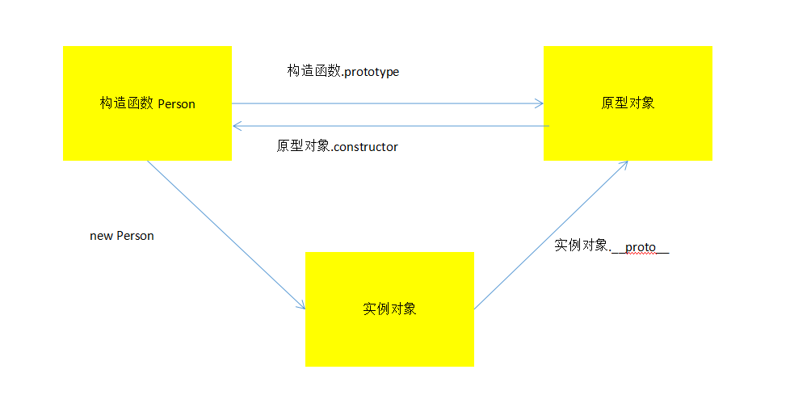
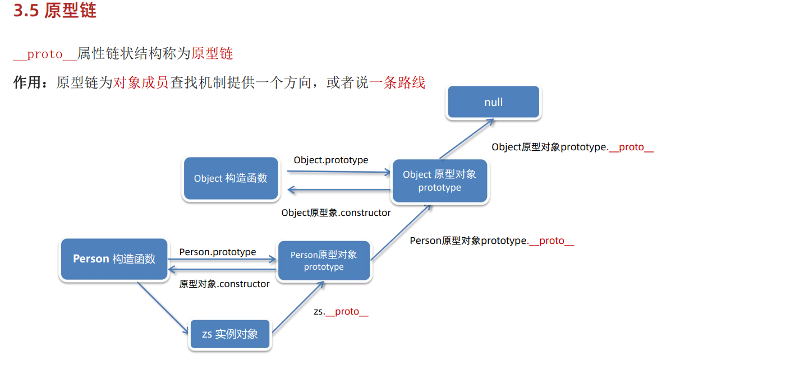
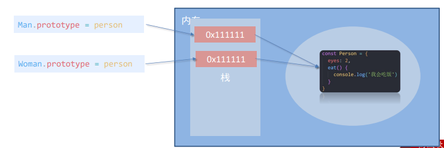
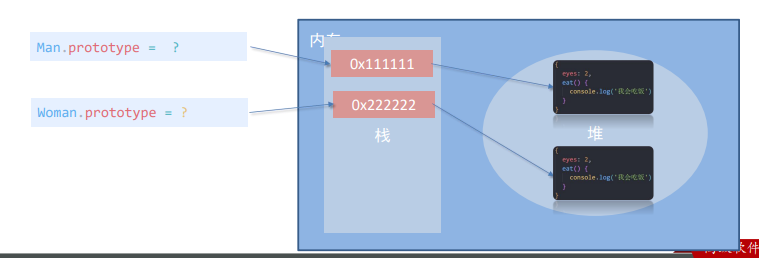
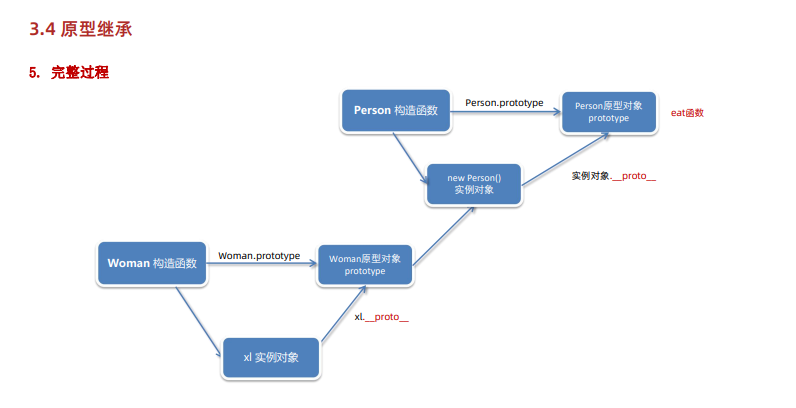

## a标签的`javascript:;`

- 在日常开发中，我们设置的 a 标签有时是需要跳转的，此时将href属性设置为跳转路径即可，
- 但有的时候，我们不希望点击a标签发生跳转，这个时候就可以把href属性设置为 `javascript:;`


## `作用域`

作用域是变量或者函数能起作用域的区域

分为全局作用域和局部作用域

全局作用域：

在script标签中的最外层的区域，还有外链js中最外层的区域是全局作用域

```javascript
<script>
	// 最外层的区域
</script>
```


局部作用域：

- 函数内部就是一个局部作用域，也称为叫函数作用域

- {}里面也是一种局部作用域，也称为块级作用域

- 注意：并不是每一个{}都会产生块级作用域


不同代码块之间的变量无法互相访问


在这个代码效果相当于就是声明了一个全局变量 num

```javascript
window.num = 10086
```


在函数内直接使用变量来赋值，也会造成变量声明在全局作用域

```javascript
function fn(){
    // window.money = 888
    money=888
}
fn()
```


## `作用域链`

- 作用域内部嵌套了`一个或多个`作用域的结构，这种结构就会导致访问变量的时候产生一个`由内而外`的访问顺序，这样一个访问顺序就是作用域链


本质上是底层变量查找机制(就近原则)

在函数被执行时，会优先查找当前函数作用域中查找变量

如果当作用域查找不到则会逐级向上查找父级作用域直到全局作用域

```
function fn(){
	let money = 100
	function fn2(){
		// 查找money变量的顺序是：先查找函数自己有没有这个money变量
		// 当前函数内部没有声明money变量，于向上查找
	}
	fn2()
}
fn()
```


## `垃圾回收机制`

- 当编写完了js代码以后，会打开页面运行js代码，运行js代码的时候会遇到变量声明，就会在内存中开辟空间保存变量的数据


- 如果内存不去释放，一直占用，就会导致内存用完了，会导致程序崩溃，电脑死机

- 此时就需要有一个 '人' 去帮助我们释放内存-----`垃圾回收机制`


垃圾回收机制会去检查所有占用的内存空间，如果发现占用的内存空间无人使用了，就会释放这个空间


JS中内存分配和回收都是自动完成的，内存在不使用的时候会被垃圾回收器自动回收

```
function fn(){
	// 运行下面两行代码的时候，就会在内存中开辟空间保存变量数据
	let name = 'jack'
	let age = 20
}
fn()
//当我们执行完了上面这一行之后，垃圾回收机制就会发现函数局部作用域的变量不需要在使用了，此时就会把之前占用的空间释放掉

// 注意：全局变量的数据不会被垃圾回收，只会在页面关闭的时候清除
```


### `内存的生命周期`

js环境中分配的内存，一般有如下生命周期：

1. 内存分配：当我们声明变量、函数、对象的时候、系统会自动为他们分配内存
2. 内存使用：即读写内存，也就是使用变量、函数等
3. 内存回收：使用完毕，由垃圾回收机制自动回收不在使用的内存


说明：

全局变量的数据不会被垃圾回收(关闭页面回收)

一般情况下局部变量的值，不用了，会被自动回收掉


内存泄漏：程序中分配的内存由于某种原因程序未释放或无法释放，叫做内存泄漏


## `闭包`

- 一个函数对周围状态的引用捆绑在一起，闭包让开发者可以从内部函数访问外部函数的作用域

- 从一个函数作用域访问另一个函数作用域

简答的说法：闭包就是函数，函数就是闭包


闭包 = 内层函数 + 外层函数的变量

```
function fn(){
	const a = 1
	function fn2(){
		console.log(a)
	}
	fn2()
}
fn()
```

闭包的应用，实现数据私有化，统计函数调用次数

```
let count = 1
function fn(){
	count++
	connsole.log(`函数被调用${count}次`)
}
fn()
```

Closure:发生了闭包的访问


为什么要使用闭包

闭包可以将数据保存起来，在需要使用的时候再去使用


使用场景：希望使用闭包来保存一些数据，利用闭包可以将一些，全局作用域数据更改为 局部作用域数据，避免全局作用域污染的问题


## 变量名提升

var是声明变量的一个关键字

let、const 声明变量和var声明变量只有一个不同之处，var有变量提升的机制存在

变量名提升：

1. 变量提升会提升到当前作用域的最前面
2. 只提升变量声明，不提升变量赋值


## 函数提升

当我们 声明函数的时候，无论在函数声明的前面还是后面都可以调用

和变量提升类似，不过函数的提升是直接将整个函数体提升到当前作用域的最前面

函数提升只提升声明，不提升调用

函数表达式不存在函数提升的现象


## arguments对象

- 函数内部的伪数组变量，是一个伪数组
- 只存在于函数中
- 用来访问参数数据对象，包含了调用时传入的所有实参，可以用来获取实参数据

作用：动态获取函数的实参

通过for循环一次得到传递过来的实参

使用场景：

就是获取所有的参数数据(包括形参没有定义的那种数据)

```
function fn(){
	let res = 0
	for(let i = 0;i < arguments.length; i++){
		res += arguments[i]
	}
	return res
}
const result = fn(1,2,3,4,5)
console.log(result)
```


## `剩余参数(...)`

- ...是语法符号，是一个真数组

- 用于获取多余的实参，并形成一个数组,是一个数组形式的数据
- 里面包含的所有的实参

- 允许我们将一个不定数量的参数表示为一个数组

```
function 函数名(...参数名){

}

function 函数名(其他形参,...参数名){

}
```


## `展开运算符(...)`

展开运算符(...):将一个数组或对象进行展开，获取数组中的元素 或者，获取对象中的成员

语法结构：

- `...数组`

- `...对象`

```
const x = [1,2,3,4,5]
let max = Math.max(...x)
```


将两个数组合并

```js
const arr = [1, 2, 3]
const arr2 = [100, 200, 300]
const hebing = [...arr, ...arr2]
console.log(hebing);
```


## `箭头函数`

- 表达式函数，不存在函数提升

- ES6之后提供的一种函数的简化写法，让代码更加简介


```
()=>{}
```


如果箭头函数的执行语句只有一句话的时候，可以简写{}

如果这句话的结果就是返回值，可以省略 return

```
const res3 =(item,index)=> console.log(123)
```


如果箭头函数只有一个形参，那么这个形参的 () 可以省略

```
const res3 = item => console.log(123)
```


总结：

- 如果返回值是一个对象，则需要把对象用`()`包起来

- 箭头函数没用 `arguments`，只能使用`...`动态获取实参

  

箭头函数中的this

箭头函数本身没有this，它只会沿用上一层作用域的this


## 对象的属性方法简写形式

对象中的属性在特定情况下，可以简写，方法也可以简写，让将来开发变得更加简洁，迅捷

```js
let age = 20
let obj = {
	name: 'jack',
	age: age,
	say:function(){}
}
```

上面的情况可以简写为

```js
let obj ={
	name: 'jack',
	// 当属性名 和 要 赋值的变量名一致，我们可以直接简写为属性名
	// age => age:age
	age,
	// 对象的方法可以简写为
	say(){}
}
```


## `解构赋值`

- 可以将数组，对象中的数据获取出来，赋值给变量

- 对象和数组的解构形式不方便进行数据计算，处理，

- 如果想要单独对某个元素进行处理，需要将这个数据单独取出来，

- 此时就可以使用解构赋值做这个事情(把某个数据单独拿出来)


语法解构：

### `对数组进行解构赋值`

```
const [one,two,three] = [1,2,3]

// 拿到two，three的值
const arr = [one,two,three]
const [two,three] = arr
```

- 创建了one,two,three 三个变量，分别获取数组中的1,2,3个元素

复杂数据解构

```
// 拿到所有人的分数数据
let studennts = [{nname:'jack',score:80},{name:'lily',score:80},{name:rose,score:70}]
const [{score:fn1},{score:fn2},{score:fn3}] = students
```


解构赋值数组的经典--交换变量

```
let x = 'jack'
let y = 'rese'
[x,y] = [y,x]
```

- 使用y变量得到数组中第一个元素的值
- 使用x变量得到数组中第二个元素的值


补充：

js代码一般可以不用写 `;` 作为语句的结束

但是有两种情况必须添加 `;` 作为语句的结束

- 遇到 `()` 的情况，必须添加 `; ` 作为结束
- 遇到 `[]` 的情况下，必须添加 `;` 作为结束

```
consolel.og(x,y)

(function(){

})()
```

相当于

```
console.log(x,y)(function(){

})()
```

将`console.log`当作一个函数来调用


### `对象解构赋值`

```
// 创建name,age 两个变量，分别得到，对象中的name属性和age数组的值
// 将右边的name属性给到左边的name变量
const { name：name,age:age } = { name:'jack',age:20}
```


对象解构赋值的基本使用

```
const username = 'andy'
const user = {
	usernname:'小明',
	age:18
}
const {username,age,gender} = user	
console.log(username)	// 小明
console.log(age)	// 18
console.log(gender)	// undefined
```

注意：

1. 要求变量名和属性名必须一致
2. 如果变量名和属性名不一致，则默认是undefined
3. 变量名不要和外面的变量名冲突，否则会报错


更改解构变量名(重命名)	`变量名：新变量名`

```
// 将数据放到uname里面
const {username:uname,age} = user
console.log(uname)	// 小明
console.log(age)	// 18
```


### `函数内部对实参进行解构赋值`

```
const obj = {name:'rose',age:20}
// 解构赋值形参 {age} 相当于是 {age} = obj
function printAge({age,name,sex,school='传智'}){
	console.log(age)
}
printAge(obj)
```


## `数组的filter方法(过滤筛选)`

数组的filter方法可以按照一定条件进行数组筛选，会将符合条件的数组作为结果数组返回，结果数组中会包含所有符合条件的数据

如果没有一个元素符合条件，返回的就是空数组

将来进行实际开发的时候，如果要筛选数组，首选filter

语法解构：

```
let res =arr.filter( item => item.age > 16)
```


例子：

```
let girls =arr.filter((item,index)=>{
	// filter回调函数中 返回的是真，意思就是符合条件
	// 返回的是假就是说没有返回条件
	return item.gender === '女'
})
```


## 创建对象的方式

创建对象的方式有三种

，就是希望大家将来创建对象的时候可以有更多的选择，最重要的是能看懂别人的代码

### `字面量`

```
let obj ={
name:'jack'
}
```


### `调用 new Object()构造函数`

```
let obj2 =new Object()
```

利用 new Object 创建对象


### `利用构造函数创建对象`

创建一个构造函数，然后调用构造函数创建对象

实际开发中，如果采用面相函数编程的方式，就会使用构造函数创建对象

使用场景：常规的 `{...}`语法允许创建一个对象，比如我们创建了一个`佩奇`对象，继续创建`乔治`的对象还需要再重新写一遍，此时可以通过构造函数来快速创建多个类型的对象

- 创建声明一个函数，他就可以是构造函数

- 箭头函数不能是构造函数
- 使用 `new 关键字` 调用的才是构造函数

- `构造函数潜规则`---函数名第一个字母应该要大写

`例子`

```
funnction Cat(nanme,color){
	// 构造函数中的this 是我们新创建的那个对象
	this.name=name
	this.color=color
}
```

使用构造函数创建对象

```
let wangcai = new Cat('旺财','白色')
```


当我们调用构造函数的时候，默认就会创建一个空对象

构造函数中会通过this 环境对象 来访问新创建的空对象


注意：为了跟普通函数区分开来，构造函数必须使用new来调用

构造函数中无需编写return语句，返回值默认就是新创建的对象

构造函数必须通过 this 环境对象 来访问新创建的对象

专业名词：使用new 创建构造函数的行为被称为实例化

实例化创建出来的对象叫做实例对象


`构造函数的执行过程`

1. 先创建一个空对象
2. 用环境对象this，来访问新创建的对象
3. 开始执行函数内部代码，给对象添加属性，方法
4. 执行完毕默认将新对象，也就是this返回出去


实例成员和静态成员

`实例成员：`实例对象上的属性和方法

`静态成员：`构造函数上添加的属性或方法称为静态成员


静态方法：

`Array.isArray`判断是否是一个数组

```
const res = Array.isArray(arr)
```


`Object.keys` 获取对象的成员名，键

```
const res = Object.keys(obj)
```


`Object.values` 获取对象的值

```
const res = Object.values(obj)
```


``Object.assign` 将参数2对象中的数据拷贝给 参数1

```
const person = {}
Object.assign(person,obj)
```


## 万物皆对象

js数据都可以认为是对象

当字符串调用方法的时候，js解析器字符串转化为字符串对象，在调用方法

调用方法结束之后，会立刻销毁字符串对象

```
'abc'.trim()
```


let str = new String('hehe')

let num = new Number()

let bol = new Boolean()

像这么基本数据类型，对应的对象类型称为---包装类型


## 数组方法介绍

`reduce:`累计器

作用：

- 返回累计处理的结果，经常用于求和

参数：

- 如果有起始值，则把初始值累加到里面

```
arr.reduce(function(上一次值，当前值){},起始值)
```

执行过程：

1. 如果没有起始值，则`上一次`值以数组的`第一个数组元素的值`
2. 每一次循环，则返回值给做为，下一次循环的`上一次值`
3. 如果有起始值，则 起始值作为`上一次值`


`filter`：用于对数组进行过滤

作用：

- 创建一个新数组，新数组中的元素是通过`检查指定数组`中符合条件的所有元素。

参数：

- 回调函数

```
arr.filter(function(){})
```

执行过程：

1. 方法接收一个回调函数作为参数
2. 将数组中的每个元素传递给该函数，
3. 该函数可以对每个元素进行操作并返回一个布尔值
4. 如果该元素包含在数组里，返回true


find:查找元素

findIndex:查找元素的索引

every:要求每一个元素都符合条件

some:只要有一个元素符合条件即可


## `数组的静态方法`

实例对象的方法就是实例方法

构造函数身上的方法就是 静态方法


`Array.from()`

- from方法可以帮助我们将伪数组 转换为 真的数组

```
Array.from(伪数组)
```


## `字符串的实例方法`

学习方法三要素：

- 参数是什么
- 每个参数的效果
- 方法的返回值是什么

`split`

- 可以将字符串进行分割，变成一个数组，跟数组的join是一对的

参数：

- 是一个字符串，会根据字符串进行分割

返回值：

- 是一个数组，数组中包含分割的结果

```
const myDate = '2023-05-01'
const date = myDate.split('-')
// 打印结果
['2023','05','01']
```


`starsWith`：判断字符串是否是以某些特定内容开头

作用：

- 判断字符串是否是以某些特定内容开头

参数：

- 第一个参数是判断的字符串，使用这个字符串来判断是否开头

- 第二个参数是索引，如果写了这个值就会从索引处开始判断，可选

返回值：

- boolean值
- true代表以这个字符串开头
- false代表不是这个字符串开头

```
const arr = 'https.itcast.cn'
arr.starsWith('https')
```


`endsWith`：判断字符串是否以特定字符串结尾

作用：

- 判断字符串是否是以某些特定内容结尾

参数：

- 第一个参数是判断的字符串，使用这个字符串来判断是否结尾

- 第二个参数是索引，截取字符串前n位，可选，默认是str.length

返回值：

- boolean值
- true代表以这个字符串结尾
- false代表不是这个字符串结尾


includes：判断字符串中是否包含特定内容


toUpperCase：将字符串转换为大写字母字母


toLowerCase：将字符串转换成小写字母


trim()：去除前后空格


## `数字的方法`

`toFixed()`

如果不写参数，就会直接返回整数

如果写了参数，就会参照参数来保留小数的位置

注意：toFixed 方法的返回值是一个字符串

```
const num =3.33333
num.toFixed(2)	// 保留小数点后两位
```


## `面向过程编程`

分析出解决问题所需要的步骤，然后用函数把这些步骤一步一步实现，使用的时候再一个一个的依次调用就可以了

优点：性能比面向对象高，适合跟硬件联系很难紧密的东西

缺点：不灵活、复用性较差


## `面向对象编程(oop)`

- 是一种编程思想

- 分析要做的事情，拆分成一个个的对象，让对象之间分工合作完成要做的功能


把事物分解成为一个个对象，然后由对象之间分工与合作

面向对象是以对象功能来划分问题，而不是步骤

特性：

- 封装性
- 继承性
- 多态性

优点：易维护、易复用、易拓展，由于面向对象有封装、继承、多态性的特性，可以设计出低耦合的系统，使系统更灵活、更易维护

缺点：性能比面向过程差


## 构造函数

是面向对象编程的代码实现

`封装`是面向对象中的一部分，js面向对象可以通过`构造函数`实现的`封装`

把公共的属性和方法抽取封装到构造函数里面来实现数据的共享，这样创建的实例对象可以使用这些属性和方法了


不止构造函数体现了封装，函数也是

不需要知道具体的代码实现，只需要知道功能如何使用即可

总结：

- 构造函数体现了面向对象的封装特性

- 构造函数创建的对象`彼此独立、互不影响`

- 但是存在`浪费内存的问题`


## 原型对象

创建构造函数的时候，js解析器自动创建出来的

用来解决性能问题，解决内存浪费问题

js规定，每一个构造函数都会有一个`prototype`属性，这个属性就是原型，就是一个对象

特点：给原型对象添加属性和方法，实例对象可以直接访问和使用，共用的属性和方法我们都会加到原型里面去，这样就不会出现重复的代码了


我们可以给原型对象身上添加属性或方法，我们添加在原型对象身上的属性和方法可以被所有new出来的实例对象共用


结论：

1. 添加到 原型对象 身上的属性和方法，所有当前构造函数创建出来的实例对象，都可以访问和使用
2. 添加到原型对象身上的方法中的this 是调用方法的对象


## 给系统内置的原型对象添加方法

除了我们自己可以创建一些自定义构造函数之外，咱们js还给我们提供了一系列的构造函数：Object，Array，Date


这些系统提供的构造函数是否有原型对象呢？

有的

```
Object.prototype
Array.prototype
Date.prototype
```


目标：我们以前创建数组，可以调用数组的方法做事情

想要给数组添加一些方法，绕过我们自己的开发变得更加迅捷


## `访问实例对象中成员的查找原则`

当访问 实例对象.属性 的时候，会如何查找属性呢？

1. 先在实例对象中查找属性，有就访问
2. 如果实例对象中没有属性，就继续去原型对象中查找

查找顺序：

1. 先找对象自己本身，再找原型对象


## constructor属性

是原型对象的一个属性，可以表示原型对象对应的构造函数是谁

语法：

```
原型对象.constructor
```


```
function Person(name){
	this.name = name
}
Person.prototype.sayHi = funcntion(){
	console.log('你好')
}
let jack = new Person('jack')
let rose = new jack.constructor('rose')
```


使用场景：

1. 如果有多个对象的方法，我们可以给原型对象采取对象形式的赋值
2. 但是这样会覆盖构造函数原型对象对象原来的内容
3. 修改后的原型对象constructor 就不在指向当前的构造函数了
4. 此时需要在修改后的原型对象中，添加一个 constructor 指向原来的构造函数


现在是创建了一个新的对象，覆盖修改了prototype原型对象

```
Perso.prototype = {
	sayHi(){
		console.log('hi')
	},
	// 必须要重新设置constructor
	constructor:Person
}
```

必须要重新设置constructor


## `__proto__`属性

是每一个实例对象都拥有的属性，这个属性可以帮助我们访问到原型对象

- `__proto__` 可以等价于 prototype,是同一个对象，都是原型对象

- 只是 prototype 是 `构造函数.prototype`

- 而`__proto__` 是`实例对象.__proto__`

- 实例对象可以通过`__proto__`访问原型对象


可以通过`__proto__`添加共享的方法

```
jack.__proto__.run = function(){
	consonlog(this.name + '在跑')
}
jack.run()
```


构造函数，实例对象，原型对象三者之间的关系




## `原型链`

js的底层查找机制

指的是，实例对象和原型对象，以及原型对象的原型对象组成的一个链式解构

我们学习原型链是为了解决一个问题，导读我们访问属性或方法的时候该怎么查找

查找的顺序是：

1. 先到实例 对象中查找
2. 再到原型对象中查找
3. 再到原型对象的原型对象中查找
4. 一种找到`Object.prototype`为止
5. 如果还找不到，结果哦就是null




## `原型链-instanceof 运算符`

`instanceof` ：判断实例对象，是否在某个构造函数的原型链上

使用场景：

- 将来如果需要判断某个实例对象是不是由 某个构造函数创建出来的就可以使用`instanceof`
- 大部分情况下用来判断，某个实例对象是不是由某个构造函数创建的


语法解构：

```
实例对象 instanceof 构造函数
```


例子：

```
let arr = [1,2,3]
// 判断 arr是否是由 Array 创建的，new Array
// 判断 arr实例对象是否在 Array 构造函数的原型链上
arr instanceof Array
```

```
// 判断 arr 是否是由 Object 创建你的
// 准确的说，判断 arr实例对象 是否在 Object 构造函数的原型链上
arr istanceof Object
```


补充：

所有的原型对象的祖宗都是 `Object.prototype`


## 原型继承

通过原型来实现一个继承的效果(自己没有，拿别人的`[原型]`来使用)

- 有些公共的属性和发给发可以写在父级身上，子级通过继承也可以使用这些属性和方法

- js中大多都是借助原型对象实现继承的特性

### `字面量继承`

语法解构：

1、抽取公共部分代码

- 放到person对象里面

```
// 下把公共部分抽取出来
cnst person = {
	eye: 2,
	eat(){
		console.log('我会吃饭')
	}
}
function Man(){}
function Woman(){}
```

2、继承-通过原型对象实现继承

- 把男人和女人的对象赋值为person对象

```
Man.prototype = person
Woooman.prototype = person
```


但是这样会有一个问题：

- 如果给女人添加了一个方法，男人也会自动增加

原因：

- 因为男人和女人使用了同一个对象，根据引用类型的特点，他们指向同一个对象，修改一个就都会影响




### `构造函数实例化对象继承`

解决：

- 男人和女人不要使用同一个对象，但是不同对象里面包含相同的属性和方法
- 因为new每次都会创建有个新的对象




完整的过程：




原型继承的关键点：

找到做原型继承的儿子构造函数，将他的原型对象设置为父亲的实例对象


## `浅拷贝`

浅拷贝是将 旧的对象数据拷贝一份，赋值给 新的对象

注意：

- 浅拷贝是会产生新的对象的，跟旧的对象是不同的对象，只是数据相同

浅拷贝的实现方式：

```
Object.assign(新对象,旧对象)
```

展开运算符：

```
{...对象}
```

数组浅拷贝：

`concat()`

```
let arr = [1,2,3,4]
let newArr = []
newArr = newArr.concat(arr)
```

把对象拷贝给一个新的对象，开发中我们经常需要复制一个对象

如果直接赋值，则复制的是地址，修改任何一个对象，另外一个对象都会变化


注意：

- 如果要拷贝的对象中只有简单类型的数据，应该使用浅拷贝

- 如果要拷贝的的对象中包含复杂类型的数据，应该使用深拷贝
- 只会拷贝 对象中的一层数据，不会考虑多层数据嵌套(对象嵌套对象)
- 如果出现多层数据嵌套，应该使用浅拷贝进行处理


## `深拷贝`

拷贝多层，不再拷贝地址

旧对象中的所有数据全部进行拷贝，赋值给新对象

保证了对象之间，属性数据之间都是互相独立，互不影响


### `JSON序列化完成深拷贝`

1. 使用 `JSON.stringify()` 将对象转换为字符串
2. 再使用 `JSON.parse()` 将字符串转化为对象


JSON序列化实现深拷贝的问题：

- 无法拷贝 `函数` 和 `undefined` 的数据
- 遇到这两个东西会忽略掉


### `lodash实现深拷贝`

1. 下载引入 lodash库
2. 通过_访问 lodash 库，并调用 cloneDeep 方法实现深拷贝


### `自己封装递归函数实现深拷贝`

#### `什么是递归函数？`

在函数内部调用自身 就是递归调用函数，简称递归函数

```
functionn fn(){
	// 自己调用自己
	fn()
}
fn()
```

有限递归，不写return死路一条！！！


## throw 抛异常

异常处理是指预估代码执行过程中可能发生的错误，然后最大程度的避免错误的发生导致整个程序无法继续运行

1. throw 抛出异常信息，程序也会终止执行
2. throw 后面跟的是错误提示信息
3. Error 对象配合 throw 使用，能够设置更详细的错误信息


## `try/catch捕获错误信息`

- 测试代码是否有异常，可以通过try / catch 捕获错误信息(浏览器提供的错误信息)

- 编写代码保证 在程序出错的情况下也能正常运行，不会影响出错代码后面的代码的运行

语法：

```js
try{
	可能出错的代码
}catch(err){
	当代码出错之后，会执行catch里面的代码
}finally{
	无论代码是否出错，都会执行finally里面的代码
}
```


## `debugger断点调试`

`debugger` 语句调用调试功能，例如设置断点


## 改变this指向

`call()`：

- 使用call方法可以调用函数，并且改变函数中的this指向

语法：

```
函数名.call( thisArg,arg1,arg2,arg3 ...argN)
```

- 通过 call方法会调用函数
- 参数 thisArg 就是调用函数的人，也就是函数中的this
- 如果不传，默认是window调用
- arg1-argN 是原本函数就需要的数据


使用场景：检测数据类型

```
Object.prototype.toString.call(检测数据)
```


`apply()`：

语法：

```
函数名.apply( thisArg,[arg1,arg2,arg3 ...argN])
```

- 通过 call方法会调用函数

- 参数 thisArg 就是调用函数的人，也就是函数中的this
- 如果不传，默认是window调用

- arg1-argN 是原本函数就需要的数据,现在放在数组中


使用场景：

经常用来做数组方法的一些处理(比如说让伪数组调用数组的方法)

```
Array.prototype.push.apply(伪数组,[添加元素])
```


`bind()`：

bind方法不会调用函数，而是会返回一个修改了this指向 函数体

语法：

```
const 新函数 =  函数名.bind( thisArg,arg1,arg2,arg3 ...argN)
```


使用场景：

改变定时器函数，事件处理函数的this指向

```
setInterval(function(){}.bind(调用者),1000)
```

建议：

如果是需要立刻调用函数，应该使用apply或者call

如果是一个回调函数需要改变this指向，则使用bind


## `防抖(debounce)`

单位时间之内，多次触发，只会执行最后一次，以最后一次为准

可以有效的去减少 触发的次数，让性能得到提升

语法：

`lodash语法`：

```
_.debounce(回调函数,单位时间)
```


