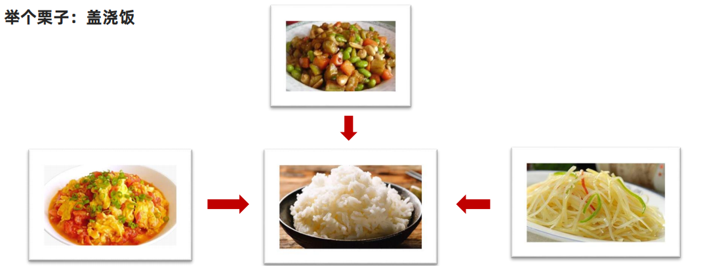
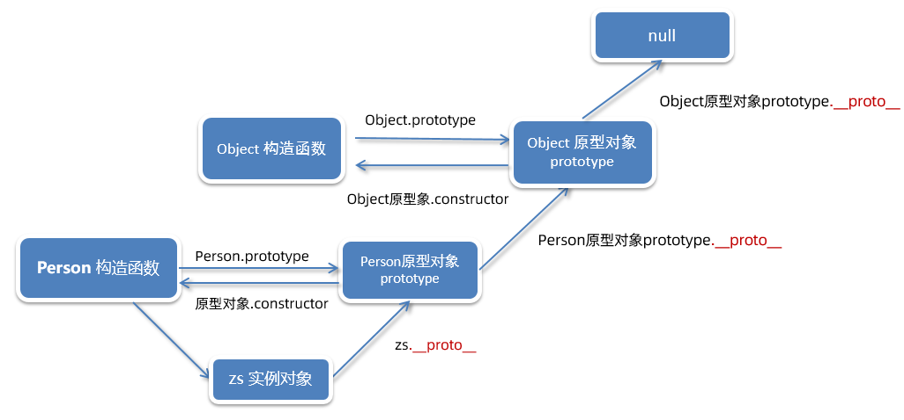
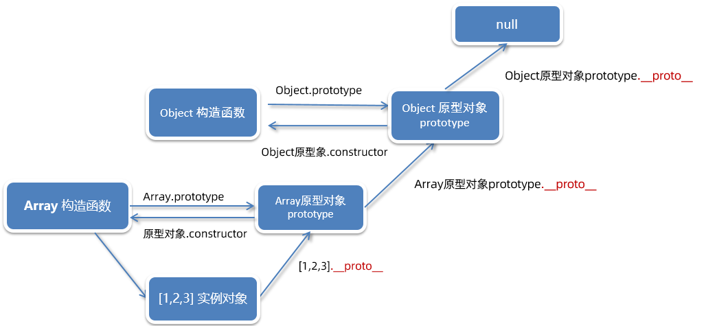

# JavaScript 进阶 - 第3天笔记

> 了解构造函数原型对象的语法特征，掌握 JavaScript 中面向对象编程的实现方式，基于面向对象编程思想实现 DOM 操作的封装。

- 编程思想
- 构造函数
- 原型
- 综合案例

## 编程思想

> 学习 JavaScript 中基于原型的面向对象编程序的语法实现，理解面向对象编程的特征。

### 面向过程

面向过程就是分析出解决问题所需要的步骤，然后用函数把这些步骤一步一步实现，使用的时候再一个一个的依次

调用就可以了。

 举个栗子：蛋炒饭


### 面向对象

面向对象是把事务分解成为一个个对象，然后由对象之间分工与合作。



在面向对象程序开发思想中，每一个对象都是功能中心，具有明确分工。

面向对象编程具有灵活、代码可复用、容易维护和开发的优点，更适合多人合作的大型软件项目。

面向对象的特性：

- 封装性


- 继承性
- 多态性

### 编程思想对比

**面向过程**

优点：性能比面向对象高，适合跟硬件联系很紧密的东西，例如单片机就采用的面向过程编程。

缺点：不灵活、复用性较差

**面向对象**

优点：易维护、易复用、易扩展，由于面向对象有封装、继承、多态性的特性，可以设计出低耦合的系统，使系统 更加灵活、更加易于维护 

缺点：性能比面向过程低

>生活离不开蛋炒饭，也离不开盖浇饭，选择不同而已，只不过前端不同于其他语言，面向过程更多

## 构造函数

封装是面向对象思想中比较重要的一部分，js面向对象可以通过构造函数实现的封装

把公共的属性和方法抽取封装到构造函数里面来实现数据的共享，这样创建的实例对象可以使用这些属性和方法了

```html
<body>
  <script>
    // 1. 构造函数实现封装，封装人的姓名、年龄和 sayHi方法

    function Person(name, age) {
      this.name = name
      this.age = age
      this.sayHi = function () {
        console.log('hi~')
      }
    }

    // 实例化
    const zs = new Person('张三', 18)
    const ls = new Person('李四', 19)
    console.log(zs)
    console.log(ls)
    console.log(zs === ls)  // false 

    // 2. 构造函数实现封装有个小问题
    console.log(zs.sayHi === ls.sayHi)  // false 两个函数不一样

  </script>
</body>
```

总结：

1.  构造函数体现了面向对象的封装特性
2. 构造函数实例创建的对象彼此独立、互不影响


封装是面向对象思想中比较重要的一部分，js面向对象可以通过构造函数实现的封装。

前面我们学过的构造函数方法很好用，但是 存在`浪费内存`的问题

## 原型

### 原型对象-prototype

是什么？JavaScript 规定，每一个构造函数都有一个prototype属性，指向另一个对象，所以我们也称为原型对象

**使用场景：**

可以解决：构造函数封装时函数（方法）会多次创建，占用内存的问题

原型对象可以挂载函数，对象实例化不会多次创建原型对象里面的函数，节约内存

```html
<body>
  <script>
    // 1. 构造函数实现封装，封装人的姓名、年龄和 sayHi方法

    function Person(name, age) {
      this.name = name
      this.age = age
      // this.sayHi = function () {
      //   console.log('hi~')
      // }
    }
    Person.prototype.sayHi = function () {
      console.log('hi~')
    }
    console.log(Person.prototype)  // 原型对象
    // 实例化
    const zs = new Person('张三', 18)
    const ls = new Person('李四', 19)
    zs.sayHi()
    ls.sayHi()
    // console.log(zs)
    // console.log(ls)

    // 构造函数实现封装有个小问题
    console.log(zs.sayHi === ls.sayHi)  //  true


  </script>
</body>
```

**构造函数和原型对象中的this 都指向实例化的对象**

> 1. 箭头函数不能做构造函数，因为箭头函数里面没有this
> 2. 原型对象里面的函数如果需要用到this，也不要用箭头函数

```html
<body>
  <script>
    // 1. 构造函数this指向 实例对象
    function Person(name, age) {
      this.name = name
    }

    // 2. 原型对象this指向 实例对象
    Person.prototype.sayHi = function () {
      console.log('hi~')
      console.log(this)  // 指向实例对象 zs
    }

    const zs = new Person('张三')
    zs.sayHi()

  </script>
</body>
```

### constructor 属性


在哪里？ 每个原型对象里面都有个constructor 属性（constructor 构造函数）

作用：该属性指向该原型对象的构造函数， 简单理解，就是指向我的爸爸，我是有爸爸的孩子

**使用场景：**

如果有多个对象的方法，我们可以给原型对象采取对象形式赋值.

但是这样就会覆盖构造函数原型对象原来的内容，这样修改后的原型对象 constructor 就不再指向当前构造函数了

此时，我们可以在修改后的原型对象中，添加一个 constructor 指向原来的构造函数。

~~~html
<body>
  <script>
    // constructor属性
    function Person(name) {
      this.name = name
    }

    // 1. constructor属性在原型对象里面
    // console.log(Person.prototype)

    // 2.  constructor属性 指向原型对象的构造函数
    console.log(Person.prototype.constructor === Person)  // true

    // 3. 有什么使用场景呢？
    // Person.prototype.sing = function () {
    //   console.log('我会唱歌')
    // }
    // Person.prototype.dance = function () {
    //   console.log('我会跳舞')
    // }

    // console.log(Person.prototype)

    Person.prototype = {
      // 手动指定一个constructor 指回构造函数
      constructor: Person,
      sing() {
        console.log('我会唱歌')
      },
      dance() {
        console.log('我会跳舞')
      }
    }
    console.log(Person.prototype)

  </script>
</body>
~~~


### 原型

对象都会有一个属性 __proto__  指向构造函数的prototype 原型对象

之所以我们对象可以使用构造函数 prototype 原型对象的方法，就是因为对象有 __proto__ 原型的存在

~~~html
<body>
  <script>
    // 构造函数
    function Person(name) {
      this.name = name
    }

    // 1. 实例对象里面有 __proto__ 属性
    const zs = new Person('张三')
    console.log(zs)

    // 2.  __proto__ 指向原型对象 
    console.log(zs.__proto__ === Person.prototype)  // true

    // 3. 注意事项
    // 3.1 prototype 原型对象    __proto__ 原型
    // 3.2 __proto__ 非标准属性，在现代浏览器里面显示的是 [[Prototype]] 但是他们是等价的
    // 3.3 __proto__ 尽量不要修改它，否则会影响性能

  </script>
</body>
~~~

注意：

1. __proto__ 原先是JS非标准属性，但是 es6 规范中开始标准化， [[prototype]]和__proto__意义相同
2. 尽量不要修改这个属性，对性能影响非常严重的
3. 约定： prototype原型对象而  __proto__原型

### 原型链

__proto__属性链状结构称为原型链

作用：原型链为对象成员查找机制提供一个方向，或者说一条路线



```html
<body>
  <script>
    // __proto__属性链状结构称为原型链

    // Person构造函数
    function Person(name) {
      this.name = name
    }

    // 1. 实例对象
    const zs = new Person('张三')
    zs.sayHi = function () {
      console.log('实例对象的方法')
    }
    // zs.sayHi()
    // 2. Person 原型对象
    Person.prototype.sayHi = function () {
      console.log('Person原型对象的方法')
    }
    // zs.sayHi()
    // 3. Ojbect 原型对象
    Object.prototype.sayHi = function () {
      console.log('Object原型对象的方法')
    }
    // zs.sayHi()

    // 4. null
    zs.sayHi()
    // console.log(zs.sayHi)  // undefined
  </script>
</body>
```

①当访问一个对象成员(属性/方法)时，首先查找这个对象自身有没有该成员(属性/方法)

②如果没有就查找它的原型对象（也就是 __proto__指向的 prototype 原型对象）

③如果还没有就查找原型对象的原型对象（Object的原型对象）

④依此类推一直找到 Object 为止（null）

⑤原型链就在于为对象成员查找机制提供一个方向，或者说一条路线

#### instanceof 运算符

用来检测构造函数.prototype 是否存在于实例对象的原型链上

~~~html
<body>
  <script>
    // instanceof 运算符 
    // 语法:  实例对象  instanceof  构造函数
    // 作用： 检测构造函数的原型对象是否在实例对象的原型链上
    // Person构造函数
    function Person(name) {
      this.name = name
    }

    function Person1(name) {
      this.name = name
    }
    const zs = new Person('张三')
    console.log(zs instanceof Person)  // true
    console.log(zs instanceof Person1)  // false

    // 数组 
    const arr = [1, 2, 3]
    console.log(arr instanceof Array)  //  true
    console.log(arr instanceof Object)  //  true 

    console.log(arr) // __proto__
    console.log(arr.__proto__ === Array.prototype) // true
    console.log(Array.prototype.__proto__ === Object.prototype) // true
  </script>
</body>
~~~



### 原型继承

继承是面向对象编程的另一个特征。龙生龙、凤生凤、老鼠的儿子会打洞描述的正是继承的含义

有些公共的属性和方法可以写到父级身上，子级通过继承也可以使用这些属性和方法

JavaScript 中大多是借助原型对象实现继承的特性

~~~html
<body>
  <script>
    // 1. 抽取封装 公共的属性和方法  Person构造函数
    // 父级
    function Person() {
      this.eyes = 2
    }
    Person.prototype.eat = function () {
      console.log('我会吃饭')
    }
    console.log(new Person())
    console.log(new Person() === new Person())  // false

    // 男人构造函数
    function Man() {

    }
    // 女人构造函数
    function Woman() {

    }
    // 2. 继承-借助于原型对象
    Man.prototype = new Person()
    Man.prototype.constructor = Man
    console.log(Man.prototype)
    const zs = new Man()
    // console.log(zs)

    Woman.prototype = new Person()
    Woman.prototype.constructor = Woman

    const xl = new Woman()
    // console.log(xl)

    Woman.prototype.baby = function () {
      console.log('我会生孩子')
    }
    console.log(xl)
    console.log(zs)  // 张三没有baby方法了

  </script>
</body>
~~~


