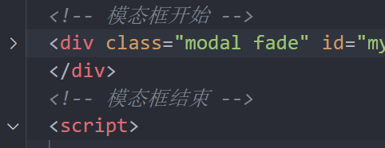

# js进阶第三天作业

## 客观题

1.下面关于编程思想说法错误的是? (D)

 A： 面向过程就是分析出解决问题所需要的步骤，然后用函数把这些步骤一步一步实现，使用的时候再一个一个的依次调用就可以了

 B：面向对象是把事务分解成为一个个对象，然后由对象之间分工与合作

 C： 面向过程编程性能比面向对象高，但是没有面向对象易维护、易复用、易扩展

 D：面向对象编程 易维护、易复用、易扩展，性能也比面向过程高

2.下面是面向对象编程特性的是? (ABC)

 A：封装性 

 B：继承性

 C：多态性

 D：优先级

3.原型对象是? (B)

 A：Object

 B：prototype

 C： _ __proto____

 D：consturctor

4.原型对象的作用说法错误的是? (D)

 A：构造函数通过原型分配的函数是所有对象所 共享的

 B：JavaScript 规定，每一个构造函数都有一个 prototype 属性，指向另一个对象，所以我们也称为原型对象

 C： 我们可以把那些不变的方法，直接定义在 prototype 对象上，这样所有对象的实例就可以共享这些方法

 D：原型经常挂载函数，但是比较耗费内存

5.关于构造函数和原型对象里面this指向说法正确的是? (A)

 A：构造函数和原型对象中的this 都指向 实例化的对象

 B：构造函数的this指向window

 C： 原型对象的this指向构造函数

 D：构造函数和实例对象里面没有this，跟箭头函数一样 

6.原型是? (B)

  A：Object

 B：prototype

 C： _ __proto____

 D：consturctor

7.为什么实例对象可以访问构造函数的原型对象中的属性和方法呢？ (A)

  A：因为实例对象里面有原型  _ __proto____ 它指向原型对象

 B：因为实例对象有constructor 指向原型对象

 C： 因为实例对象有 this指向原型对象

 D：没啥原因，反正就是能....

8.下列选项中关于原型链说法正确的是？ (ABCD)

  A：原型链的意义就在于为对象成员查找机制提供一个方向，或者说一条路线

 B：当访问一个对象的属性（包括方法）时，首先查找这个对象自身有没有该属性

 C：如果没有就查找它的原型（也就是 __proto__指向的 prototype 原型对象）

 D：如果还没有就查找原型对象的原型（Object的原型对象）依此类推一直找到 Object 为止（null）

9.下列选项中关于原型继承说法正确的是？ (ABC)

  A：核心是子类原型继承父类的实例： Man.prototype = new Person()

 B：父类新增原型方法或是原型属性子类都可以访问到

 C：Man.prototype = new Person()   其中 new Person() 生成一个对象，并且是独立的，互不影响

 D：子类继承了父级的一些属性和方法，但是子类不能随意扩展自己的方法和属性

## 主观题

### 英雄列表- 让案例具备新增功能

本作用练习使用第三方bootstarp插件

已经准备好的素材：

1. 新增了 添加按钮  
2. html新增了 bootstarp的模态框结构

 

3. 引入第三方js库

~~~html

~~~

**需求：**

1. 点击添加，页面可以弹出一个模态框
2. 输入相关数据，页面会多一条数据

须知：

显示和隐藏模态框是 bootstarp给我们提供好的代码，我们只需要调用即可

~~~javascript
// 显示模态框  bootstrap提供的语法直接使用即可
$("#myModal").modal("show")
// 隐藏模态框   bootstrap提供的语法直接使用即可
$("#myModal").modal("hide")
~~~

### 冰墩墩雪花效果

同学们只需要看懂里面的代码，自己尝试去修改，比如改变雪花颜色，比如修改其他雪花符号等等

 D：Man = new Person()    其实也可以的