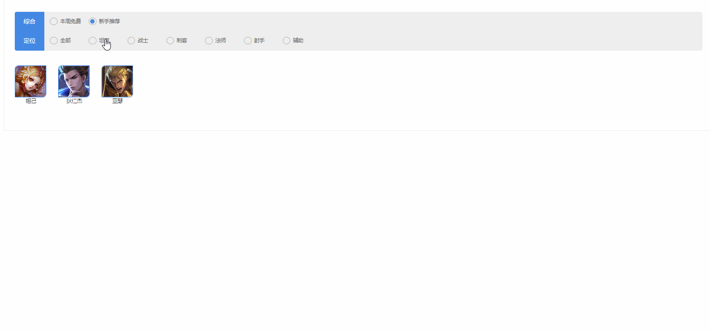
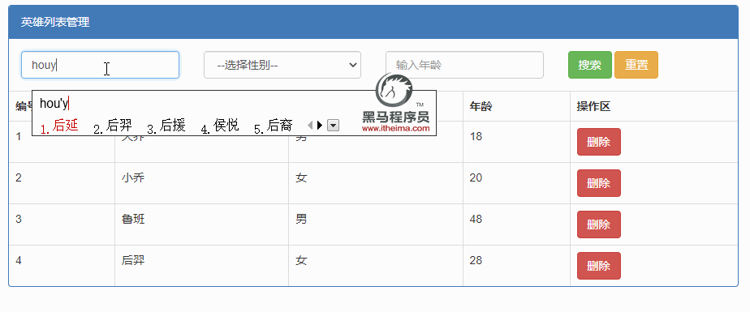

# 作业安排

## 客观题

1.下列关于作用域说法错误的是？(D)

 A：  JavaScript作用可以分为全局作用域和局部作用域

 B： 全局作用域声明的变量可以给局部作用域使用

 C： 局部作用域可以分为函数作用域和块级作用域

 D： 局部作用域声明的变量可以给其他局部作用域使用

2.下列关于作用域链说法错误的是？(C)

 A： 作用域链本质上是底层的变量查找机制

 B： 在函数被执行时，会优先查找当前函数作用域中查找变量

 C： 如果当前作用域查找不到则会优先从全局作用域查找，按照从外到内的顺序查找

 D： 子作用域能够访问父作用域，父级作用域无法访问子级作用域

3.下列关于垃圾回收机制说法正确的是？(ABCD) 多选

 A： 全局变量一般不会回收，通常在关闭页面回收全局变量

 B： 一般情况下局部变量的值, 不用了, 会被自动回收掉

 C： 不再用到的内存，没有及时释放，就叫做内存泄漏

 D： 常见的浏览器垃圾回收算法: 引用计数法和 标记清除法

4.下列闭包说法错误的是？(A)

 A： 闭包使用也是一个巧妙的用法，不存在内存泄漏的问题

 B： 简单理解：闭包 =  内层函数 + 外层函数的变量 

 C： 闭包使用的时候，内部的变量因为被外部引用了，所以代码执行完毕不会释放内存

 D： 闭包可以封闭数据，实现数据私有，外部也可以访问函数内部的变量

5.下列关于剩余参数说法错误的是？(C)

 A： 剩余参数允许我们将一个不定数量的参数表示为一个数组

 B： 剩余参数是个真数组，具备pop、push等方法

 C： 剩余参数和arguments动态参数是一样的，但是写法更简单

 D： 开发中提倡使用剩余参数想必也是极好的

6.下列关于箭头函数说法正确的是？(ABC)

 A： 箭头函数更适用于那些本来需要匿名函数的地方

 B： 箭头函数没有 arguments 动态参数，但是有 剩余参数

 C： 箭头函数不会创建自己的this,它只会从自己的作用域链的上一层沿用this

 D： 以后开发中，我们使用简便的箭头函数了，函数可以一律改为箭头函数

7.下列关于箭头函数写法正确的是?(ABC)

 A： const fn = x =>  x + x    只有一个参数可以省略小括号

 B： const fn = x =>  x + x    只有一行代码，可以省略大括号，而且还可以省略return

 C： const fn = x =>  ({uname})    箭头函数还可以返回对象，但是必须用小括号包含

 D： const fn = x，y =>   x + y    平时省略小括号更简单

8.下列关于数组解构说法错误的是?(B)

 A： 数组解构是将数组的单元值快速批量赋值给一系列变量的简洁语法

 B： [a,b] = [1,2,3]  这样写返回的结果是  a = 2    b =  3  

 C： [a,b] = [[1,2], 3]   返回的结果是:  a = [1,2]   b  = 3

 D： 还是建议尽量数组单元值和变量匹配

9.有如下代码，下列关于对象解构说法正确的是?(B)

~~~javascript
const obj = [{uname: '佩奇'， age: 18}]
~~~

 A： {uname, age}  可以得到    佩奇 和  18

 B：[{uname}] 可以得到  佩奇

 C： {age}  可以得到 18

 D： [uname, age ] 可以得到    佩奇   和  18

10.下面关于数组方法说法错误的是? (A)

 A：forEach 方法可以遍历数组，并且返回一个新的数组，不修改原数组

 B：map 方法可以迭代数组，主要用于数据处理，并且返回一个新的数组，不修改原数组

 C：filter方法可以筛选数组，主要用于筛选符合条件数据，并且返回一个新的数组，不修改原数组

 D:   push、shift、splice 都会修改原数组

## 排错题

### 排错题1

~~~JavaScript
// 下面第几行代码有错误？ 问题是什么？
const num = 10
function getSum() {
  const count = 10
  console.log(num)
}
console.log(count)
~~~

### 排错题2 

~~~JavaScript
// 请说出一下代码是否错误，如果有错如何改正，才能返回一个对象
const fn = x => {name: x, age: x * 2}
~~~

### 排错题3

~~~javascript
// 下列代码有什么错误？  有2出大错误哦
 const username = document.querySelector('.username').value
 const password = document.querySelector('.password').value
 document.querySelector('button').addEventListener('click', function () {
   const obj = {
     username,
     password,
     sayHi = () {
       console.log('hi~')
     }
   }
   console.log(obj)
 })
~~~

### 排错题4

~~~JavaScript
// 下列有什么错误？ 有一处错误
const arr = [
  {
    username: '小明',
    age: 18
  }
]
const { [username, age] } = arr
~~~

### 排错题5

~~~JavaScript
// 下列有一处错误，请找出哦~~
const obj = {
    username: '小明',
    age: 18
}
const {uname: username, age} = obj
~~~

## 主观题

### 代码题1 - 英雄筛选案例 

**需求**

1. 根据提供的数据实现页面渲染
2. 点击不同按钮渲染不同英雄
3. 请简单总结这个案例
   1. 我掌握了什么知识 (数组遍历？)
   2. 我什么知识还需加强 (箭头函数？)

### 代码题2-英雄筛选

**需求**

1. 根据提供的数组实现页面渲染
2. 实现点击删除功能
3. 实现输入英雄名称、性别、年龄 搜索功能
4. 实现 重置功能
    1. 点击 **重置按钮**
    2. 名称、性别、年龄 输入框清空
    3. 显示未筛选的列表（已经删除的，不能再次显示）
5. 请简单总结这个案例
    1. 我掌握了什么知识 (数组遍历？)
    2. 我什么知识还需加强 (箭头函数？)

## 编程强化

### 第一题：

~~~javascript
// 原数组
const input = [
    '生煎',
    '灌汤包',
    '水饺',
    '汉堡',
]

// 请把数组转换为以下格式：
const output = [
  {
    label: '生煎',
    value: '生煎',
  },
  {
    label: '灌汤包',
    value: '灌汤包',
  },
  {
    label: '水饺',
    value: '水饺',
  },
  {
    label: '汉堡',
    value: '汉堡',
  },
]

// 先不要看答案：

function transform(arr) {
    // item: '生煎' >>> ({ label: '生煎', value: '生煎' })
    return arr.map(item => ({
        label: item,
        value: item,
    }))
}

~~~

### 第二题：

~~~javascript
//  已知有以下数据：
const data = [
    {
        sku: '1001',
        name: 'iPhone 7 Plus 128G 玫瑰金色 移动联通电信4G手机',
        is5G: false,
        price: 6188,
        count: 100, // 库存
        suggestions: [
            '1002',
            '1003',
            '1004',
        ], // 相关推荐
    },
    {
        sku: '1002',
        name: 'iPhone 14 Pro 256G 深空灰色 移动联通电信5G手机',
        is5G: true,
        price: 9999,
        count: 100,
        suggestions: [
            '1001',
            '1003',
        ],
    },
    {
        sku: '1003',
        name: 'iPhone 14 Pro Max 256G 深空灰色 移动联通电信5G手机',
        is5G: true,
        price: 10999,
        count: 0,
        suggestions: [
            '1001',
            '1002',
        ],
    },
    {
        sku: '1004',
        name: 'iPhone 14 Pro Max 256G 白色 移动联通电信5G手机',
        is5G: true,
        price: 10999,
        count: 9,
        suggestions: [
            '1001',
        ],
    },
]

// 请完成以下需求：
// 1. 找出所有5G手机
// 2. 找出所有有货的手机
// 3. 找出所有有货的5G手机

// 先不要看答案
// 1. 找出所有5G手机
console.log( data.filter(d => d.is5G) )

// 2. 找出所有有货的手机
console.log( data.filter(d => d.count) )

// 3. 找出所有有货的5G手机
console.log( data.filter(d => d.count && d.is5G) )

~~~

### 第三题：

~~~JavaScript
// 有如下数据
const data = [
    {
        id: '1faa0e81', // 快递单号
        from: { // 发件人信息
            name: '张三',
            id: '1412908431238',
            phone: '13800138000',
            address: '北京市朝阳区望京soho',
        },
        to: { // 收件人信息
            name: '李四',
            id: '1412908431239',
            phone: '13800138001',
            address: '北京市海淀区西二旗',
        },
        timestamp: 1610000000000, // 时间戳
        status: 'pending', // 状态 pending在途中 resolved已签收 rejected拒签
        goodsType: 'food', // 类型 food食品 electronic电子
        price: 18,  // 价格
        type: '次日达', // 快递类型
    },
    {
        id: '1faa0e82',
        from: {
            name: '张武',
            id: '1412908431240',
            phone: '13800138002',
            address: '重庆市渝中区渝中路',
        },
        to: {
            name: '李六',
            id: '1412908431241',
            phone: '13800138003',
            address: '重庆市渝北区渝北路',
        },
        timestamp: 1610000123123,
        status: 'resolved',
        goodsType: 'electronics',
        price: 188,
        type: '次日达',
    },
    {
        id: '1faa0e83',
        from: {
            name: '赵信',
            id: '1412908431242',
            phone: '13800138004',
            address: '上海市浦东新区张江高科',
        },
        to: {
            name: '王9',
            id: '1412908431243',
            phone: '13800138005',
            address: '深圳市南山区科技园',
        },
        timestamp: 1610000123124,
        status: 'pending',
        goodsType: 'food',
        price: 18,
        type: '次日达',
    },
    {
        id: '1faa0e84',
        from: {
            name: '蛮王',
            id: '1412908431244',
            phone: '13800138006',
            address: '重庆市渝中区千与千寻小区',
        },
        to: {
            name: '艾希',
            id: '1412908431245',
            phone: '13800138007',
            address: '重庆市渝北区中央公园',
        },
        timestamp: 1610000123125,
        status: 'rejected',
        goodsType: 'flowers',
        price: 99,
        type: '隔日达',
    },
]

// 请完成以下需求

// 1. 找出所有food类型的订单

// 2. 找出所有次日达的订单

// 3. 找出所有次日达的food类型的订单

// 4. 统计快递的拒签率(rejected为退回)

// 5. 找出所有在途中的订单(即pending状态的订单)

//  先不要看答案哦

// 1. 找出所有food类型的订单
console.log( data.filter(d => d.goodsType === 'food') )

// 2. 找出所有次日达的订单
console.log( data.filter(d => d.type === '次日达') )

// 3. 找出所有次日达的food类型的订单
console.log( data.filter(d => d.type === '次日达' && d.goodsType === 'food') )

// 4. 统计快递的拒签率(rejected为退回)
console.log( data.filter(d => d.status === 'rejected').length / data.length )

// 5. 找出所有在途中的订单(即pending状态的订单)
console.log( data.filter(d => d.status === 'padding') )
~~~

 D：join 方法可以把数组元素根据小括号的参数，拼接为一个字符串