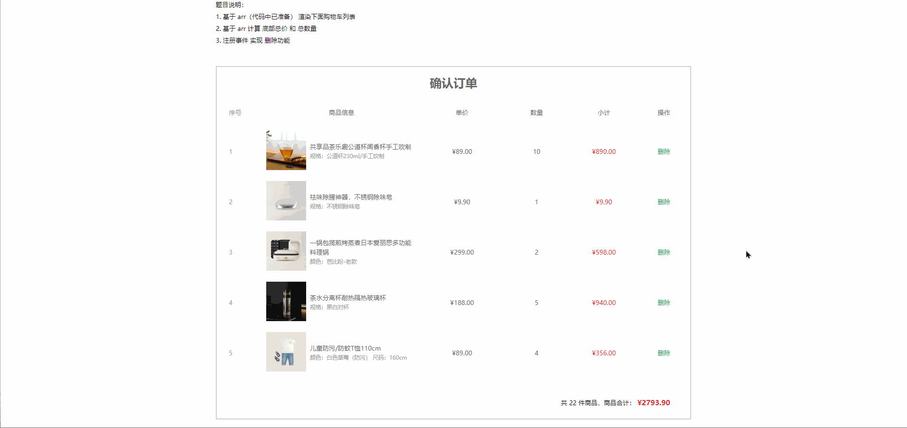
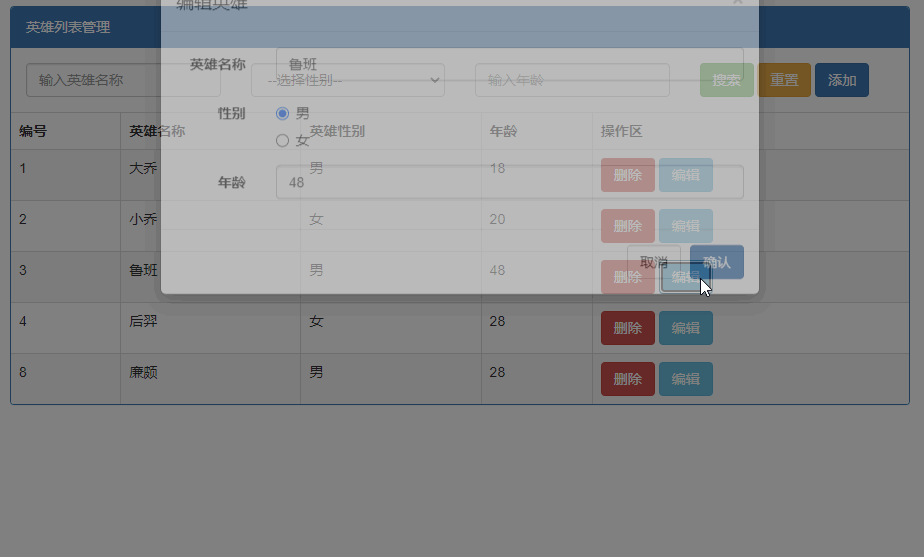

## 客观题

1. 下列选项中关于深浅拷贝说法错误的是？ (D)

   A：直接赋值对象的方法，只要是对象，都会相互影响，因为是直接拷贝对象栈里面的地址

   B：浅拷贝时，对象属性值是简单数据类型直接拷贝值，如果属性值是引用数据类型则拷贝的是地址

   C：深拷贝拷贝的是对象，不是地址，所以不会相互影响了

   D：我们可以采取函数递归的方式完成浅拷贝

2. 下列选项中关于函数递归说法错误的是？ (C)

   A：如果一个函数在内部可以调用其本身，那么这个函数就是递归函数

   B：递归函数的作用和循环效果类似，不断的自己调用自己

   C：由于递归很容易发生“栈溢出”错误（stack overflow），所以必须要加退出条件  break

   D：我们可以利用递归函数实现 setTimeout 模拟 setInterval效果

3. 下列选项中可以完成深拷贝的是？ (ABC)

   A：通过递归函数实现深拷贝

   B：利用js库lodash里面cloneDeep内部实现了深拷贝

   C：通过JSON.stringify() 转换字符串，再利用 JSON.parse() 方法转换为对象可以完成深拷贝

   D：可以采取bind方法完成深拷贝

4. 下列选项中throw抛异常说法错误的是？ (A)

   A：throw 抛出异常信息，但是我们必须加 return 来终止程序的往下执行

   B： throw 后面跟的是错误提示信息

   C：Error 对象配合 throw 使用，能够设置更详细的错误信息

   D：Error 对象配合 throw 控制台显示的提示可以为红色警示

5. 下列选项中 try/catch捕获错误信息 说法错误的是？ (A)

   A：将预估可能发生错误的代码写在 catch 代码段中

   B：如果 try 代码段中出现错误后，会执行 catch 代码段，并截获到错误信息

   C：我们需要给catch 添加 return 可以终止程序继续执行

   D：finally  不管是否有错误，都会执行 

6. 下列选项中 关于this指向说法错误的是？ (D)

   A：普通函数this指向我们理解为谁调用 this 的值指向谁

   B：定时器中的this 指向 window

   C：箭头函数中的 this 与普通函数完全不同，也不受调用方式的影响，事实上箭头函数中并不存在 this

   D：箭头函数中没有this， 是沿用 window，简单说，箭头函数的this 指向window

7. 下列选项中 可以改变this指向的方法是？ (ABC)

   A：call()

   B：bind()

   C：apply()

   D：catch()

8. 下列选项中说法错误的是？ (D)

   A：call 和 apply  会调用函数, 并且改变函数内部this指向

   B：bind  不会调用函数, 可以改变函数内部this指向，它也是主要用来改变this指向的

   C：call 和 apply 传递的参数不一样, call 传递参数 aru1, aru2..形式  apply 必须数组形式[arg]

   D： apply 主要使用场景是可以改变定时器的this指向，并且不调用函数

9. 下列选项中关于节流和防抖说法正确的是？ (ABCD)

   A：节流: 单位时间频繁触发事件，只执行一次函数,比如可以利用节流实现 1s之内只能触发一次鼠标移动事件

   B：防抖： 单位时间频繁触发事件，只执行最后一次函数，

   C：节流应用场景:  鼠标移动，页面尺寸发生变化，滚动条滚动等开销比较大的情况下

   D：防抖应用场景：搜索框输入


## 主观题

### 代码题

题目说明：

1. 基于 arr（代码中已准备） 渲染下面购物车列表
2. 基于 arr 计算 底部总价 和 总数量
3. 注册事件 实现 删除功能



## 综合实战(勇于挑战)

同学们利用晚自习或者第二天休息完成以下代码（勇于挑战自己）

### 编程题

~~~html
<body>
    <script>
      // 要求：必须使用上 es5/es6 相关的语法
      // 比如: 展开运算符，数组reduce，filter，map等语法...

      // 1. 封装函数，求得数组中的最大值  [1, 6, 2, 8, 11, 5]
      function getMax(arr) {
        // 填入代码
      }
      let arr = [1, 6, 2, 8, 11, 5]
      let max = getMax(arr)

      // --------------------------------------------------------------

      // 2. 封装函数，求得传入数组元素的和 [3, 9, 9, 2, 7, 5]
      function getSum(arr) {
        // 填入代码
      }
      let arr2 = [3, 9, 9, 2, 7, 5]
      let sum2 = getSum(arr2)

      // --------------------------------------------------------------

      // 3. 封装函数，求得传入数组⾥⼤于 5 的和 [4, 9, 6, 90, 3, 11]
      function getLargeSum(arr) {}
      let arr3 = [4, 9, 6, 90, 3, 11]
      let sum3 = getLargeSum(arr3)

      // --------------------------------------------------------------
      // 4. 对数组，按照价格进行升序排序
      const arr4 = [
        { id: 1, name: '茶杯', price: 18 },
        { id: 2, name: '电视机', price: 2000 },
        { id: 3, name: '牙刷', price: 8 },
        { id: 4, name: '电脑', price: 5000 },
      ]

      // ---------------------------------------------------------------
      // 5. 将学生数组中的所有姓名，存入成一个新数组，并过滤掉小强 => 得到 ['小明', '小丽', '小美']
      const arr5 = [
        { id: 1, name: '小强', score: 18 },
        { id: 2, name: '小明', score: 2000 },
        { id: 3, name: '小丽', score: 8 },
        { id: 4, name: '小美', score: 5000 },
      ]
    </script>
  </body>
~~~

### 英雄列表案例具备编辑功能

效果如下：



**需求：**

1. 实现点击编辑，出现编辑模态框（**标题文字也是编辑英雄 点击新增，标题则还是新增英雄**），并且里面会出现，待编辑的数据

    

2. 在编辑框内可以修改英雄的信息，点击确认
    1. 关闭模态框
    2. 页面的数据发生更新

3. 同时要保证之前的功能都正常

**提示：**

1. 获取单选框中为男的dom元素

```JavaScript
document.querySelector(`[name='heroGender'][value='男}']`)
```
2. 属性选择器 `document.querySelector("[属性名='属性值']")`
3. 获取选中的单选框的值 `document.querySelector("[name='heroGender']:checked")`

## 常见面试题

### 什么是递归

一种函数调用自身的操作 ，在实现递归的函数中，往往都需要添加终止递归的条件

### 什么是深拷贝 什么是浅拷贝

1. 浅拷贝只是针对引用类型数据中的属性做了一层复制，如果被拷贝到属性也是引用类型，那么这个属性只是做了个引用地址的传递。
    1. 做了浅拷贝的对象之间可能会**相互影响**
2. 深拷贝是针对引用类型数据中的属性做无限层级的复制，不管属性是值类型还是引用类型，会完整复制一份。
    1. 做了深拷贝打两个对象之间相互**不会影响**
3. **除了 递归克隆对象、JSON.stringify 两种方式做的拷贝，其他方法全部都是浅拷贝**

### call、apply、bind的区别

1. 他们三都可以修改this指向，
2. call、apply 在修改this指向的同时也会调用原函数、bind 不调用函数只会返回修改this指向后的函数
3. call和apply接收参数的方式不一样，call类似普通函数一样接收参数、apply接收的参数必须都放在一个数组内。

### 什么是防抖和节流

1. 所谓节流，单位时间内，某个动作只能执行一次 可以用在 鼠标移动、页面尺寸缩放 resize、滚动条滚动等场景
2. 所谓防抖，单位时间内，某个动作只能执行最后一次，可以用在 搜索框 业务中。


