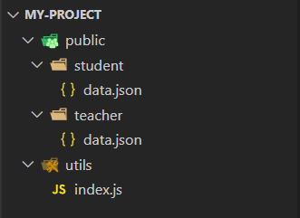
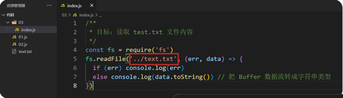

# Day01_Node.js入门

## 知识点自测


1. 从 index.js 出发，访问到 student/data.json 的相对路径如何写?

   

   A：`../public/teacher/data.json`

   B：`./public/student/data.json`

   C：`../student/data.json`

   <details>
   <summary>答案</summary>
   <ul>
   <li>A选项正确</li>
   </ul>
   </details>


2. 如下代码运行结果是多少?

   ```js
   const str = `我们都是好人，好人就是我`
   const result = str.replace(/好/g, '')
   ```

   A：`我们都是人，好人就是我`

   B：`我们都是人，人就是我`

   <details>
   <summary>答案</summary>
   <ul>
   <li>B选项正确</li>
   </ul>
   </details>


3. 以下哪个正则表达式，能匹配字符串中的小括号？

   A：`/(/`

   B：`/\(/`

   <details>
   <summary>答案</summary>
   <ul>
   <li>B选项正确，因为在正则表达式里直接写小括号，相当于分组功能，而不是匹配字符串小括号里，可以加一个斜杠代表转义，转换它去匹配小括号字符串而不再是分组</li>
   </ul>
   </details>


4. 如下代码返回的结果是什么？

   ```js
   const str = '/api/hello?a=10&b=20'
   const result = str.startsWith('/api/hello')
   ```

   A：true

   B：false

   <details>
   <summary>答案</summary>
   <ul>
   <li>A 项正确，startsWith 用于判断调用的字符串是否以传入的目标字符串开头，是返回 true，否则返回 false 在原地</li>
   </ul>
   </details>


## 提前安装软件

在配套的资料文件夹中，先安装好 Node.js 环境，上课可以节省时间

具体安装过程可以参考 PPT 和 配套视频！


## 目录

* Node.js 安装与使用
* fs 模块
* path 模块
* 案例 - 前端项目压缩
* http 模块 - 创建 Web 服务
* 案例 - 省份列表接口
* 案例 - 浏览时钟


## 学习目标

1. 掌握 Node.js 的作用和使用
2. 体验前端工程化压缩整合
3. 掌握端口号的作用
4. 掌握 Web 服务的功能


## 01.什么是 Node.js

### 目标

什么是 Node.js，有什么用，为何能独立执行 JS 代码，演示安装和执行 JS 文件内代码


### 讲解

1. Node.js 是一个独立的 JavaScript 运行环境，能独立执行 JS 代码，因为这个特点，它可以用来编写服务器后端的应用程序

2. Node.js 作用除了编写后端应用程序，也可以对前端代码进行压缩，转译，整合等等，提高前端开发和运行效率

3. Node.js 基于Chrome V8 引擎封装，独立执行 JS 代码，但是语法和浏览器环境的 V8 有所不同，没有 document 和 window 但是都支持 ECMAScript 标准的代码语法

4. 想要得到 Node.js 需要把这个软件安装到电脑，在素材里有安装程序（window 和 mac 环境的）参考 PPT 默认下一步安装即可

5. Node.js 没有图形化界面，需要使用 cmd 终端命令行（利用一些命令来操控电脑执行某些程序软件）输入，node -v 检查是否安装成功

   ```bash
   node -v
   ```

   

6. 需求：新建 index.js 文件，编写打印代码和 for 循环打印 3 个 6

   ```js
   /**
    * 目标：编写 js 代码，用 node 命令执行
    * 终端作用：敲击命令，调用对应程序执行
    * 终端打开：目标文件->右键->在集成终端中打开
    * 命令：node xxx.js （注意路径）
    */
   console.log('Hello, World')
   for (let i = 0; i < 3; i++) {
     console.log(6)
   }
   ```

   

7. Node.js 执行目标 JS 文件，需要使用 node xxx.js 命令来执行（我们可以借助 VSCode 集成终端使用，好处：可以快速切换到目标 JS 文件所在终端目录，利用相对路径找到要执行的目标 JS 文件

   


### 小结

1. Node.js 有什么用？

   <details>
   <summary>答案</summary>
   <ul>
   <li>编写后端程序，提供数据和网页资源，还可以作为前端工程化的工具，翻译压缩整合代码等，提高开发效率</li>
   </ul>
   </details>


2. Node.js 为何能执行 JS 代码？

   <details>
   <summary>答案</summary>
   <ul>
   <li>基于 Chrome 的 V8 引擎封装</li>
   </ul>
   </details>


3. Node.js 与浏览器环境的 JS 最大区别？

   <details>
   <summary>答案</summary>
   <ul>
   <li>Node.js 环境中没有 BOM 和 DOM，但是也用 JS 语法</li>
   </ul>
   </details>


4. Node.js 如何执行代码？

   <details>
   <summary>答案</summary>
   <ul>
   <li>在 VSCode 终端中输入：node xxx.js 回车即可执行（注意路径）</li>
   </ul>
   </details>


## 02.fs模块-读写文件

### 目标

了解模块概念，使用 fs 模块封装的方法读写文件内容


### 讲解

1. 模块：类似插件，封装了方法和属性供我们使用

2. fs 模块：封装了与本机文件系统进行交互的，方法和属性

3. fs 模块使用语法如下：

   * 加载 fs 模块，得到 fs 对象

     ```js
     const fs = require('fs')
     ```

   * 写入文件内容语法：

     ```js
     fs.writeFile('文件路径', '写入内容', err => {
       // 写入后的回调函数
     })
     ```

   * 读取文件内容的语法：

     ```js
     fs.readFile('文件路径', (err, data) => {
       // 读取后的回调函数
       // data 是文件内容的 Buffer 数据流
     })
     ```


4. 需求：向 test.txt 文件写入内容并读取打印

   ```js
   /**
    * 目标：使用 fs 模块，读写文件内容
    * 语法：
    * 1. 引入 fs 模块
    * 2. 调用 writeFile 写入内容
    * 3. 调用 readFile  读取内容
    */
   // 1. 引入 fs 模块
   const fs = require('fs')
   // 2. 调用 writeFile 写入内容
   // 注意：建议写入字符串内容，会覆盖目标文件所有内容
   fs.writeFile('./text.txt', '欢迎使用 fs 模块读写文件内容', err => {
     if (err) console.log(err)
     else console.log('写入成功')
   })
   // 3. 调用 readFile  读取内容
   fs.readFile('./text.txt', (err, data) => {
     if (err) console.log(err)
     else console.log(data.toString()) // 把 Buffer 数据流转成字符串类型
   })
   ```

   


### 小结

1. 什么是模块？

   <details>
   <summary>答案</summary>
   <ul>
   <li>类似插件，封装了方法和属性</li>
   </ul>
   </details>


2. fs 模块的作用？

   <details>
   <summary>答案</summary>
   <ul>
   <li>读写本机文件内容</li>
   </ul>
   </details>


## 03.path模块-路径处理

### 目标

使用 path 模块来得到绝对路径


### 讲解

1. 为什么在 Node.js 待执行的 JS 代码中要用绝对路径：

   > Node.js 执行 JS 代码时，代码中的路径都是以终端所在文件夹出发查找相对路径，而不是以我们认为的从代码本身出发，会遇到问题，所以在 Node.js 要执行的代码中，访问其他文件，建议使用绝对路径

2. 新建 03 文件夹编写待执行的 JS 代码，访问外层相对路径下的文件，<span style="color: red;">然后在最外层终端路径来执行目标文件，造成问题</span>

   

   


3. 问题原因：就是从代码文件夹出发，使用`../text.txt`解析路径，找不到目标文件，报错了！

4. 解决方案：使用模块内置变量 `__dirname`配合 path.join() 来得到绝对路径使用

   ```js
   const fs = require('fs')
   console.log(__dirname) // D:\备课代码\2_node_3天\Node_代码\Day01_Node.js入门\代码\03
   
   // 1. 加载 path 模块
   const path = require('path')
   // 2. 使用 path.join() 来拼接路径
   const pathStr = path.join(__dirname, '..', 'text.txt')
   console.log(pathStr)
   
   fs.readFile(pathStr, (err, data) => {
     if (err) console.log(err)
     else console.log(data.toString())
   })
   ```

   

5. 再次执行查看问题就被修复了！以后在 Node.js 要执行的 JS 代码中访问其他文件的路径，都建议使用绝度路径


### 小结

1. path.join() 方法有什么用？

   <details>
   <summary>答案</summary>
   <ul>
   <li>按照所在本机系统的分隔符作为定界符来链接你传入的路径</li>
   </ul>
   </details>


2. `__dirname` 模块内置变量的值是多少？

   <details>
   <summary>答案</summary>
   <ul>
   <li>动态获取当前文件所在文件夹的绝对路径</li>
   </ul>
   </details>


## 04.案例-压缩前端html

### 目标

压缩前端代码，体验前端工程化的例子


### 讲解

1. 前端工程化：前端代码压缩，整合，转译，测试，自动部署等等工具的集成统称，为了提高前端开发项目的效率

2. 需求：把准备好的 html 文件里的回车符（\r）和换行符（\n）去掉进行压缩，写入到新 html 中

3. 步骤：

   1. 读取源 html 文件内容
   2. 正则替换字符串
   3. 写入到新的 html 文件中，并运行查看是否能正常打开网页

4. 代码如下：

   ```js
   /**
    * 目标一：压缩 html 里代码
    * 需求：把 public/index.html 里的，回车/换行符去掉，写入到 dist/index.html 中
    *  1.1 读取 public/index.html 内容
    *  1.2 使用正则替换内容字符串里的，回车符\r 换行符\n
    *  1.3 确认后，写入到 dist/index.html 内
    */
   const fs = require('fs')
   const path = require('path')
   // 1.1 读取 public/index.html 内容
   fs.readFile(path.join(__dirname, 'public', 'index.html'), (err, data) => {
     const htmlStr = data.toString()
     // 1.2 使用正则替换内容字符串里的，回车符\r 换行符\n
     const resultStr = htmlStr.replace(/[\r\n]/g, '')
     // 1.3 确认后，写入到 dist/index.html 内
     fs.writeFile(path.join(__dirname, 'dist', 'index.html'), resultStr, err => {
       if (err) console.log(err)
       else console.log('压缩成功')
     })
   })
   ```

   


### 小结

1. 前端工程化的理解？

   <details>
   <summary>答案</summary>
   <ul>
   <li>对前端代码进行优化，集成各种提高前端开发效率的工具等</li>
   </ul>
   </details>


## 05.案例-压缩前端JS

### 目标

体验前端工程化，压缩，转译，整合代码


### 讲解

1. 需求：把准备好的 JS 文件代码的回车符，换行符，打印语句去掉，并插入到之前 html 内容之后

2. 步骤：

   1. 读取 js 文件内容
   2. 正则表达式替换回车符，换行符，打印语句为空字符串
   3. 拼接 html 代码和 js 代码，写入到新的 html 文件中

3. 代码如下：

   ```js
   /**
    * 目标二：压缩 js 里代码，并整合到 html 中一起运行
    *  2.1 读取 public/index.js 内容
    *  2.2 使用正则替换内容字符串里的，回车符\r 换行符\n 打印语句console.log('xxx');
    *  2.3 确认后，拼接 html 内容写入到 dist/index.html 内
    */
   const fs = require('fs')
   const path = require('path')
   fs.readFile(path.join(__dirname, 'public', 'index.html'), (err, data) => {
     const htmlStr = data.toString()
     const resultStr = htmlStr.replace(/[\r\n]/g, '')
   
     // 2.1 读取 public/index.js 内容
     fs.readFile(path.join(__dirname, 'public', 'index.js'), (err, data) => {
       const jsStr = data.toString()
       // 2.2 使用正则替换内容字符串里的，回车符\r 换行符\n 打印语句console.log('xxx');
       const jsResultStr = jsStr.replace(/[\r\n]/g, '').replace(/console.log\('.+?'\);/g, '')
       const result = `<script>${jsResultStr}</script>`
       console.log(result)
   
       // 2.3 确认后，拼接 html 内容写入到 dist/index.html 内
       fs.writeFile(path.join(__dirname, 'dist', 'index.html'), resultStr + result, err => {
         if (err) console.log(err)
         else console.log('压缩成功')
       })
     })
   
   
   })
   ```

   


### 小结

1. 正则表达式中如何匹配小括号字符？

   <details>
   <summary>答案</summary>
   <ul>
   <li>要使用转译字符，转换正则中小括号匹配的目标</li>
   </ul>
   </details>


## 06.认识URL中的端口号

### 目标

认识 URL 中端口号的作用，以及 Web 服务的作用


### 讲解

1. URL 是统一资源定位符，简称网址，用于访问网络上的资源
2. 端口号的作用：标记服务器里对应的服务程序，值为（0-65535 之间的任意整数）
3. 注意：http 协议，默认访问的是 80 端口
4. Web服务：一个程序，用于提供网上信息浏览功能
5. 注意：0-1023 和一些特定的端口号被占用，我们自己编写服务程序请避开使用


### 小结

1. 端口号的作用？

   <details>
   <summary>答案</summary>
   <ul>
   <li>标记区分服务器里不同的服务程序</li>
   </ul>
   </details>

2. 什么是 Web 服务？

   <details>
   <summary>答案</summary>
   <ul>
   <li>提供网上信息浏览的服务的一个程序</li>
   </ul>
   </details>


## 07.http模块-创建Web服务

### 目标

基于 Node.js 环境，使用内置 http 模块，创建 Web 服务程序


### 讲解

1. 需求：引入 http 模块，使用相关语法，创建 Web 服务程序，响应返回给请求方一句提示 ‘hello，world’
2. 步骤：
   1. 引入 http 模块，创建 Web 服务对象
   2. 监听 request 请求事件，对本次请求，做一些响应处理
   3. 启动 Web 服务监听对应端口号
   4. 运行本服务在终端进程中，用浏览器发起请求

3. 注意：本机的域名叫做 localhost

4. 代码如下：

   ```js
   /**
    * 目标：使用 http 模块，创建 Web 服务
    * Web服务：一个程序，用于提供网上信息浏览服务
    * 步骤：
    *  1. 引入 http 模块，创建 Web 服务对象
    *  2. 监听 request 事件，对本次请求，做一些响应处理
    *  3. 启动 Web 服务监听对应端口号
    *  4. 运行本服务在终端，用浏览器访问 http://localhost:3000/ 发起请求（localhost 是本机域名）
    * 注意：终端里启动了服务，如果想要终止按 ctrl c 停止即可
    */
   // 1. 引入 http 模块，创建 Web 服务对象
   const http = require('http')
   const server = http.createServer()
   // 2. 监听 request 事件，对本次请求，做一些响应处理
   server.on('request', (req, res) => {
     res.end('hello, world') // 一次请求只能对应一次响应
   })
   // 3. 启动 Web 服务监听对应端口号
   server.listen(3000, () => {
     console.log('Web 服务启动了')
   })
   ```

   


### 小结

1. 如何访问本机里运行的 Web 服务？

   <details>
   <summary>答案</summary>
   <ul>
   <li>http://localhost:Web服务的端口号/资源路径</li>
   </ul>
   </details>


## 08.Web服务-支持中文字符

### 目标

让 Web 服务，返回中文字符，浏览器正确解析加载


### 讲解

1. 需求：让 Web 服务返回中文字符，浏览器能正确加载解析

2. 步骤：给 Web 服务程序添加响应头，设置内容类型和正确的编码格式，重启 Web 服务测试访问即可

   ```js
   res.setHeader('Content-Type', 'text/html;charset=utf-8')
   ```

3. 编码：编码是信息从一种形式或格式转换为另一种形式的过程，指的把文字在计算机里的二进制数据，用什么形式展示出来

4. utf-8编码：是一种关系映射表，也叫 utf-8 编码表，可以把中文，英文等等很多字符准确的展示出来


### 小结

1. 如何让 Web 服务支持中文字符的返回和展示？

   <details>
   <summary>答案</summary>
   <ul>
   <li>在响应头上设置指定的响应内容类型的标记和编码格式</li>
   </ul>
   </details>


## 09.案例-省份列表接口

### 目标

基于 Web 服务，编写代码，把省份列表数据响应给请求方


### 讲解

1. 需求：基于 Web 服务，开发提供省份列表数据的接口，了解下后端的代码工作过程

   

2. 步骤：

   1. 基于 http 模块，创建 Web 服务
   2. 使用 req.url 获取请求资源路径，并读取 province.json 理论省份数据返回给请求方
   3. 其他路径，暂时返回不存在的提示
   4. 运行 Web 服务，用浏览器发起请求测试，看是否可以获取到省份列表数据

3. 代码如下：

   ```js
   /**
    * 目标：基于 Web 服务，开发-省份列表数据接口
    * 步骤：
    *  1. 创建 Web 服务
    *  2. 使用 req.url 获取请求的资源路径，读取 json 文件数据返回
    *  3. 其他请求的路径，暂时返回不存在的提示
    *  4. 运行 Web 服务，用浏览器请求地址查看效果
    */
   const fs = require('fs')
   const path = require('path')
   // 1. 创建 Web 服务
   const http = require('http')
   const server = http.createServer()
   server.on('request', (req, res) => {
     // 2. 使用 req.url 获取请求的资源路径，读取 json 文件数据返回
     if (req.url === '/api/province') {
       fs.readFile(path.join(__dirname, 'data/province.json'), (err, data) => {
         res.setHeader('Content-Type', 'application/json;charset=utf-8')
         res.end(data.toString())
       })
     } else {
       // 3. 其他请求的路径，暂时返回不存在的提示
       res.setHeader('Content-Type', 'text/html;charset=utf-8')
       res.end('你要访问的资源路径不存在')
     }
   })
   server.listen(3000, () => {
     console.log('Web 服务启动了')
   })
   
   ```

   

### 小结

1. 后端接口是如何运行的？

   <details>
   <summary>答案</summary>
   <ul>
   <li>判断前端请求的路径，执行对应的代码，并返回需要的数据</li>
   </ul>
   </details>


## 10.案例-城市列表接口

### 目标

体验城市列表接口开发效果，以及查询参数如何传递给后端，后端是如何找到对应的数据


### 讲解

1. 需求：基于刚刚的 Web 服务，开发提供城市列表数据的接口，了解下后端代码的工作过程

   

2. 步骤：

   1. 判断 req.url 资源路径+查询字符串，路径前缀匹配 /api/city
   2. 借助 querystring 模块的方法，格式化查询字符串
   3. 读取 city.json 城市数据，匹配省份名字下属城市列表
   4. 返回城市列表，启动 Web 服务测试

3. 代码如下：

   ```js
   /**
    * 目标：基于 Web 服务，开发-城市列表数据接口
    * 步骤：
    *  1. 判断 req.url 资源路径+查询字符串，路径前缀匹配/api/city
    *  2. 借助 querystring 模块的方法，格式化查询参数字符串
    *  3. 读取 city.json 城市数据，匹配省份名字下属城市列表
    *  4. 返回城市列表，启动 Web 服务测试
    */
   const qs = require('querystring')
   const fs = require('fs')
   const path = require('path')
   const http = require('http')
   const server = http.createServer()
   server.on('request', (req, res) => {
     // 省份列表接口
     if (req.url === '/api/province') {
       fs.readFile(path.join(__dirname, 'data/province.json'), (err, data) => {
         res.setHeader('Content-Type', 'application/json;charset=utf-8')
         res.end(data.toString())
       })
       // 1. 判断 req.url 资源路径+查询字符串，路径前缀匹配/api/city
     } else if (req.url.startsWith('/api/city')) {
       // 城市列表接口
       // 2. 借助 querystring 模块的方法，格式化查询参数字符串
       // req.url: '/api/city?pname=辽宁省'
       // 以?分隔符分割，拿到'pname=辽宁省'查询参数字符串
       const str = req.url.split('?')[1]
       // 把查询参数字符串 转成 JS 对象结构
       const query = qs.parse(str)
       // 获取前端发来的省份名字
       const pname = query.pname
       // 3. 读取 city.json 城市数据，匹配省份名字下属城市列表
       fs.readFile(path.join(__dirname, 'data/city.json'), (err, data) => {
         // 把 JSON 文件内对象格式字符串，转成对象结构
         const obj = JSON.parse(data.toString())
         // 省份名字作为 key，去obj对象里取到对应城市列表 value 值
         const cityList = obj[pname]
         // 4. 返回城市列表，启动 Web 服务测试
         // 响应的是 JSON 字符串内容
         res.setHeader('Content-Type', 'application/json;charset=utf-8')
         res.end(JSON.stringify(cityList))
       })
     } else {
       res.setHeader('Content-Type', 'text/html;charset=utf-8')
       res.end('你要访问的资源路径不存在')
     }
   })
   server.listen(3000, () => {
     console.log('Web 服务启动了')
   })
   
   ```

   


### 小结

1. 为什么查询参数的名字是后端规定的？

   <details>
   <summary>答案</summary>
   <ul>
   <li>因为后端访问对应的属性拿到前端，传递过来的数据</li>
   </ul>
   </details>


## 11.案例-浏览时钟

### 目标

体验 Web 服务除了接口数据以外，还能返回网页资源等


### 讲解

1. 需求：基于 Web 服务，开发提供网页资源的功能，了解下后端的代码工作过程

   

2. 步骤：

   1. 基于 http 模块，创建 Web 服务
   2. 使用 req.url 获取请求资源路径为 /index.html 的时候，读取 index.html 文件内容字符串返回给请求方
   3. 其他路径，暂时返回不存在的提示
   4. 运行 Web 服务，用浏览器发起请求

3. 代码如下：

   ```js
   /**
    * 目标：编写 web 服务，监听请求的是 /index.html 路径的时候，返回 dist/index.html 时钟案例页面内容
    * 步骤：
    *  1. 基于 http 模块，创建 Web 服务
    *  2. 使用 req.url 获取请求资源路径，并读取 index.html 里字符串内容返回给请求方
    *  3. 其他路径，暂时返回不存在提示
    *  4. 运行 Web 服务，用浏览器发起请求
    */
   const fs = require('fs')
   const path = require('path')
   // 1. 基于 http 模块，创建 Web 服务
   const http = require('http')
   const server = http.createServer()
   server.on('request', (req, res) => {
     // 2. 使用 req.url 获取请求资源路径，并读取 index.html 里字符串内容返回给请求方
     if (req.url === '/index.html') {
       fs.readFile(path.join(__dirname, 'dist/index.html'), (err, data) => {
         res.setHeader('Content-Type', 'text/html;charset=utf-8')
         res.end(data.toString())
       })
     } else {
       // 3. 其他路径，暂时返回不存在提示
       res.setHeader('Content-Type', 'text/html;charset=utf-8')
       res.end('你要访问的资源路径不存在')
     }
   })
   server.listen(8080, () => {
     console.log('Web 服务启动了')
   })
   ```

   

### 小结

1. Web 服务程序都有什么功能？

   <details>
   <summary>答案</summary>
   <ul>
   <li>提供数据和网页资源等等功能，其他它的功能远不止于此</li>
   </ul>
   </details>


## 今日重点(必须会)

1. 前端工程化思想：基于 Node.js 环境对前端代码进行优化处理
2. Web 服务程序的作用：返回 JSON 接口数据和网页资源等


## 今日作业(必完成)

参考作业文件夹的md要求


## 参考文献

介绍: MDN 是 Mozilla基金会的开发者网络平台。提供了大量关于各种HTML、CSS和JavaScript功能的开放、详细的文档，以及广泛的Web API参考资料。

[MDN(Mozilla Developer Network)网站](https://developer.mozilla.org/zh-CN/)

[MDN-JavaScript更多了解](https://developer.mozilla.org/zh-CN/docs/Web/JavaScript)

[node官方文档-中文站](https://nodejs.org/zh-cn/)

[node中文网](http://nodejs.cn/)

[node更多了解-学习](http://nodejs.cn/learn/introduction-to-nodejs)

[fs模块-更多学习](http://nodejs.cn/api-v16/fs.html)

[path模块-更多学习](http://nodejs.cn/api-v16/path.html)
