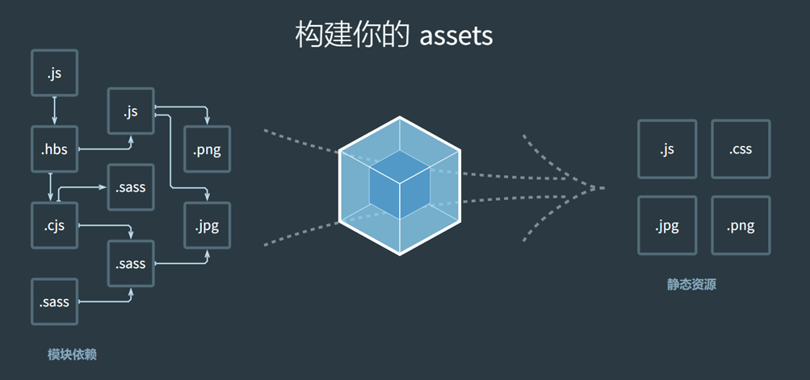
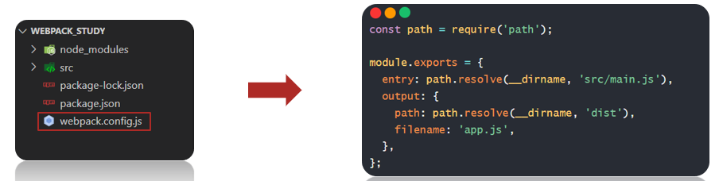
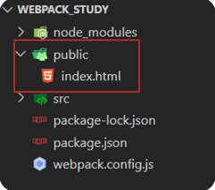
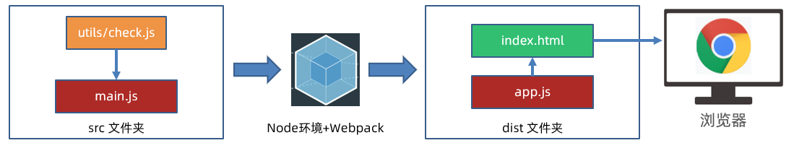
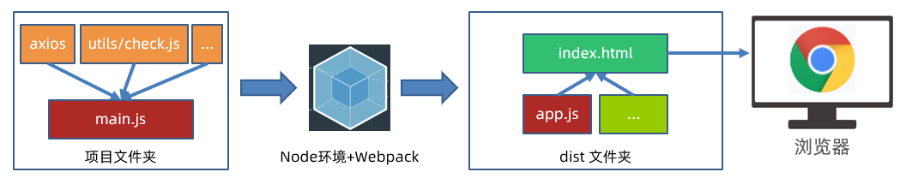

# Day03_Webpack模块打包工具

## 知识点自测

1. 以下哪个选项是 ECMAScript 默认导出和导入的语法？

   A：export 和 require

   B：module.exports = {} 和 import 变量名

   C：export default 和 import 变量名

   D：export 和 import { 同名变量名 }

   <details>
   <summary>答案</summary>
   <ul>
   <li>C选项正确</li>
   </ul>
   </details>


2. 对以下 less 样式代码描述正确的是？

   ```js
   .title {
     span {
       color: red;
     }
   }
   ```

   A：查找 class 名字叫 title 元素范围内，所有 span 标签

   B：查找 class 名字叫 title 和 span 标签

   <details>
   <summary>答案</summary>
   <ul>
   <li>A选项正确</li>
   </ul>
   </details>


3. 以下代码运行结果是多少？

   ```js
   const arr = [1, 2, 3, 4].map(val => val * 2)
   console.log(arr)
   ```

   A：[undefined, undefined, undefined, undefined]

   B：[2, 4, 6, 8]

   <details>
   <summary>答案</summary>
   <ul>
   <li>B选项正确</li>
   </ul>
   </details>


4. 以下针对 axios 函数使用时的配置项描述正确的选项？

   ```js
   axios({
    // 这里
   })
   ```

   A：url：请求的方法，method：传递参数

   B：data：传递查询参数，params：传递请求体参数

   C：url：请求的网址，method：请求的方法

   D：data：传递请求体参数，params：传递请求体参数

   <details>
   <summary>答案</summary>
   <ul>
   <li>C选项正确</li>
   </ul>
   </details>


## 目录

* Webpack 简介与体验
* 案例 - 打包注册用户网页
* 插件 plugins 和加载器 loader 的使用
* 案例 - 注册用户完成 - npm 作用在前端项目
* Webpack 开发服务器，打包模式
* 调试代码 source map
* 配置 @ 路径


## 学习目标

1. 了解 Webpack 的作用
2. 掌握 npm 下载的软件包是如何作用在前端项目的
3. 了解开发环境和生产环境的特点和区别
4. 掌握 Webpack 配置解析别名的功能


## 01.什么是 Webpack

### 目标

了解 Webpack 的概念和作用，以及使用


### 讲解

1. Webpack 是一个静态模块打包工具，从入口构建依赖图，打包有关的模块，最后用于展示你的内容

   


2. 静态模块：编写代码过程中的，html，css， js，图片等固定内容的文件

3. 打包过程，注意：只有和入口有直接/间接引入关系的模块，才会被打包

   


4. Webpack 的作用：把静态模块内容，压缩，这个和，转译等（前端工程化）
   * 把 less/sass 转成 css 代码
   * 把 ES6+ 降级成 ES5 等
   * 支持多种模块文件类型，多种模块标准语法

 5. 为何不学 vite？

    > 现在很多项目还是基于 Webpack 来进行构建的，所以还是要掌握 Webpack 的使用

 6. 体验 Webpack 打包 2 个 JS 文件内容

 7. 需求：封装 utils 包，校验用户名和密码长度，在 index.js 中使用，使用 Webpack 打包

 8. 步骤：

    1. 新建项目文件夹 Webpack_study，初始化包环境，得到 package.json 文件

       ```bash
       npm init -y
       ```

    2. 新建 src 源代码文件夹（书写代码）包括 utils/check.js 封装用户名和密码长度函数，引入到 src/index.js 进行使用

       * src/utils/check.js

         ```js
         /**
          * 目标：封装检验用户名和密码长度的函数
          */
         export const checkUserName = uname => {
           return uname.length >= 8
         }
         export const checkPassWord = pwd => {
           return pwd.length >= 6
         }
         
         export default {
           checkUserName,
           checkPassWord
         }
         ```

       * src/index.js

         ```js
         /**
          * 目标：引入工具函数使用
          */
         import { checkUserName, checkPassWord } from './utils/check.js'
         const unameResult = checkUserName('itheima007')
         const pwdResult = checkPassWord('7654321')
         console.log(unameResult, pwdResult)
         ```

    3. 下载 webpack webpack-cli 到项目（版本独立）

       ```bash
       npm i webpack webpack-cli --save-dev
       ```

       > 注意：虽然 webpack 是全局软件包，封装的是命令工具，但是为了保证项目之间版本分别独立，所以这次比较特殊，下载到某个项目环境下，但是需要把 webpack 命令配置到 package.json 的 scripts 自定义命令，作为局部命令使用

       

    4. 项目中运行工具命令，采用自定义命令的方式（局部命令）

       ```bash
       npm run build
       ```

       > npm run 自定义命令名字
       >
       > 注意：实际上在终端运行的是 build 右侧的具体命名

    5. 自动产生 dist 分发文件夹（压缩和优化后，用于最终运行的代码）

 9. 需求最终流程图：

    


### 小结

1. Webpack 有什么用?

   <details>
   <summary>答案</summary>
   <ul>
   <li>压缩，转译，整合，打包我们的静态模块</li>
   </ul>
   </details>

2. Webpack 怎么用？

   <details>
   <summary>答案</summary>
   <ul>
   <li>初始化环境，编写代码，安装 Webpack 软件包，配置自定义命令，打包体验查看结果</li>
   </ul>
   </details>

3. 如何运行 package.json 里的自定义命令？

   <details>
   <summary>答案</summary>
   <ul>
   <li>npm run 自定义命令</li>
   </ul>
   </details>

4. Webpack 默认入口和出口？

   <details>
   <summary>答案</summary>
   <ul>
   <li>src/index.js 和 dist/main.js</li>
   </ul>
   </details>


## 02.修改 Webpack 打包入口和出口

### 目标

了解 Webpack 配置文件使用，影响 Webpack 打包过程和结果


### 讲解

1. [Webpack 配置]([https://webpack.docschina.org/concepts/#entry](https://webpack.docschina.org/concepts/))：影响 Webpack 打包过程

2. 步骤：

   1. 项目根目录，新建 Webpack.config.js 配置文件

   2. 导出配置对象，配置入口，出口文件路径

      ```js
      const path = require('path')
      
      module.exports = {
        entry: path.resolve(__dirname, 'src/main.js'), // 入口
        output: { // 出口
          path: path.resolve(__dirname, 'dist'),
          filename: 'app.js',
          clean: true // 先清空 dist，然后再输出最新内容
        }
      }
      ```

   3. 重新打包观察

1. 图解：

   


### 小结

1. 如何影响 Webpack 打包过程?

   <details>
   <summary>答案</summary>
   <ul>
   <li>查文档，新建配置文件和配置属性</li>
   </ul>
   </details>


## 03.案例-注册用户-长度判断

### 目标

体验前端项目代码，如何被 Webpack 打包和使用


### 讲解

1. 需求：点击注册按钮，判断用户名和密码长度是否符合要求

2. 步骤：

   1. 新建 public/index.html 准备网页模板（方便查找标签和后期自动生成 html 文件做准备）

      

   2. 核心 JS 代码写在 src/main.js 打包入口文件

      ```js
      /**
       * 目标：点击注册，检验用户名和密码长度
       */
      document.querySelector('.login-btn').addEventListener('click', () => {
        const username = document.querySelector('.username').value
        const password = document.querySelector('.password').value
      
        if (!checkUserName(username)) {
          alert('用户名长度要大于等于8位')
          return
        } else if (!checkPassWord(password)) {
          alert('密码长度要求大于等于6位')
          return
        }
      
        console.log('用户名和密码长度符合要求')
      })
      ```

      

   3. 运行自定义命令，让 Webpack 打包 JS 代码

   4. 手动复制 index.html 到 dist 下，手动引入打包后的 JS 代码文件，运行 dist/index.html 在浏览器查看效果

      


### 小结

1. Webpack 打包后的前端代码是如何运行的?

   <details>
   <summary>答案</summary>
   <ul>
   <li>手动引入到 html 文件中，再交给浏览器运行</li>
   </ul>
   </details>


## 04.Webpack 自动生成 html 文件

### 目标

让 Webpack 拥有自动生成 html 文件能力，并引入打包后的其他资源


### 讲解

1. [插件 html-webpack-plugin 作用](https://webpack.docschina.org/plugins/html-webpack-plugin/)：在 Webpack 打包时生成 html 文件，并引入其他打包后的资源

2. 步骤：

   1. 下载 html-webpack-plugin 本地软件包到项目中

      ```bash
      npm i html-webpack-plugin --save-dev
      ```

   2. 配置 webpack.config.js 让 Webpack 拥有插件功能

      ```js
      // ...
      const HtmlWebpackPlugin = require('html-webpack-plugin');
      
      module.exports = {
        // ...
        plugins: [ // 插件列表
          new HtmlWebpackPlugin({
            template: path.resolve(__dirname, 'public/index.html') // 以指定的 html 文件作为生成模板
          })
        ]
      };
      ```

   3. 指定以 public/index.html 为模板复制到 dist/index.html，并自动引入其他打包后资源

3. 运行打包命令，观察打包后 dist 文件夹下内容并运行查看效果


### 小结

1. html-webpack-plugin 插件怎么用?

   <details>     
   <summary>答案</summary> 
   <ul>
   <li>找到插件文档，下载到项目中，配置到 Webpack 的配置文件中即可使用</li>
   </ul> 
   </details>


## 05.Webpack-打包 css 代码

### 目标

让 Webpack 能够打包 css 代码


### 讲解

1. 注意：Webpack 默认只识别 JS 和 JSON 文件内容，所以想要让 Webpack 识别更多不同内容，需要使用加载器

2. 介绍需要的 2 个加载器来辅助 Webpack 才能打包 css 代码

   * [加载器 css-loader](https://webpack.docschina.org/loaders/css-loader/)：解析 css 代码
   * [加载器 style-loader](https://webpack.docschina.org/loaders/style-loader/)：把解析后的 css 代码插入到 DOM（style 标签之间）

3. 步骤：

   1. 准备 css 文件引入到 src/mian.js 中（压缩转译处理等）

      ```js
      /**
       * 目标：引入 css 文件内容
       */
      import './css/index.css'
      ```

      > 注意：这里只是引入代码内容让 Webpack 处理，不需定义变量接收在 JS 代码中继续使用，所以没有定义变量接收

   2. 下载 css-loader 和 style-loader 本地软件包

      ```bash
      npm i css-loader style-loader --save-dev
      ```

   3. 配置 webpack.config.js 让 Webpack 拥有该加载器功能

      ```js
      // ...
      
      module.exports = {
        // ...
        module: { // 加载器
          rules: [ // 规则列表
            {
              test: /\.css$/i, // 匹配 .css 结尾的文件
              use: ['style-loader', 'css-loader'], // 使用从后到前的加载器来解析 css 代码和插入到 DOM
            }
          ]
        }
      };
      ```

   4. 打包后运行 dist/index.html 观察效果，看看准备好的样式是否作用在网页上


### 小结

1. 加载器的作用是什么?

   <details>     
   <summary>答案</summary> 
   <ul>
   <li>让 Webpack 识别更多的代码内容类型</li>
   </ul> 
   </details>


## 06.Webpack-打包 less 代码

### 目标

让 Webpack 拥有打包 less 代码功能


### 讲解

1. [加载器 less-loader](https://webpack.docschina.org/loaders/less-loader/)：把 less 代码编译为 css 代码，还需要依赖 less 软件包

2. 步骤：

   1. 准备 less 样式引入到 src/main.js 中

      ```js
      /**
       * 目标：引入 less 文件内容
       */
      import '@/less/index.less'
      ```

   2. 下载 less 和 less-loader 本地软件包

      ```bash
      npm i less less-loader --save-dev
      ```

   3. 配置 webpack.config.js 让 Webpack 拥有功能

      ```js
      // ...
      
      module.exports = {
        // ...
        module: { // 加载器
          rules: [ // 规则列表
            // ...
            {
              test: /\.less$/i,
              use: [
                // compiles Less to CSS
                'style-loader',
                'css-loader',
                'less-loader',
              ],
            },
          ]
        }
      };
      ```

   4. 打包后运行 dist/index.html 观察效果


### 小结

1. Webpack 支持 less 代码打包需要哪 2 个软件包?

   <details>     
   <summary>答案</summary> 
   <ul>
   <li>需要 less less-loader 这 2 个软件包</li>
   </ul> 
   </details>


## 07.Webpack-打包图片

### 目标

 让 Webpack 支持图片等资源打包


### 讲解

1. [资源模块](https://webpack.docschina.org/guides/asset-modules/)：Webpack 内置了资源模块的打包，无需下载额外 loader 

2. 步骤：

   1. 准备图片素材到 src/assets 中（存放资源模块 - 图片/字体图标等）

   2. 在 index.less 中给 body 添加背景图

      ```less
      body{
        background: url(../assets/background.png) no-repeat center center;
      }
      ```

   3. 在 main.js 中给 img 标签添加 logo 图片

      ```js
      /**
       * 目标：要给 img 标签设置一个 logo 图片
       * 注意：再赋予给 img 的 src 属性图片的时候，需要把图片数据对象引入过来
       */
      import imgObj from '@/assets/logo.png'
      document.querySelector('.logo-img').src = imgObj
      ```

   4. 配置 webpack.config.js 让 Webpack 拥有打包图片功能

      ```js
      // ...
      
      module.exports = {
        // ...
        module: { // 加载器
          rules: [ // 规则列表
            // ...
            { // 针对资源模块（图片，字体文件，图标文件等）处理
              test: /\.(png|jpg|jpeg|gif)$/i,
              type: 'asset', // 根据文件大小（8KB）小于：把文件转成 base64 打包进 js 文件中（减少网络请求次数）大于：文件复制到输出的目录下
              generator: { // 输出文件时，路径+名字
                filename: 'assets/[hash][ext]'
              }
            }
          ]
        }
      };
      ```

   5. 打包后运行 dist/index.html 观察效果

3. 注意：

   * 小于 8KB 文件会被转成 data URI（base64 字符串）打包进 JS 文件中（好处：可以减少网络请求次数，缺点：增加 30% 体积）
   * 大于 8KB 文件会被复制到 dist 下，自动替换使用代码的图片名字


### 小结

1. 资源模块指的是什么?

   <details>     
   <summary>答案</summary> 
   <ul>
   <li>图片，字体文件等等</li>
   </ul> 
   </details>


## 08.Webpack 集成 babel 编译器

### 目标

让 Webpack 集成 babel 编译器功能处理 JS 代码


### 讲解

1. [babel 定义](https://www.babeljs.cn/docs)：是一个 JavaScript 语法编译器，将采用 ECMAScript 2015+ 语法编写的代码转换为向后兼容的 JavaScript 语法，以便能够运行在当前和旧版本的浏览器或其他环境中

2. [babel-loader](https://webpack.docschina.org/loaders/babel-loader/)：让 Webpack 可以使用 babel 转译 JavaScript 代码

3. 步骤：

   1. 编写一段映射数组元素，每个数值 + 1 的代码（要求用箭头函数）

      ```js
      /**
       * 目标：让 Webpack + Babel 编译降级 JS 语法
       */
      const arr = [1, 2, 3]
      const result = arr.map(val => val + 1)
      console.log(result)
      ```

   2. 下载 babel babel-loader core 本地软件包

      ```bash
      npm i babel-loader @babel/core @babel/preset-env -D
      ```

   3. 配置 webpack.config.js 让 Webpack 拥有功能

      ```js
      // ...
      
      module.exports = {
        // ...
        module: { // 加载器
          rules: [ // 规则列表
            // ...
            {
              test: /\.m?js$/,
              exclude: /(node_modules|bower_components)/, // 排除指定目录里的 js （不进行编译降级）
              use: {
                loader: 'babel-loader',
                options: {
                  presets: ['@babel/preset-env'] // 预设规则
                }
              }
            }
          ],
        }
      };
      ```

   4. 打包运行 dist/index.html 观察效果

4. 各个软件包的作用表格：

   | **模块**          | **作用**                |
   | ----------------- | ----------------------- |
   | @babel/core       | Js 编译器，分析代码     |
   | @babel/preset-env | babel 预设，规则        |
   | babel-loader      | 让 webpack 翻译 js 代码 |


### 小结

1. babel 编译器的作用?

   <details>     
   <summary>答案</summary> 
   <ul>
   <li>把 ECMAScript2015+ 语法向后转换，兼容低版本浏览器</li>
   </ul> 
   </details>


## 09.案例-注册用户-完成功能

### 目标

在 Webpack 环境下，使用 npm 下包作用在前端项目


### 讲解

1. 需求：点击注册按钮，基于 npm 下载 axios 包，完成提交用户名和密码到服务器完成注册功能

2. 步骤：

   1. 使用 npm 下载 axios

      ```bash
      npm i axios
      ```

   2. 引入到 src/main.js 中编写业务实现

      ```js
      /**
       * 目标：基于 axios 完成注册用户功能
       */
      import axios from 'axios'
      document.querySelector('.login-btn').addEventListener('click', () => {
        const username = document.querySelector('.username').value
        const password = document.querySelector('.password').value
      
        if (!checkUserName(username)) {
          alert('用户名长度要大于等于8位!!!')
          return
        } else if (!checkPassWord(password)) {
          alert('密码长度要求大于等于6位')
          return
        }
      
        console.log('用户名和密码长度符合要求')
        axios({
          url: 'http://hmajax.itheima.net/api/register',
          method: 'POST',
          data: {
            username,
            password
          }
        }).then(result => {
          alert(result.data.message)
        }).catch(error => {
          alert(error.response.data.message)
        })
      })
      ```

   3. 打包后运行 dist/index.html 观察效果

3. 注册用户功能图解：

   


### 小结

1. npm 下载的包如何作用在前端项目上?

   <details>     
   <summary>答案</summary> 
   <ul>
   <li>被 Webpack 打包处理后，再引入到 html 文件中运行</li>      
   </ul> 
   </details>


## 10.Webpack 开发服务器

### 目标

体验 webpack-dev-server 开发服务器，快速开发应用程序


### 讲解

1. 每次改动代码，都要重新打包，很麻烦，所以这里给项目集成 webpack-dev-server 开发服务器

2. 作用：启动 Web 服务，打包输出源码在内存，并会自动检测代码变化热更新到网页

3. 步骤；

   1. 下载 webpack-dev-server 软件包到当前项目

      ```bash
      npm i webpack-dev-server --save-dev
      ```

   2. 配置自定义命令，并设置打包的模式为开发模式

      ```json
      "scripts": {
        // ...
        "dev": "webpack serve --mode=development"
      },
      ```

   3. 使用 npm run dev 来启动开发服务器，访问提示的域名+端口号，在浏览器访问打包后的项目网页，修改代码后试试热更新效果

      > 在 js / css 文件中修改代码保存后，会实时反馈到浏览器


### 小结

1. webpack-dev-server 的作用?

   <details>     
   <summary>答案</summary> 
   <ul>
   <li>启动 Webpack 开发服务器，会启动一个 Web 服务，实时检测代码变化重新打包，并快速反应最新效果到浏览器页面上</li>
   </ul> 
   </details>


## 11.Webpack 打包模式

### 目标

了解不同打包模式对代码和环境的影响


### 讲解

1. [打包模式](https://webpack.docschina.org/configuration/mode/)：告知 Webpack 使用相应模式的内置优化

2. 分类：

   | **模式名称** | **模式名字** | **特点**                         |
   | ------------ | ------------ | -------------------------------- |
   | 开发模式     | development  | 调试代码，实时加载，模块热替换等 |
   | 生产模式     | production   | 压缩代码，资源优化，更轻量等     |

3. 如何设置影响 Webpack呢？

   * 方式1：在 webpack.config.js 配置文件设置 mode 选项

     ```js
     // ...
     
     module.exports = {
       // ...
       mode: 'production'
     }
     ```

   * 方式2：在 package.json 命令行设置 mode 参数

     ```json
     "scripts": {
       "build": "webpack --mode=production",
       "dev": "webpack serve --mode=development"
     },
     ```

4. 注意：命令行设置的优先级高于配置文件中的，推荐用命令行设置


### 小结

1. 两种模式的区别?

   <details>     
   <summary>答案</summary> 
   <ul>
   <li>开发模式注重代码热替换更快，让开发调试代码更便捷，生产模式注重项目体积更小，更轻量，适配不同的浏览器环境</li>
   </ul> 
   </details>


## 12.Webpack 开发环境调错 source map

### 目标

在开发环境如何精准定位到报错源码位置


### 讲解

1. [source map]([https://webpack.docschina.org/guides/development/#using-source-maps](https://webpack.docschina.org/guides/development/))：可以准确追踪 error 和 warning 在原始代码的位置

2. 问题：代码被压缩和混淆，无法正确定位源代码位置（行数和列数）

3. 设置：webpack.config.js 配置 devtool 选项

   ```js
   // ...
   
   module.exports = {
     // ...
     devtool: 'inline-source-map'
   }
   ```

   > inline-source-map 选项：把源码的位置信息一起打包在 JS 文件内

4. 注意：source map 适用于开发环境，不要在生产环境使用（防止被轻易查看源码位置）


### 小结

1. 为何打包后，在控制台无法准确定位到源码的位置信息?

   <details>     
   <summary>答案</summary> 
   <ul>
   <li>因为 Webpack 把代码压缩和混淆了</li>
   </ul> 
   </details>


## 13.Webpack 设置解析别名路径

### 目标

设置 Webpack 如何设置路径别名，方便我们引入目标模块


### 讲解

1. [解析别名]([https://webpack.docschina.org/configuration/resolve#resolvealias](https://webpack.docschina.org/configuration/resolve))：配置模块如何解析，创建 import 或 require 的别名，来确保模块引入变得更简单

2. 例如：

   1. 原来路径如下：

      ```js
      import { checkUsername,  checkPassword } from '../src/utils/check.js'
      ```

   2. 配置解析别名：在 webpack.config.js 中设置

      ```js
      // ...
      
      module.exports = {
        // ...
        resolve: {
          alias: {
            MyUtils: path.resolve(__dirname, 'src/utils'),
            '@': path.resolve(__dirname, 'src')
          }
        }
      }
      ```

   3. 这样我们以后，引入目标模块写的路径就更简单了

      ```js
      import { checkUsername,  checkPassword } from 'MyUtils/check.js'
      import { checkUsername,  checkPassword } from '@/utils/check.js'
      ```

3. 修改代码的路径后，重新打包观察效果是否正常！


### 小结

1. 路径中的 '@' 符号代表什么意思？

   <details>     
   <summary>答案</summary> 
   <ul>
   <li>看在 webpack 配置中的别名路径是什么，就会在打包时替换成哪个路径使用</li>
   </ul> 
   </details>


## 今日总结（必须会）

1. Webpack 对前端代码进行处理的事项
2. npm 下载的包是如何作用在前端项目里的
3. Webpack 开发服务器作用
4. 开发环境和生产环境的区别
5. Webpack 配置解析别名的设置


## 今日作业（必完成）

参考作业配套文件夹里的 md 的说明


## 参考文献

1. [Webpack官方中文文档](https://webpack.docschina.org/)


 