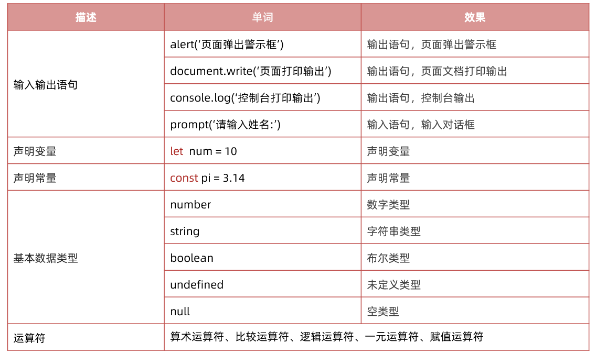
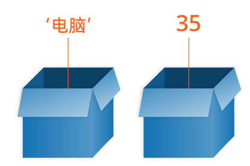
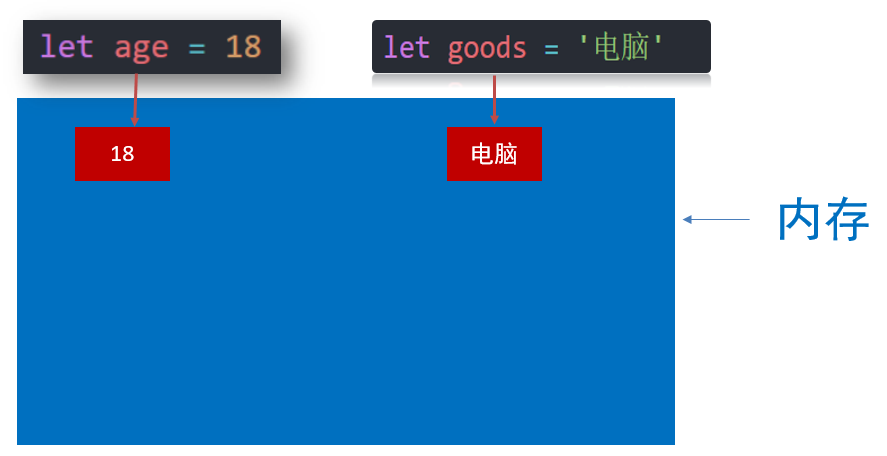
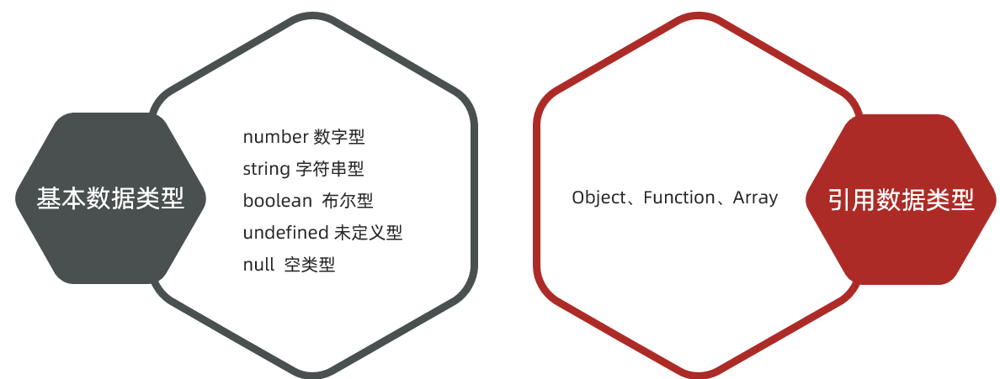
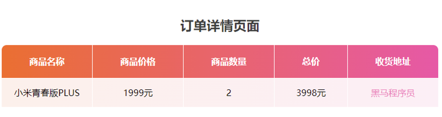

# JavaScript 基础 - 第1天

> 了解变量、数据类型、运算符等基础概念，能够实现数据类型的转换，结合四则运算体会如何编程。

- JavaScript介绍
- 变量
- 常量
- 数据类型
- 运算符
- 实战案例

重点单词：

 

## js介绍

>能说出JavaScript 是什么? 怎么写?
>
>能写出JavaScript 输入和输出语句

###  js是什么？

#### 是什么？

是一种运行在客户端（浏览器）的编程语言，可以用来创建动态更新的内容，控制多媒体，制作图像动画等交互效果

### 怎么写?

JavaScript 程序不能独立运行，它需要被嵌入 HTML 中，然后浏览器才能执行 JavaScript 代码。通过 `script` 标签将 JavaScript 代码引入到 HTML 中，有两种方式：

#### 内部方式

通过 `script` 标签包裹 JavaScript 代码

```html
<!DOCTYPE html>
<html lang="en">
<head>
  <meta charset="UTF-8">
  <title>JavaScript 基础 - 引入方式</title>
</head>
<body>
  <!-- 内联形式：通过 script 标签包裹 JavaScript 代码 -->
  <script>
    alert('嗨，欢迎来传智播学习前端技术！')
  </script>
</body>
</html>
```

#### 外部形式

一般将 JavaScript 代码写在独立的以 .js 结尾的文件中，然后通过 `script` 标签的 `src` 属性引入

```javascript
// demo.js
document.write('嗨，欢迎来传智播学习前端技术！')
```

```html
<!DOCTYPE html>
<html lang="en">
<head>
  <meta charset="UTF-8">
  <title>JavaScript 基础 - 引入方式</title>
</head>
<body>
  <!-- 外部形式：通过 script 的 src 属性引入独立的 .js 文件 -->
  <script src="demo.js"></script>
</body>
</html>
```

如果 script 标签使用 src 属性引入了某 .js 文件，那么 标签的代码会被忽略！！！如下代码所示：

```html
<!DOCTYPE html>
<html lang="en">
<head>
  <meta charset="UTF-8">
  <title>JavaScript 基础 - 引入方式</title>
</head>
<body>
  <!-- 外部形式：通过 script 的 src 属性引入独立的 .js 文件 -->
  <script src="demo.js">
    // 此处的代码会被忽略掉！！！！
  	alert(666);  
  </script>
</body>
</html>
```

#### 注释和结束符

通过注释可以屏蔽代码被执行或者添加备注信息，JavaScript 支持两种形式注释语法：

#### 单行注释

使用 `// ` 注释单行代码

```html
<!DOCTYPE html>
<html lang="en">
<head>
  <meta charset="UTF-8">
  <title>JavaScript 基础 - 注释</title>
</head>
<body>
  
  <script>
    // 这种是单行注释的语法
    // 一次只能注释一行
    // 可以重复注释
    document.write('嗨，欢迎来传智播学习前端技术！');
  </script>
</body>
</html>
```

#### 多行注释

使用 `/* */` 注释多行代码

```html
<!DOCTYPE html>
<html lang="en">
<head>
  <meta charset="UTF-8">
  <title>JavaScript 基础 - 注释</title>
</head>
<body>
  
  <script>
    /* 这种的是多行注释的语法 */
    /*
    	更常见的多行注释是这种写法
    	在些可以任意换行
    	多少行都可以
      */
    document.write('嗨，欢迎来传智播学习前端技术！')
  </script>
</body>
</html>
```

**注：编辑器中单行注释的快捷键为 `ctrl + /`**

#### 结束符

在 JavaScript 中 `;` 代表一段代码的结束，多数情况下可以省略 `;` 使用回车（enter）替代。

```html
<!DOCTYPE html>
<html lang="en">
<head>
  <meta charset="UTF-8">
  <title>JavaScript 基础 - 结束符</title>
</head>
<body>
  
  <script> 
    alert(1);
    alert(2);
    alert(1)
    alert(2)
  </script>
</body>
</html>
```

实际开发中有许多人主张书写 JavaScript 代码时省略结束符 `;`

### 输入和输出语句

输出和输入也可理解为人和计算机的交互，用户通过键盘、鼠标等向计算机输入信息，计算机处理后再展示结果给用户，这便是一次输入和输出的过程。

#### 输出语句

~~~javascript
// 1. 输出语句
//  1.1 alert 页面弹出警示框
// alert('你好,js')
// 1.2 document.write 向页面文档输入内容 显示到页面body标签之内, 可以正常的解析标签
document.write('今日特价')
document.write('<h4>今日特价</h4>')
// 1.3 console.log 给我们程序员调试使用的   console 控制台
console.log('给咱们程序员使用的')
~~~

####  输入语句

向 `prompt()` 输入任意内容会以弹窗形式出现在浏览器中，一般提示用户输入一些内容。

```html
<!DOCTYPE html>
<html lang="en">
<head>
  <meta charset="UTF-8">
  <title>JavaScript 基础 - 输入输出</title>
</head>
<body>
  
  <script> 
    // 1. 输入的任意数字，都会以弹窗形式展示
    document.write('要输出的内容')
    alert('要输出的内容');

    // 2. 以弹窗形式提示用户输入姓名，注意这里的文字使用英文的引号
    prompt('请输入您的姓名:')
  </script>
</body>
</html>
```

## 变量

### 变量是什么&基本使用

> 理解变量是计算机存储数据的“容器”，掌握变量的声明方式

变量是计算机中用来存储数据的“容器”，变量不是数据本身，它们仅仅是一个用于存储数值的容器。可以理解为是一个个用来装东西的纸箱子。

 

#### 声明

声明(定义)变量有两部分构成：声明关键字、变量名（标识）

```html
<!DOCTYPE html>
<html lang="en">
<head>
  <meta charset="UTF-8">
  <title>JavaScript 基础 - 声明和赋值</title>
</head>
<body>
  
  <script> 
    // let 变量名
    // 声明(定义)变量有两部分构成：声明关键字、变量名（标识）
    // let 即关键字，所谓关键字是系统提供的专门用来声明（定义）变量的词语
    // age 即变量的名称，也叫标识符
    let age
  </script>
</body>
</html>
```

关键字是 JavaScript 中内置的一些英文词汇（单词或缩写），它们代表某些特定的含义，如 `let` 的含义是声明变量的，看到 `let`  后就可想到这行代码的意思是在声明变量，如 `let age;` 

`let` 和 `var` 都是 JavaScript 中的声明变量的关键字，推荐使用 `let` 声明变量！！！

#### 赋值

声明（定义）变量相当于创造了一个空的“容器”，通过赋值向这个容器中添加数据。

```html
<!DOCTYPE html>
<html lang="en">
<head>
  <meta charset="UTF-8">
  <title>JavaScript 基础 - 声明和赋值</title>
</head>
<body>
  
  <script> 
    // 声明(定义)变量有两部分构成：声明关键字、变量名（标识）
    // let 即关键字，所谓关键字是系统提供的专门用来声明（定义）变量的词语
    // age 即变量的名称，也叫标识符
    let age
    // 赋值，将 18 这个数据存入了 age 这个“容器”中
    age = 18
    // 这样 age 的值就成了 18
    document.write(age)
    
    // 也可以声明和赋值同时进行
    let str = 'hello world!'
    alert(str);
  </script>
</body>
</html>
```

#### 变量更新

变量赋值后，还可以通过简单地给它一个不同的值来更新它。

~~~javascript
// 1.更新变量
let age = 18
age = 19
// 注意: 不要多次声明同一个变量
// let age = 19
console.log(age)
   
~~~

#### 声明多个变量

**语法**：多个变量中间用逗号隔开。

**说明**：看上去代码长度更短，但并不推荐这样。为了更好的可读性，一般情况下我们一行只声明一个变量。 

~~~javascript
// 2. 一次声明多个变量的简写方式 (了解 能认出来就可以了)
// let uname = 'pink老师', sex = '男'
let uname = 'pink老师'
let sex = '男'
console.log(uname, sex)
~~~

#### let 和 var 区别

在较旧的JavaScript，使用关键字 var 来声明变量 ，而不是 let

var 现在开发中一般不再使用它，只是我们可能再老版程序中看到它。

let 为了解决 var 的一些问题。

var 声明一些不合理的地方：

1. 可以先使用 在声明 (不合理)
2. var 声明过的变量可以重复声明(不合理)
3. 比如变量提升、全局变量、没有块级作用域等等

**结论：**

> var 就是个bug，别迷恋它了，以后声明变量我们统一使用 **let** 

### 变量的本质

内存：计算机中存储数据的地方，相当于一个空间

变量本质：是程序在内存中申请的一块用来存放数据的小空间

 

### 变量名命名规则

关于变量的名称（标识符）需要遵守：

**规则：**

1. 只能是字母、数字、下划线、$，且不能能数字开头
2. 字母区分大小写，如 Age 和 age 是不同的变量
3. JavaScript 内部已占用于单词（关键字或保留字）不允许使用
4. 尽量保证变量具有一定的语义，见字知义

**规范：**

1. 起名要有意义
2. 遵守小驼峰命名法
   1. 第一个单词首字母小写，后面每个单词首字母大写。例：userName

~~~javascript
// 1. 规则(法律)
// 1.1 变量名不能是关键字
// let let = 10
// 1.2 变量名的组成: 英文字母 数字 _  $ ，不能以数字开头
// let 1num = 10 错误
// let num! = 10 错误
// 1.3 js严格区分大小写
// let age = 18
// console.log(Age)

// 2. 规范(道德)
// 2.1 起名要有意义
// let age = 18
// let nl = 19
// 2.2 我们命名建议采取小驼峰命名法
let myName = 'pink老师'
let myFirstName = 'p'
~~~


## 常量

**是什么**：也是一个容器，用于保存数据的

**和变量的区别**： 常量里面保存的值是不允许改变的

**使用场景**：当某个值永远不会改变的时候，我们可以使用常量来保存，目的为了程序的安全

~~~javascript
// 常量： 也是一个容器用来保存的数据
const pi = 3.14
console.log(pi)
// 注意事项：
// 1. 常量里面的值是不允许修改的
pi = 3.141592653
console.log(pi)
// 2. 常量必须要初始化(声明常量的时候必须要赋值)
// const url
~~~

>注意： 常量不允许重新赋值,声明的时候必须赋值（初始化）

## 数据类型

> 计算机世界中的万事成物都是数据。

生活中会把物品进行归类，不同的物品不能混淆在一起。

计算机程序可以处理大量的数据，方便程序员的使用数据。

 


### 数字型和字符串型

**数字型：**

即我们数学中学习到的数字，可以是整数、小数、正数、负数

通过` typeof `关键字检测数据类型

**字符串：**

被引号包裹的一段文字信息

JS中的字符串:

通过单引号（ ‘’） 、双引号（ “”）或反引号( `` ) 包裹的数据都属于字符串

单引号和双引号没有本质上的区别，推荐使用单引号。

>注意事项：
>
>1. 单引号/双引号可以互相嵌套，但是不以自已嵌套自已（口诀：外双内单，或者外单内双）
>2. 一定注意变量名不要加引号，否则认为是字符串

~~~javascript
// 1. 数字型： 用于计算的， js数字类型包含： 整数、小数
// let num1 = 18
// let num1 = -18
let num1 = 18.88
// let num1 = -18.88
console.log(typeof num1)  // number   typeof 关键字检测数据类型

// 2. 字符串类型: 被引号包裹的一段文字信息   单引号 双引号  反引号
let goods = '笔记本电脑'
let address = "黑马程序员"
console.log(typeof goods)  // string
console.log(typeof address)  // string
let color = `粉红色`
let tel = '13612342234'
// 2.1 变量是不能加引号的,变量加了引号就不是盒子了，是一个字符串
console.log('goods')
// 2.2 字符串嵌套的问题. 不能嵌套自己, 外单内双  或者 外双内单
console.log('今日特价"跳楼大甩卖"速速抢购')
console.log("今日特价'跳楼大甩卖'速速抢购")
~~~

### 模板字符串

**使用场景:**

拼接字符串和变量

**语法**

~~~javascript
// 1. 字符串拼接
let age = 91
// console.log('pink老师今年' + age + '岁')
console.log('pink老师今年' + age + '岁')

// 2. 模板字符串
console.log(`pink老师今年${age}岁`)
// 3. 模板字符串里面的字符串可以换行
~~~

>  注意：反引号中间的字符串可以换行的

### 布尔类型

表示肯定或否定时在计算机中对应的是布尔类型数据，它有两个固定的值 `true` 和 `false`，表示肯定的数据用 `true`，表示否定的数据用 `false`。

```html
<!DOCTYPE html>
<html lang="en">
<head>
  <meta charset="UTF-8">
  <title>JavaScript 基础 - 数据类型</title>
</head>
<body>
  
  <script> 
    //  pink老师帅不帅？回答 是 或 否
    let isCool = true // 是的，摔死了！
    isCool = false // 不，套马杆的汉子！

    document.write(typeof isCool) // 结果为 boolean
  </script>
</body>
</html>
```

### undefined

未定义是比较特殊的类型，只有一个值 undefined，只声明变量，不赋值的情况下，变量的默认值为 undefined，一般很少【直接】为某个变量赋值为 undefined。

```html
<!DOCTYPE html>
<html lang="en">
<head>
  <meta charset="UTF-8">
  <title>JavaScript 基础 - 数据类型</title>
</head>
<body>
  
  <script> 
    // 只声明了变量，并末赋值
    let tmp;
    document.write(typeof tmp) // 结果为 undefined
  </script>
</body>
</html>
```

**注：JavaScript 中变量的值决定了变量的数据类型。**

## 运算符

### 算术运算符

数字是用来计算的，比如：乘法 * 、除法 / 、加法 + 、减法 - 等等，所以经常和算术运算符一起。

算术运算符：也叫数学运算符，主要包括加、减、乘、除、取余（求模）等

| 运算符 | 作用                                                 |
| ------ | ---------------------------------------------------- |
| +      | 求和                                                 |
| -      | 求差                                                 |
| *      | 求积                                                 |
| /      | 求商                                                 |
| **%**  | 取模（取余数），开发中经常用于作为某个数字是否被整除 |

> 注意：在计算失败时，显示的结果是 NaN （not a number）

~~~javascript
// 算术运算符
console.log(1 + 2 * 3 / 2) //  4 
let num = 10
console.log(num + 10)  // 20
console.log(num + num)  // 20

// 1. 取模(取余数)  使用场景：  用来判断某个数是否能够被整除
console.log(4 % 2) //  0  
console.log(6 % 3) //  0
console.log(5 % 3) //  2
console.log(3 % 5) //  3

// 2. 注意事项 : 如果我们计算失败，则返回的结果是 NaN (not a number)
console.log('pink老师' - 2)
console.log('pink老师' * 2)
console.log('pink老师' + 2)   // pink老师2
~~~

### 赋值运算符

赋值运算符：对变量进行赋值的运算符

 =     将等号右边的值赋予给左边, 要求左边必须是一个容器

| 运算符 | 作用     |
| ------ | -------- |
| +=     | 加法赋值 |
| -+     | 减法赋值 |
| *=     | 乘法赋值 |
| /=     | 除法赋值 |
| %=     | 取余赋值 |

~~~javascript
// 赋值运算符
let num = 1
// 1. 需求 我们想要num变量里面的值 + 1， 加完之后再把计算结果存到num里面
// num = num + 1
// console.log(num)

// 2. += 赋值运算符
num += 1   // 当前情况下是等价于  num = num + 1
console.log(num)
~~~

### 自增/自减运算符

| 符号 | 作用 | 说明                       |
| ---- | ---- | -------------------------- |
| ++   | 自增 | 变量自身的值加1，例如: x++ |
| --   | 自减 | 变量自身的值减1，例如: x-- |

1. ++在前和++在后在单独使用时二者并没有差别，而且一般开发中我们都是独立使用
2. ++在后（后缀式）我们会使用更多

>注意：
>
>1. 只有变量能够使用自增和自减运算符
>2. ++、-- 可以在变量前面也可以在变量后面，比如: x++  或者  ++x 

~~~javascript
// 1. 自增运算符： 可以让变量里面的值加1
// let x = 3
// // x++   // x = x + 1 或者  x += 1 
// ++x
// console.log(x)

// 2. ++在前和++在后的区别。 如果单独使用，没有区别，如果参与了运算就有区别
// 2.1 ++在前  前缀式 ： 先对变量值+1， 然后拿着变量值做运算
// let x = 3
// let y = ++x
// console.log(y) // 4
// console.log(x) // 4

// 2.2 ++在后 后缀式 ： 先拿着变量值运算，再对变量值+1 
let x = 3
let y = x++
console.log(y) // 3
console.log(x) // 4
~~~

### 比较运算符

使用场景：比较两个数据大小、是否相等，根据比较结果返回一个布尔值（true / false）

| 运算符 | 作用                                   |
| ------ | -------------------------------------- |
| >      | 左边是否大于右边                       |
| <      | 左边是否小于右边                       |
| >=     | 左边是否大于或等于右边                 |
| <=     | 左边是否小于或等于右边                 |
| ===    | 左右两边是否`类型`和`值`都相等（重点） |
| ==     | 左右两边`值`是否相等                   |
| !=     | 左右值不相等                           |
| !==    | 左右两边是否不全等                     |

~~~javascript
// 比较运算符： 根据比较结果返回 布尔值 true / false 
console.log(3 > 5)  // false
console.log(3 < 5) // true
console.log(3 >= 5)  //  false 
console.log(3 >= 3)  // true
console.log(3 <= 5)  // true

// console.log(3 = 3)  // 错误
// 1. 判断是否相等我们使用 ===  要求 值 和 数据类型都相等返回的结果才是true,提倡使用三等  全等
console.log(3 === 3)    // true 
console.log(3 === '3') //  false 

console.log(3 !== 3)  // false 
console.log(3 !== '3') // true

// 2. == 判断是否相等，使用较少, 判断值是否相等，并不判断数据类型是否相等
console.log(3 == 3)  // true 
console.log(3 == '3') //  true 
console.log(3 != 3) // false 
~~~

### 逻辑运算符

使用场景：可以把多个布尔值放到一起运算，最终返回一个布尔值

| 符号 | 名称   | 日常读法 | 特点                       | 口诀           |
| ---- | ------ | -------- | -------------------------- | -------------- |
| &&   | 逻辑与 | 并且     | 符号两边有一个假的结果为假 | 一假则假       |
| \|\| | 逻辑或 | 或者     | 符号两边有一个真的结果为真 | 一真则真       |
| !    | 逻辑非 | 取反     | true变false  false变true   | 真变假，假变真 |

| A     | B     | A && B | A \|\| B | !A    |
| ----- | ----- | ------ | -------- | ----- |
| false | false | false  | false    | true  |
| false | true  | false  | true     | true  |
| true  | false | false  | true     | false |
| true  | true  | true   | true     | false |

~~~javascript
// 逻辑运算符:  逻辑与 &&  逻辑或 ||  逻辑非 ! 
// 1.逻辑与 &&  一假则假
console.log(false && false)  // false
console.log(false && true)  // false
console.log(true && false)  // false
console.log(true && true)  // true
console.log(3 > 5 && 2 < 4)  // false 
// 判断某个数字是否在 8096到36999 之间： 数字大于等于 8096 并且小于等于36999
let num = 1000
console.log(num >= 8096 && num <= 36999)  // false

console.log('------')
// 2. 逻辑或 ||   一真则真
console.log(true || false)  // true
console.log(false || true)  // true
console.log(true || true)  // true
console.log(false || false)  // false
console.log('------')

// 3. 逻辑非 取反
console.log(!false)  // true
console.log(!true)  // false
~~~

### 运算符优先级

 

>  逻辑运算符优先级： ！> && >  ||  

## 综合案例



需求：用户输入商品价格和商品数量，以及收货地址，可以自动打印订单信息

分析：

①：输入数据

​      需要输入3个数据，所以需要3个变量来存储   价格 price、数量 num、地址 address

②：处理数据

​     需要计算总的价格保存变量：总计 total  = price *  num 

③：输出数据

​      页面打印生成表格，里面填充数据，使用模板字符串

**完整代码：**

~~~html
<!DOCTYPE html>
<html lang="en">

<head>
  <meta charset="UTF-8">
  <meta http-equiv="X-UA-Compatible" content="IE=edge">
  <meta name="viewport" content="width=device-width, initial-scale=1.0">
  <title>综合案例-商品订单信息页面</title>
  <style>
    .title {
      text-align: center;
      color: #3e3e3e;
    }

    .order {
      /* 合并相邻边框 */
      border-collapse: collapse;
      height: 80px;
      margin: 0 auto;
      text-align: center;
      border-radius: 10px 10px 0 0;
      overflow: hidden;
    }

    /* 给行添加渐变背景颜色 */
    .order tr:nth-child(1) {
      background-image: linear-gradient(to right, #f46e33, #f057a5);
    }

    .order tr:nth-child(2) {
      background-image: linear-gradient(to right, #fdf0eb, #fdeff6);
    }

    .order tr:nth-child(2) :last-child {
      color: #f282bb;
    }

    .order th {
      padding: 5px 50px;
      color: #fff;
    }

    .order,
    th,
    td {
      border: 1px solid #fff;
      line-height: 50px;
    }
  </style>
</head>

<body>
  <h2 class="title">订单详情页面</h2>

  <script>
    // 1. 输入数据
    let price = prompt('请你输入商品单价:')
    let num = prompt('请您输入商品数量:')
    let address = prompt('请您输入收货地址:')
    // 2. 处理数据
    let total = price * num  // 计算总价
    // alert(total)

    // 3. 输出数据
    document.write(`
    <table class="order">
      <tr>
        <th>商品名称</th>
        <th>商品价格</th>
        <th>商品数量</th>
        <th>总价</th>
        <th>收货地址</th>
      </tr>
      <tr>
        <td>小米青春版PLUS</td>
        <td>${price}元</td>
        <td>${num}</td>
        <td>${total}元</td>
        <td>${address}</td>
      </tr>
  </table>
  `)

  </script>
</body>

</html>
~~~


