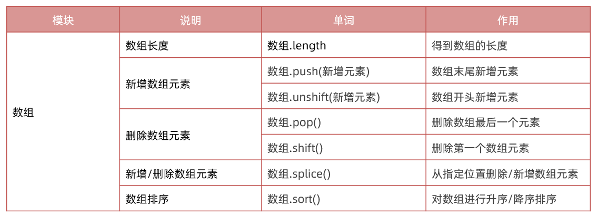
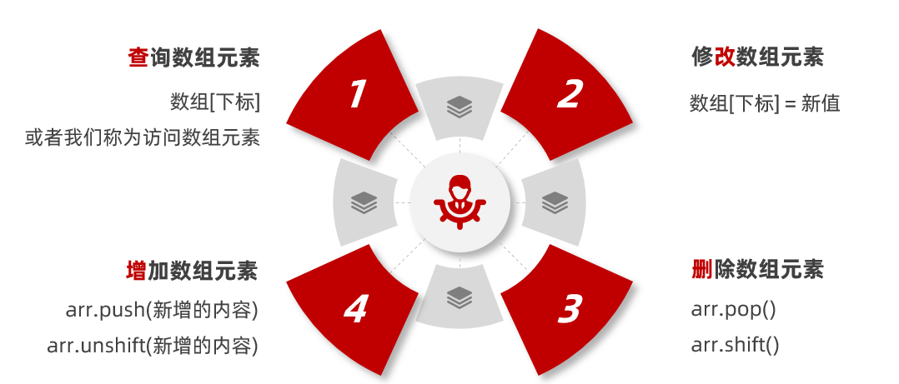
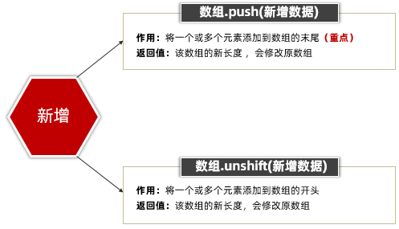
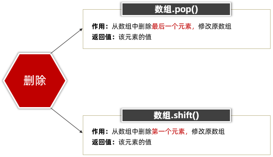
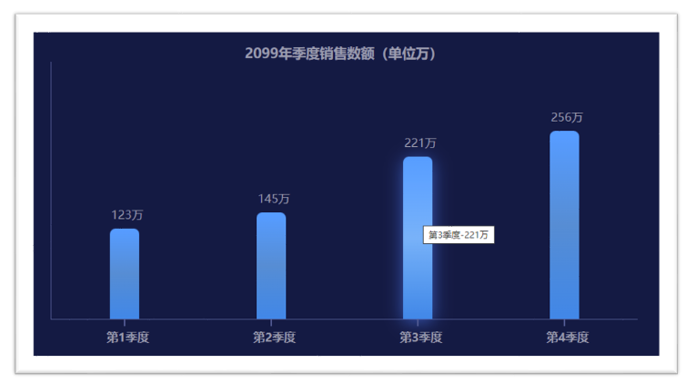

#  JavaScript 基础第三天笔记

>知道什么是数组及其应用的场景，掌握数组声明及访问的语法，具备利用数组渲染柱形图表的能力

**今日重点：**

- 循环嵌套
- 数组
- 综合案例

今日单词：

 

## 循环嵌套

利用循环的知识来对比一个简单的天文知识，我们知道地球在自转的同时也在围绕太阳公转，如果把自转和公转都看成是循环的话，就相当于是循环中又嵌套了另一个循环。


实际上 JavaScript 中任何一种循环语句都支持循环的嵌套，如下代码所示：

基本语法：

~~~javascript
for（初始化; 循环条件;变量计数） {
  for (初始化; 循环条件；变量计数）{
    //  要重复执行的代码
  }
}
~~~

例如：

```html
// 1. 外面的循环 记录第n天 
for (let i = 1; i < 4; i++) {
    document.write(`第${i}天 <br>`)
    // 2. 里层的循环记录 几个单词
    for (let j = 1; j < 6; j++) {
        document.write(`记住第${j}个单词<br>`)
    }
}
```

记住，外层循环循环一次，里层循环循环全部

### 三角型

~~~javascript
 // 外层打印几行
for (let i = 1; i <= 5; i++) {
    // 里层打印几个星星
    for (let j = 1; j <= i; j++) {
        document.write('★')
    }
    document.write('<br>')
}
~~~

 

### 九九乘法表

样式css

~~~css
span {
    display: inline-block;
    width: 100px;
    padding: 5px 10px;
    border: 1px solid pink;
    margin: 2px;
    border-radius: 5px;
    box-shadow: 2px 2px 2px rgba(255, 192, 203, .4);
    background-color: rgba(255, 192, 203, .1);
    text-align: center;
    color: hotpink;
}
~~~

javascript 

~~~javascript
 // 外层打印几行
for (let i = 1; i <= 9; i++) {
    // 里层打印几个星星
    for (let j = 1; j <= i; j++) {
        // 只需要把 ★ 换成  1 x 2 = 2   
        document.write(`
				<div> ${j} x ${i} = ${j * i} </div>
     `)
    }
    document.write('<br>')
}
~~~


## 数组

> 知道什么是数组及其应用的场景，掌握数组声明及访问的语法。

### 数组是什么？

**数组**：(Array) 是一种数据类型，属于引用数据类型

**作用**: 在单个变量名下存储多个数据

例如我要保存咱们班同学的姓名，使用数组非常方便

### 数组的基本使用

#### 定义数组

```html
<script>
  // 1. 语法，使用 [] 来定义一个空数组
  // 定义一个空数组，然后赋值给变量 classes
  // let classes = []

  // 2. 定义非空数组
  let classes = ['小明', '小刚', '小红', '小丽', '小米']
</script>
```

通过 `[]` 定义数组，数据中可以存放真正的数据，如小明、小刚、小红等这些都是数组中的数据，我们这些数据称为数组单元，数组单元之间使用英文逗号分隔。

#### 访问数组和数组索引

使用数组存放数据并不是最终目的，关键是能够随时的访问到数组中的数据（单元）。其实 JavaScript 为数组中的每一个数据单元都编了号，通过数据单元在数组中的编号便可以轻松访问到数组中的数据单元了。

我们将数据单元在数组中的编号称为索引值，也有人称其为下标。

索引值实际是按着数据单元在数组中的位置依次排列的，注意是从` 0` 开始的，如下图所示：


观察上图可以数据单元【小明】对应的索引值为【0】，数据单元【小红】对应的索引值为【2】

```html
<script>
  // 数组： 可以单个变量下存储多个数据
  // 1. 声明数组
  let names = ['小明', '小刚', '小红', '小丽', '小米']
  // let names = ['小明', '小刚', true, '小丽', 1]
  console.log(names)
  // 1.1 数组是按照顺序来存储的，每个数据都有自己的编号
  // 1.2 编号是从0开始的， 0 1 2 3... 也称为 索引 或者 下标
  // 1.3 数组里面可以存放任意的数据类型

  // 2. 数组取值  数组名[下标]
  console.log(names[0])  // '小明'
  console.log(names[1])  // '小刚'
  console.log(names[2])  // '小红'
  console.log(names[3])  // '小丽'
  console.log(names[4])  // '小米'
</script>
```

数组做为数据的集合，它的单元值可以是任意数据类型

```html
<script>
  // 6. 数组单值类型可以是任意数据类型

  // a) 数组单元值的类型为字符类型
  let list = ['HTML', 'CSS', 'JavaScript']
  // b) 数组单元值的类型为数值类型
  let scores = [78, 84, 70, 62, 75]
  // c) 混合多种类型
  let mixin = [true, 1, false, 'hello']
</script>
```

#### 遍历数组

**遍历数组**：把数组中每个数据都访问到

**数组长度**： 数组.`length`

```html
<script>
  let arr = ['迪丽热巴', '古力娜扎', '佟丽丫丫', '玛尔扎哈', '哈尼克孜']
  // console.log(arr[0])
  // console.log(arr[1])
  // console.log(arr[2])
  // console.log(arr[3])
  // 遍历数组： 把数组里面的数据每个都会访问到
  // for (let i = 0; i < 4; i++) {
  //   // console.log(i)  数组名[索引号]
  //   console.log(arr[i])
  // }

  // 1. 数组的长度 数组.length 
  // console.log(arr.length)  // 4
  for (let i = 0; i < arr.length; i++) {
    console.log(arr[i])
  }
  // 2. 数组里面的数据也称为 数组元素
</script>
```

### 操作数组

数组本质是数据集合, 操作数据无非就是 增 删 改 查 语法



#### 查询和修改数组

**查询：**

​	语法：数组[索引]

​	返回值：如果查询不到则返回 undefined

**修改：**

​	语法：数组[索引]  = 新值

​	返回值：如果下标不存在，则是新增一个数组元素，并修改了数组长度（尽量避免）

```html
<script>
  // 1. 查询数组元素
  let arr = ['迪丽热巴', '古丽扎娜']
  console.log(arr[0]) //  '迪丽热巴'
  console.log(arr[1]) //  '古丽扎娜'
  console.log(arr[2]) //  undefined

  // 2. 修改数组元素   数组[索引] = 新值
  arr[1] = '佟丽丫丫'
  // console.log(arr)
  arr[3] = '古丽扎娜'  // 如果索引号不存在，则是增加数组元素 （不提倡）
  console.log(arr)
  console.log(arr.length)  // 4 修改了数组长度
</script>
```

#### 新增



~~~javascript
// 数组新增元素
// 1. 可以向数组的末尾新增1个或者多个数组元素 数组.push(元素1...元素n)
let arr = ['迪丽热巴']
// console.log(arr.push('佟丽丫丫'))  // 返回的是新数组的长度 2
// arr.push('佟丽丫丫', '古丽扎娜')
// console.log(arr)  // 修改原数组

// 2. 可以向数组的开头增加1个或者多个数组元素 数组.unshift(元素1,...元素n)
// console.log(arr.unshift('佟丽丫丫'))  // 返回的是新数组的长度 2
arr.unshift('佟丽丫丫', '古丽扎娜')
console.log(arr) // 修改原数组
~~~

#### 删除



~~~javascript
<script>
  // 删除元素
  // 1. 删除数组中的最后一个元素  数组.pop()  修改原数组
  let arr = ['red', 'green']
// arr.pop()
// console.log(arr.pop())  // 返回的是被删除的元素
// console.log(arr)

// 2. 删除数组中的第一个元素 数组.shift() 修改原数组的
arr.shift()
// console.log(arr.shift())  // 返回的是被删除的元素
console.log(arr)
</script>
~~~

#### 数组 splice方法

数组.splice() 方法  可以添加也可以删除数组元素

说明：可以从指定位置删除或者增加的数组元素，注意它修改原数组

> splice(start,deleteCount, item1, item2...)

1. start 起始位置: 

   - 指定修改的开始位置（从0计数）

2. deleteCount 删除个数:  

   - 表示要移除的数组元素的个数


   - 可选的。如果省略则默认从指定的起始位置删除到最后

3. item1, item2...

   - 新增的元素

~~~javascript
<script>
  // splice 删除和增加数组元素
  let arr = ['迪丽热巴', '古力娜扎', '佟丽丫丫', '玛尔扎哈']
// 1. splice 删除  数组.splice(起始位置, 删除几个)
// arr.splice(1, 1) // 记住起始位置是索引号，从0 开始数
// arr.splice(1) // 如果第二个参数（删除几个）省略了，则默认删除到最后
// console.log(arr)

// 2. splice 增加  数组.splice(起始位置, 删除几个, 新增元素1,...新增元素n)
arr.splice(1, 0, '刘德华', 'pink老师')
// 2.1 注意如果是新增，则起始位置是目标位置的索引号， 删除几个（第二个参数）不能省略我们写为 0， 后面写新增的元素
console.log(arr)

// 3. splice 不是替换pop shift  unshift push.  arr.splice(0, 1)
// 开头结尾找前面 pop shift  unshift push
// splice管中间
</script>
~~~

## 综合案例

### 手风琴效果


小技巧： 利用循环拼接字符串  (原理跟累加和类似）

①：声明一个空的字符串 str = ''

②：循环里面利用 +=   进行拼接

③：把拼接完毕的字符串放入容器中

完整代码：

~~~javascript

<!DOCTYPE html>
<html lang="en">

<head>
  <meta charset="UTF-8">
  <meta name="viewport" content="width=device-width, initial-scale=1.0">
  <meta http-equiv="X-UA-Compatible" content="ie=edge">
  <title>Document</title>
  <style>
    .box {
      display: flex;
      overflow: hidden;
      width: 1120px;
      height: 260px;
      margin: 50px auto;
    }

    .box>div {
      width: 120px;
      border: 1px solid #fff;
      transition: all 0.5s;
    }

    .box>div:hover {
      width: 400px;
    }
  </style>
</head>

<body>
  <!-- <div class="box">
    <div></div>
    <div></div>
    <div></div>
    <div></div>
    <div></div>
    <div></div>
    <div></div>
  </div> -->

  <script>
    let arr = [
      './images/1.jpg',
      './images/2.jpg',
      './images/3.jpg',
      './images/4.jpg',
      './images/5.jpg',
      './images/6.jpg',
      './images/7.jpg',
    ]

    // 1. 声明一个空的字符串变量 str 
    let str = ''

    // 2. 利用for循环拼接字符串 +=
    for (let i = 0; i < arr.length; i++) {
      // console.log(arr[i])
      str += `
      <div></div>
      `
    }
    console.log(str)

    // 3. 把拼接的字符串放入 box盒子里面
    document.write(`
      <div class="box">
        ${str}
      </div>
    `)

  </script>
</body>

</html>
~~~

### 根据数据渲染柱形图效果



需求：用户输入四个季度的数据，可以生成柱形图

分析：

①：需要输入4次，所以可以把4个数据放到一个数组里面

- 声明一个空数组
- 利用循环，弹出4次框，同时把数据存到数组里面

②：遍历该数组，根据数据生成4个柱形图，渲染打印到页面中

- 声明一个空字符串str
- 根据数组利用循环拼接字符串，生成多个柱子
- 把生成的柱子添加到box盒子中

完整代码：

~~~javascript

<!DOCTYPE html>
<html lang="en">

<head>
  <meta charset="UTF-8">
  <meta http-equiv="X-UA-Compatible" content="IE=edge">
  <meta name="viewport" content="width=device-width, initial-scale=1.0">
  <title>Document</title>
  <style>
    * {
      margin: 0;
      padding: 0;
    }

    body {
      background-color: #0c143d;
    }

    .box {
      display: flex;
      justify-content: space-around;
      align-items: flex-end;
      width: 800px;
      min-height: 300px;
      border-left: 1px solid #4b578f;
      border-bottom: 1px solid #4b578f;
      margin: 0 auto;
      padding-top: 50px;
      text-align: center;
      color: #9799ab;
    }

    .box>div {
      position: relative;
      display: flex;
      flex-direction: column;
      justify-content: space-between;
      width: 40px;
      height: 0;
      background: linear-gradient(#3c99ff, #4489d0, #2283e4);
      cursor: pointer;
      border-radius: 8px 8px 0 0;
      transition: all .2s;
    }

    .box>div:hover {

      animation: bg .5s alternate infinite;

    }

    @keyframes bg {
      to {
        box-shadow: 0 5px 29px rgb(53 111 226 / 88%);
        background: linear-gradient(#3c99ff, #68aff6, #2283e4);
      }
    }

    .box>div::after {
      content: '';
      position: absolute;
      bottom: 0;
      left: 50%;
      width: 2px;
      height: 10px;
      background-color: #4b578f;
      transform: translate(-50%, 100%);
    }

    .box div span {
      width: 60px;
      margin: -30px 0 -5px -6px;
    }

    .box div h4 {
      width: 70px;
      margin: 0 0 -35px -10px;
    }

    .title {
      margin-top: 50px;
      text-align: center;
      color: #9799ab;
    }
  </style>
</head>

<body>
  <h3 class="title">2099年季度销售数额（单位万）</h3>
  <!-- <div class="box">
    <div style="height: 123px;" title="第1季度-123万">
      <span>123万</span>
      <h4>第1季度</h4>
    </div>
    <div style="height: 156px;" title="第2季度-156万">
      <span>156万</span>
      <h4>第2季度</h4>
    </div>
    <div style="height: 120px;" title="第3季度-120万">
      <span>120万</span>
      <h4>第3季度</h4>
    </div>
    <div style="height: 210px;" title="第4季度-210万">
      <span>210万</span>
      <h4>第4季度</h4>
    </div>
  </div> -->
  <script>
    // 功能1： 用户输入4次，并且把数据存放到数组里面

    // 1.1 声明一个空的数组
    let arr = []

    // 1.2 利用循环的形式让用户输入4次，并且把数据追加给数组
    for (let i = 1; i <= 4; i++) {
      let num = +prompt(`请您输入第${i}季度的销售额`)
      arr.push(num)
    }
    console.log(arr)

    // 功能2：根据数组生成柱形图

    // 2.1 声明一个空的字符串 str
    let str = ''

    // 2.2 利用循环拼接字符串，生成多个柱子
    for (let i = 0; i < arr.length; i++) {
      str += `
        <div style="height: ${arr[i]}px;" title="第${i + 1}季度-${arr[i]}万">
          <span>${arr[i]}万</span>
          <h4>第${i + 1}季度</h4>
        </div>
      `
    }
    console.log(str)

    // 2.3 把生成的柱子放到box盒子里面进行渲染
    document.write(`
      <div class="box">
        ${str}
      </div> 
    `)
  </script>
</body>

</html>
~~~

## 拓展知识

### 数组排序sort

数组. sort()  方法可以排序

语法：  

~~~javascript
<script>
    // 数组排序  数组.sort()  修改原数组
    let arr = [88, 78, 100, 34, 99]
    // arr.sort()
    // console.log(arr)  // [100, 34, 78, 88, 99]

    // 1. 升序排序
    // arr.sort(function (a, b) {
    //   return a - b
    // })
    // console.log(arr)  // [34, 78, 88, 99, 100]

    // 2. 降序排序
    arr.sort(function (a, b) {
      return b - a
    })
    console.log(arr)  //  [100, 99, 88, 78, 34]

    // 3. 获取数组最大值和最小值
    document.write(`数组的最大值：${arr[0]}`)
    document.write(`数组的最小值：${arr[arr.length - 1]}`)
  </script>
~~~

### 选择排序（了解）

选择排序原理：（了解）

就是从第一个数开始，与后面所有的数相比较，找出最小（最大）的数，放在第一个位置

以此类推，每一轮确定一个相对于这一轮最小（最大）的数

算法可视化网站地址： https://visualgo.net/zh/sorting

核心：利用循环嵌套比较，根据索引号来交换变量

①：外层循环是一共进行几轮相比较，通过观察，一共进行数组长度-1 次比较

- for (let i = 0; i < arr.length - 1; i++) 
- 把 i作为最小值起始索引  minIndex 

②：里层循环是每一轮的比较来查找最小值

- 里层循环起始值是 i + 1 个元素开始查找
- for (let j = i + 1; j < arr.length; j++)
- 进行比较的时候，发现最小的数组元素，把当前元素索引号给 minIndex

③：如果 minIndex 和 i 位置不一致，则交换变量

~~~javascript
<script>
  // 选择排序算法
  let arr = [4, 2, 5, 1, 3]
// 1  [1, 2, 5, 4, 3]
// 2  [1, 2, 5, 4, 3]
// 3  [1, 2, 3, 4, 5]
// 4  [1, 2, 3, 4, 5]
// 1. 外层循环控制是几轮能够比较出来
for (let i = 0; i < arr.length - 1; i++) {
  // 最小值的索引号
  let minIndex = i

  // 2. 里层循环来查找最小值，并且记录最小值的索引号
  for (let j = i + 1; j < arr.length; j++) {
    if (arr[j] < arr[minIndex]) {
      minIndex = j
    }
  }

  // 3. 交换变量  
  if (minIndex !== i) {
    let temp = arr[minIndex]
    arr[minIndex] = arr[i]
    arr[i] = temp
  }
}
console.log(arr)
~~~


