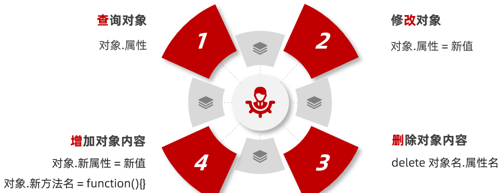
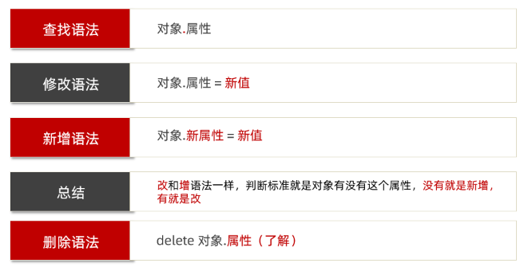
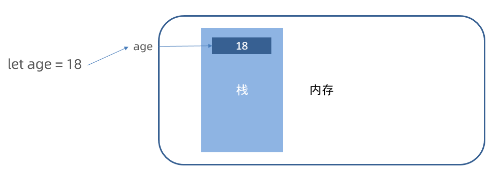
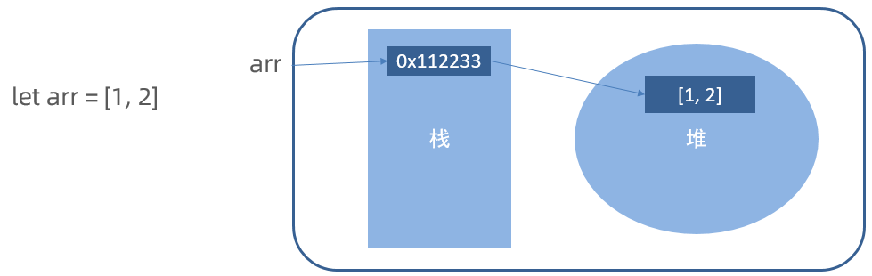

# JavaScript 基础 - 第5天

> 知道对象数据类型的特征，能够利用数组对象渲染页面

- 对象
- 综合案例
- 数据类型存储

## 对象

> 对象（Object）：JavaScript里的一种数据类型（引用类型），也是用于存储数据的
>
> 好处：可以用来详细的描述某个事物，是用键值对形式存储语义更明了
>
> 特点：对象数据是无序的，数组有序的  

### 对象基本使用

对象有属性和方法组成

#### 对象属性

数据描述性的信息称为属性，如人的姓名、身高、年龄、性别等，一般是名词性的。

1. 属性都是成 对出现的，包括属性名和值，它们之间使用英文 `:` 分隔
2. 多个属性之间使用英文 `,` 分隔
3. 属性就是依附在对象上的变量（对象外是变量，对象内是属性）

**1. 定义对象属性**

```html
<script>
  // 对象也是一种数据类型，保存数据同时可以更直观的描述事物
  // 1. 定义对象属性
  let pig = {
    sex: '女',
    age: 4,
    uname: '佩奇',
    weight: 12.6
  }
</script>
```

**2. 访问对象属性**

声明对象，并添加了若干属性后，可以使用 `.` 获得对象中属性对应的值，我称之为属性访问

```html
<script>
  // 对象也是一种数据类型，保存数据同时可以更直观的描述事物
  // 1. 定义对象属性
  let pig = {
    sex: '女',
    age: 4,
    uname: '佩奇',
    weight: 12.6
  }

  // 2. 访问对象属性  对象.属性
  console.log(pig.age)  // 4
  console.log(pig.weight)  // 12.6
</script>
```

#### 对象方法

数据行为性的信息称为方法，如跑步、唱歌等，一般是动词性的，其本质是函数。

1. 方法是由方法名和函数两部分构成，它们之间使用 : 分隔
2. 多个属性之间使用英文 `,` 分隔
3. 方法是依附在对象中的函数（对象外是函数，对象内是方法）

**1.定义对象方法**

~~~javascript
// let fn = function() {}
// 对象方法
// 1. 定义对象方法
let pig = {
  uname: '佩奇',
  sing: function () {
    console.log('唱歌')
  },
  dance: function () {
    console.log('跳舞')
  }
}
console.log(pig)

~~~

**2.调用对象方法**

声明对象，并添加了若干方法后，可以使用 `.`  调用对象中函数，我称之为方法调用。

~~~javascript
// let fn = function() {}
// 对象方法
// 1. 定义对象方法
let pig = {
  uname: '佩奇',
  sing: function () {
    console.log('唱歌')
  },
  dance: function () {
    console.log('跳舞')
  },
  sum: function (x, y) {  // 2
    // console.log(x + y)
    return x + y
  }
}
console.log(pig)

// 2. 调用对象方法
pig.sing() // 唱歌
pig.dance()  // 跳舞

// 3. 方法可以传递参数也可以有返回值，跟函数使用基本类似
let re = pig.sum(1, 2) // 1 实参
console.log(re)
~~~

**注：无论是属性或是方法，同一个对象中出现名称一样的，后面的会覆盖前面的。**

### 操作对象

对象本质是无序的数据集合, 操作对象数据无非就是 **增 删 改 查** 






~~~javascript
<script>
  // 操作对象：对数据 查、增、改、删
  let pig = {
    uname: '佩奇',
    sing: function () {
      console.log('唱歌')
    }
  }

// 1. 查： 对象.属性 对象.方法
console.log(pig.uname)  // 得到属性值
pig.sing()

// 2. 增：对象.新属性 = 新值   对象.新方法 = function(){}
pig.age = 4
pig.dance = function () {
  console.log('跳舞')
}
console.log(pig)

// 3. 改：对象.属性 = 新值  对象.方法 = 新匿名函数
pig.uname = '小猪佩奇'
pig.sing = function () {
  console.log('哼哼哼！！')
}
console.log(pig)

// 4. 删： 了解，因为我们很少对对象里面的数据做删除操作  delete
delete pig.age
delete pig.dance
console.log(pig)
</script>
~~~

#### 查找属性的另外写法

对于多词属性比如中横线分割的属性，点操作就不能用了

我们可以采取：  对象['属性'] 方式， 单引号和双引号都阔以，当然也可以用于其他正常属性

~~~javascript
<script>
  // 查询属性的另外写法  对象['属性'] 这个属性必须加引号
  let pig = {
    'pig-name': '佩奇',
    age: 4
  }
// console.log(pig.pig - name)  // NaN
console.log(pig['pig-name']) // 佩奇
console.log(pig['age']) // 4    === pig.age 
</script>
~~~

> 总结：多词属性或者需要解析变量的时候使用 [] 语法，其余的直接使用点语法

### 遍历对象

for 遍历对象的问题：

- 对象没有长度length，而且是无序的

所以我们要利用 for in 遍历对象

**语法:**

~~~javascript
for (let 变量 in 对象) {
  console.log(变量) // 属性名
  console.log(对象[变量]) // 属性值
}
~~~

1. for in语法中的 k 是一个变量, 在循环的过程中依次代表对象的属性名
2. 由于 k 是变量, 所以必须使用 [ ] 语法解析 
3. 一定记住： k 是获得对象的属性名， 对象名[k] 是获得 属性值
4. 一般不用这种方式遍历数组、主要是用来遍历对象

~~~javascript
<script>
  // 遍历对象
  let pig = {
    sex: '女',
    age: 4,
    uname: '佩奇',
    weight: 12.6,

  }

// for (let key in pig) {
//   console.log(key)  // key 是属性  
//   console.log(pig[key]) // 对象[变量] 是值
// }

for (let key in pig) {
  console.log(key)  // key 是属性   对象.属性
  // console.log(pig.key)   // pig.key  undefined  因为key是个变量不是属性
  // key  'sex'  'age'    对象[key]  对象['sex']  对象['age']
  console.log(pig[key])
}


// 注意：数组遍历用传统for， for in 主要用来遍历对象
let arr = ['red', 'green', 'pink']
for (let k in arr) {
  console.log(k)// 得到字符串类型的索引号
}
</script>
~~~

## 内置对象

内置对象：JavaScript内部提供的对象，包含各种属性和方法给开发者调用

回想一下我们曾经使用过的 `console.log`，`console`其实就是 JavaScript 中内置的对象，该对象中存在一个方法叫 `log`，然后调用 `log` 这个方法，即 `console.log()`

除了 `console` 对象外，JavaScritp 还有其它的内置的对象

### Math

`Math` 是 JavaScript 中内置的对象，称为数学对象，这个对象下即包含了属性，也包含了许多的方法。

| 属性/方法 | 作用         | 说明                                                         |
| --------- | ------------ | ------------------------------------------------------------ |
| PI        | 圆周率       | Math.PI  属性，返回圆周率                                    |
| max       | 找最大值     | Math.max(8, 3, 1) 方法，返回 8                               |
| min       | 找最小值     | Math.min(8, 3, 1) 方法，返回 1                               |
| abs       | 绝对值       | Math.abs(-1) 方法，返回 1                                    |
| ceil      | 向上取整     | Math.ceil(3.1)    方法，返回 4                               |
| floor     | 向下取整     | Math.floor(3.8)  方法，返回 3                                |
| round     | 四舍五入取整 | Math.round(3.8)  方法，返回 4， 遇到.5则舍入到相邻的在正无穷（+∞）方向上的整数 |

~~~javascript
<script>
  // 内置对象Math 
  // 1. PI 属性 圆周率
  console.log(Math.PI)

// 2. max  方法 找最大值
console.log(Math.max(8, 4, 2)) // 8

// 3. min  方法 找最小值
console.log(Math.min(8, 4, 2)) // 2

// 4. abs 方法 取绝对值 
console.log(Math.abs(-1))  // 1

// 5. ceil 方法 向上取整   ceil 天花板   往大了取
console.log(Math.ceil(1.1)) // 2
console.log(Math.ceil(1.5)) // 2
console.log(Math.ceil(1.8)) // 2
console.log(Math.ceil(-1.1)) //  -1
console.log(Math.ceil(-1.5)) //  -1
console.log(Math.ceil(-1.8)) //  -1

// 6. floor 方法 向下取整  floor 地板  往小了取
console.log(Math.floor(1.1)) // 1
console.log(Math.floor(1.5)) // 1
console.log(Math.floor(1.8)) // 1
console.log(Math.floor(-1.1)) //  -2
console.log(Math.floor(-1.5)) //  -2
console.log(Math.floor(-1.8)) //  -2

// 7. round 方法 四舍五入取整 
console.log(Math.round(1.1)) // 1
console.log(Math.round(1.5)) // 2
console.log(Math.round(1.8)) // 2
console.log(Math.round(-1.1)) // -1
console.log(Math.round(-1.8)) // -2
console.log(Math.round(-1.5)) // -1
</script>
~~~

数学对象提供了比较多的方法，这里不要求强记，通过演示数学对象的使用，加深对对象的理解。

#### 随机数 random

lMath.random()  随机数， 返回一个0 - 1之间，并且包括0不包括1的随机小数  [0, 1）

如何生成0-10的随机整数呢？

~~~javascript
Math.floor(Math.random() * (10 + 1))
~~~

如何生成5-15的随机整数？

~~~javascript
Math.floor(Math.random() * (10 + 1)) + 5
~~~

如何生成N-M之间的随机整数

~~~javascript
Math.floor(Math.random() * (M - N + 1)) + N
Math.floor(Math.random() * (差值 + 1)) + 最小值
~~~

~~~javascript
<script>
  // 1. Math随机数  Math.random() 
  // 1.1 随机的小数 0 ~1 之间
  // 1.2 能取到0，但是取不到1 [0, 1)
  // console.log(Math.random())

  // 2. 取 0 ~ 10 之间的一个随机整数
  // Math.random() * (10 + 1)
  // (0 ~ 0.99999) * 11
  // 0 ~ 10.99999
  // Math.floor(Math.random() * (10 + 1))
  // console.log(Math.floor(Math.random() * (10 + 1)))

  // 3. 取 5 ~ 15 之间的一个随机整数
  // Math.floor(Math.random() * (10 + 1))  0 ~ 10 
  // Math.floor(Math.random() * (10 + 1)) + 5  5 ~ 15 
  // console.log(Math.floor(Math.random() * (10 + 1)) + 5)

  // 4. 取 n ~ m 之间的一个随机整数  4 ~ 12 
  // Math.floor(Math.random() * (差值 + 1)) + 最小值
  console.log(Math.floor(Math.random() * (8 + 1)) + 4)
</script>
~~~

## 综合案例


需求：根据数据渲染列表页面

分析：

①：根据对象数组的数据来渲染页面
②：核心利用循环来做字符串拼接生成多个标签，然后添加到容器中渲染页面

~~~html

<!DOCTYPE html>
<html lang="en">

<head>
  <meta charset="UTF-8">
  <meta http-equiv="X-UA-Compatible" content="IE=edge">
  <meta name="viewport" content="width=device-width, initial-scale=1.0">
  <title>学成在线</title>
  <link rel="stylesheet" href="./iconfont/iconfont.css">
  <link rel="stylesheet" href="./css/base.css">
  <link rel="stylesheet" href="./css/index.css">
</head>

<body>

  <!-- 精品课程 -->
  <script>
    // 综合案例代码
    // 1. 利用对象数组的数据渲染页面
    // 综合案例代码
    let data = [
      {
        src: './uploads/quality01.png',
        title: 'JavaScript数据看板项目实战',
        num: 1125
      },
      {
        src: './uploads/quality02.png',
        title: 'Vue.js实战——面经全端项目',
        num: 2726
      },
      {
        src: './uploads/quality03.png',
        title: '玩转Vue全家桶，iHRM人力资源项目',
        num: 9456
      },
      {
        src: './uploads/quality04.png',
        title: 'Vue.js实战医疗项目——优医问诊',
        num: 7192
      },
      {
        src: './uploads/quality05.png',
        title: '小程序实战：小兔鲜电商小程序项目',
        num: 2703
      },
      {
        src: './uploads/quality06.png',
        title: '前端框架Flutter开发实战',
        num: 2841
      },
      {
        src: './uploads/quality07.png',
        title: '熟练使用React.js——极客园H5项目',
        num: 95682
      },
      {
        src: './uploads/quality08.png',
        title: '熟练使用React.js——极客园PC端项目',
        num: 904
      },
      {
        src: './uploads/quality09.png',
        title: '前端实用技术，Fetch API 实战',
        num: 1516
      },
      {
        src: './uploads/quality10.png',
        title: '前端高级Node.js零基础入门教程',
        num: 2766
      },
      {
        src: './uploads/quality10.png',
        title: '前端高级Node.js零基础入门教程',
        num: 27669
      }
    ]
    // 2. 利用循环来做字符串拼接生成多个li标签，之后把生成的li标签放入容器 ul 里面渲染即可
    let str = ''
    for (let i = 0; i < data.length; i++) {
      // console.log(data[i]) // 每个对象
      str += `
         <li>
          <a href="#">
            <div class="pic">
              
            </div>
            <h4>${data[i].title}</h4>
            <p><span>高级</span> · <i>${data[i].num}</i>人在学习</p>
          </a>
        </li>
      `
    }
    console.log(str)

    document.write(`
      <div class="course wrapper">
        <div class="hd">
          <h3>精品推荐</h3>
          <a href="#">查看全部
            <span class="iconfont icon-arrow-right-bold">
            </span>
          </a>
        </div>
        <div class="bd">
          <ul class="common">
            ${str}
          </ul>
        </div>
      </div>
    `)

  </script>
</body>

</html>
~~~

## 数据存储

#### 内存中堆栈空间分配区别：

**栈:** 优点访问速度快，基本数据类型存放到栈里面

**堆:**优点存储容量大，引用数据类型存放到堆里面





#### 变量声明

建议：  const 优先，尽量使用const，原因是：

- 很多变量声明的时候明确不会被更改了，为了安全性，那为什么不用 const 呢？
- 实际开发中也是，比如 React、Vue，基本 const 声明

总结：

有了变量先给const，如果发现它后面是要被修改的，再改为let

#### 专业术语

| 术语           | 解释                                                       | 举例                                              |
| -------------- | ---------------------------------------------------------- | ------------------------------------------------- |
| 关键字         | 在JavaScript中有特殊意义的词汇                             | let、var、function、if、else、switch、case、break |
| 保留字         | 在目前的JavaScript中没意义，但未来可能会具有特殊意义的词汇 | int、short、long、char                            |
| 标识（标识符） | 变量名、函数名的另一种叫法                                 | 无                                                |
| 表达式         | 可以被求值的代码，一般配合运算符出现                       | 10 + 3、age  >= 18                                |
| 语句           | 一段可执行的代码                                           | if ()    for()                                    |


